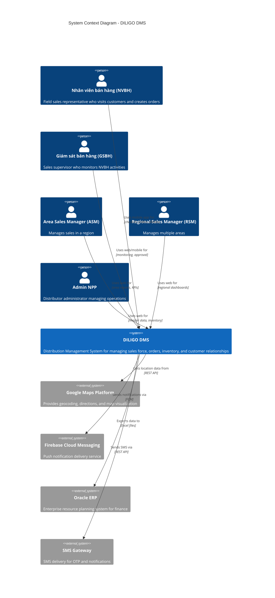
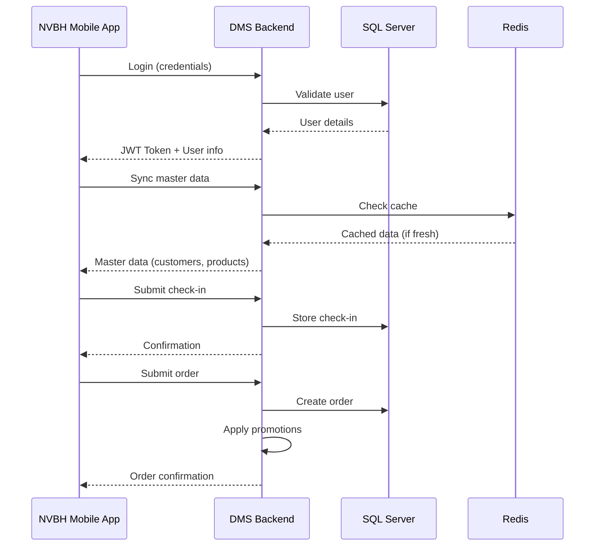
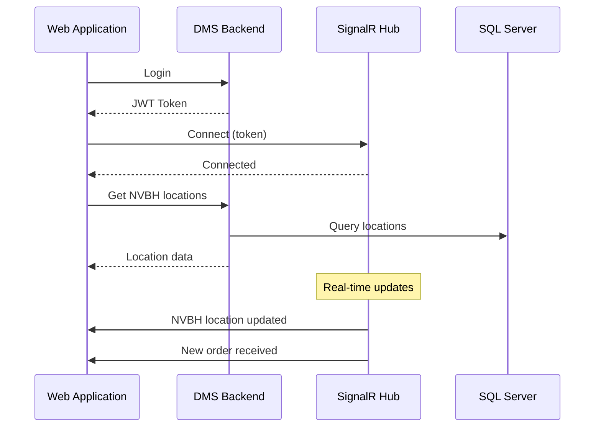
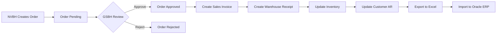
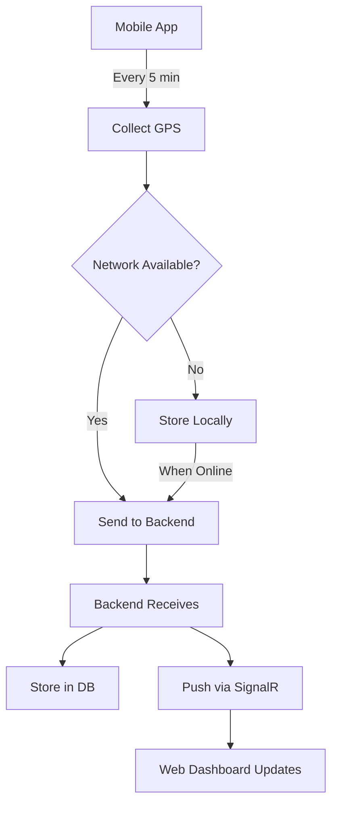
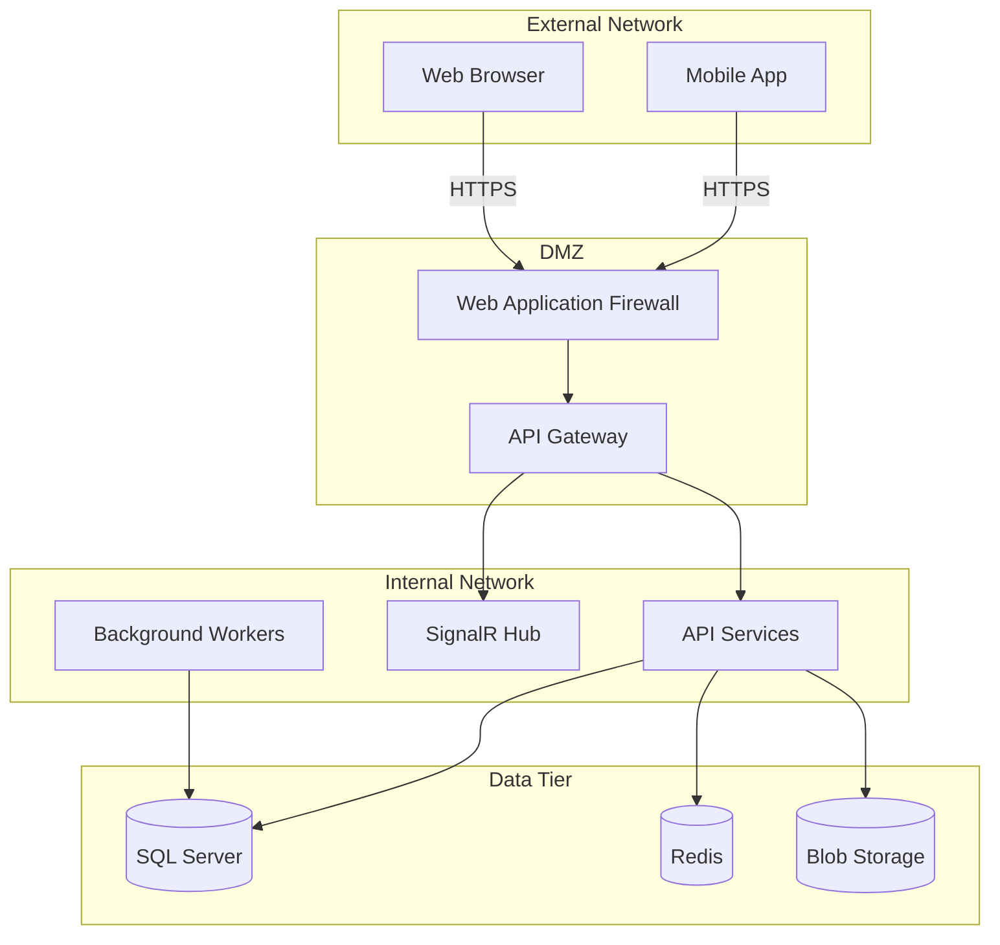

# DILIGO DMS - System Context (C4 Level 1)

## 1. System Context Diagram



---

## 2. User Personas

### 2.1 Nhân viên bán hàng (NVBH) - Sales Representative

| Attribute | Description |
|-----------|-------------|
| **Role** | Field sales representative |
| **Primary Device** | Android smartphone |
| **Location** | On the field, visiting customers |
| **Key Activities** | Check-in/out, create orders, capture photos, update customer info |
| **Pain Points** | Limited connectivity, need offline mode, GPS accuracy |
| **Goals** | Complete daily route, maximize orders, accurate reporting |

**User Journey:**
```
Morning: Clock-in → Receive route → Travel to first customer
At Customer: Check-in → Take photos → Create order → Check-out
End of Day: Complete route → Clock-out → Sync pending data
```

### 2.2 Giám sát bán hàng (GSBH) - Sales Supervisor

| Attribute | Description |
|-----------|-------------|
| **Role** | Direct supervisor of NVBH team |
| **Primary Device** | Desktop/Laptop + Mobile |
| **Location** | Office and field visits |
| **Key Activities** | Monitor NVBH locations, approve orders, track KPIs |
| **Pain Points** | Real-time visibility, fraudulent check-ins |
| **Goals** | Ensure team productivity, quick order processing |

### 2.3 Area Sales Manager (ASM)

| Attribute | Description |
|-----------|-------------|
| **Role** | Manages multiple GSBH and routes |
| **Primary Device** | Desktop/Laptop |
| **Location** | Regional office |
| **Key Activities** | View area reports, manage routes, performance analysis |
| **Pain Points** | Aggregated data delays, route optimization |
| **Goals** | Meet regional targets, optimize coverage |

### 2.4 Regional Sales Manager (RSM)

| Attribute | Description |
|-----------|-------------|
| **Role** | Strategic management of large regions |
| **Primary Device** | Desktop/Laptop |
| **Location** | Head office |
| **Key Activities** | Dashboard analysis, strategic planning, trend analysis |
| **Pain Points** | Data consistency, reporting delays |
| **Goals** | Strategic growth, market share increase |

### 2.5 Admin NPP - Distributor Administrator

| Attribute | Description |
|-----------|-------------|
| **Role** | Operational manager at distributor |
| **Primary Device** | Desktop |
| **Location** | Distributor office |
| **Key Activities** | Manage master data, process orders, inventory, AR |
| **Pain Points** | Manual data entry, inventory accuracy |
| **Goals** | Efficient operations, accurate records |

---

## 3. External Systems

### 3.1 Google Maps Platform

| Aspect | Details |
|--------|---------|
| **Purpose** | Location services, geocoding, routing |
| **Integration Type** | REST API |
| **APIs Used** | Geocoding API, Directions API, Places API, Maps JavaScript API |
| **Data Flow** | DMS → Google Maps (coordinates) → DMS (addresses, routes) |
| **Frequency** | Real-time for live tracking, on-demand for routing |
| **Cost Model** | Pay-per-use |

### 3.2 Firebase Cloud Messaging (FCM)

| Aspect | Details |
|--------|---------|
| **Purpose** | Push notifications to mobile devices |
| **Integration Type** | FCM HTTP v1 API |
| **Message Types** | Order status, alerts, announcements |
| **Data Flow** | DMS Backend → FCM → Mobile App |
| **Frequency** | Event-driven |
| **Reliability** | Best-effort delivery with retry |

### 3.3 Oracle ERP

| Aspect | Details |
|--------|---------|
| **Purpose** | Financial and accounting integration |
| **Integration Type** | Excel file export |
| **Data Exported** | Sales transactions, inventory movements |
| **Data Flow** | DMS → Excel file → Manual import to Oracle |
| **Frequency** | Daily/Weekly batch |
| **Format** | XLSX with predefined template |

### 3.4 SMS Gateway

| Aspect | Details |
|--------|---------|
| **Purpose** | OTP verification, notifications |
| **Integration Type** | REST API |
| **Providers** | Twilio / Local provider (VN) |
| **Data Flow** | DMS → SMS Gateway → User's phone |
| **Frequency** | On-demand |
| **Reliability** | Retry mechanism with fallback |

---

## 4. System Interactions

### 4.1 Mobile App ↔ Backend



### 4.2 Web App ↔ Backend



---

## 5. Data Flows

### 5.1 Order Processing Flow



### 5.2 Location Tracking Flow



---

## 6. Security Boundaries



---

## 7. Constraints

### 7.1 Technical Constraints
| Constraint | Description | Impact |
|------------|-------------|--------|
| SQL Server only | Database must be SQL Server | Limits to Microsoft ecosystem tools |
| .NET Backend | API must be .NET | Requires Windows/Linux with .NET runtime |
| Android only | No iOS support initially | Limits to Android device users |
| Excel export for ERP | No direct ERP integration | Manual process for ERP sync |

### 7.2 Business Constraints
| Constraint | Description | Impact |
|------------|-------------|--------|
| Offline mode required | Must work without network | Requires robust sync mechanism |
| Multi-distributor | Each NPP operates independently | Data isolation requirements |
| Legacy data | Must import existing data | Migration effort required |
| Vietnamese language | Primary UI language | Localization requirements |

---

## 8. Assumptions

| ID | Assumption | Risk if Invalid |
|----|------------|-----------------|
| A1 | All NVBH have Android smartphones | Need to provide devices |
| A2 | Customers have GPS coordinates | Initial data collection effort |
| A3 | Network coverage in most areas | Extended offline capabilities |
| A4 | Users comfortable with mobile apps | Training requirements |
| A5 | Azure services available in Vietnam | Consider local cloud alternatives |

---

## 9. Dependencies

| Dependency | Type | Criticality | Fallback |
|------------|------|-------------|----------|
| Google Maps API | External Service | High | OpenStreetMap |
| Firebase FCM | External Service | Medium | Local push service |
| Azure Cloud | Infrastructure | Critical | AWS/GCP migration possible |
| SQL Server | Database | Critical | None (requirement) |
| Internet connectivity | Infrastructure | High | Offline mode |
