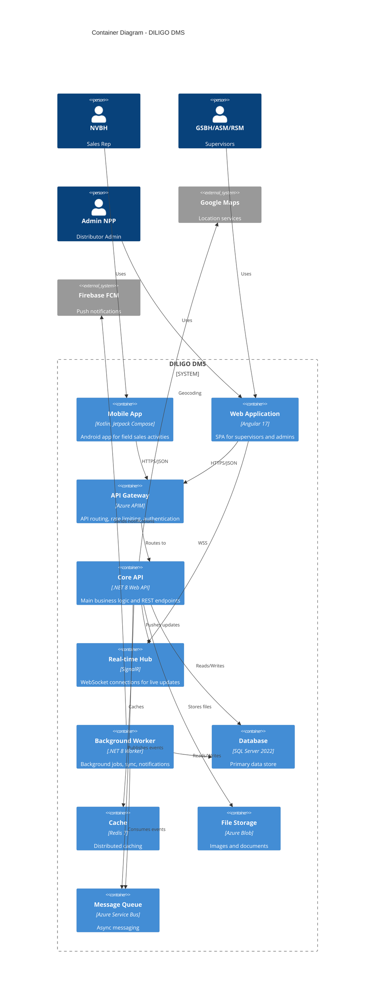
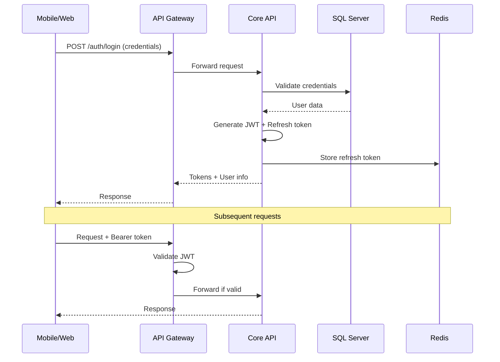
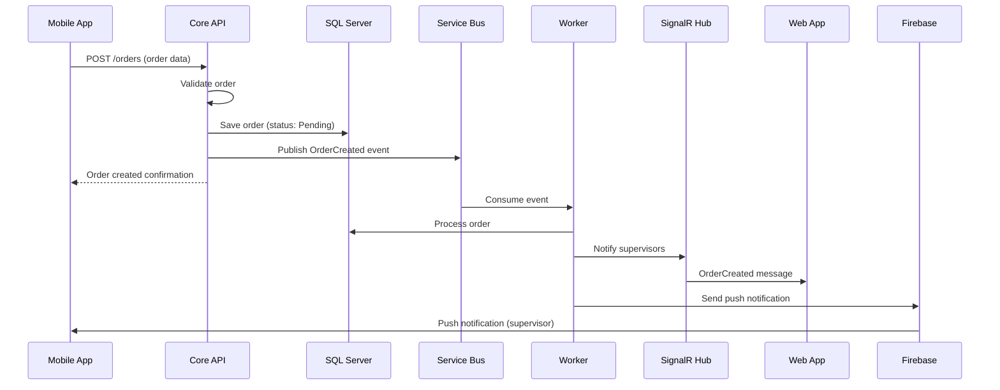
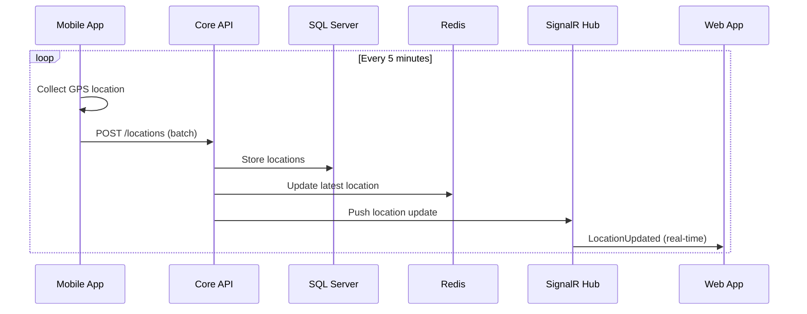
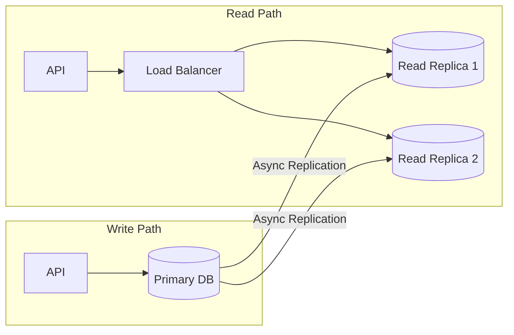
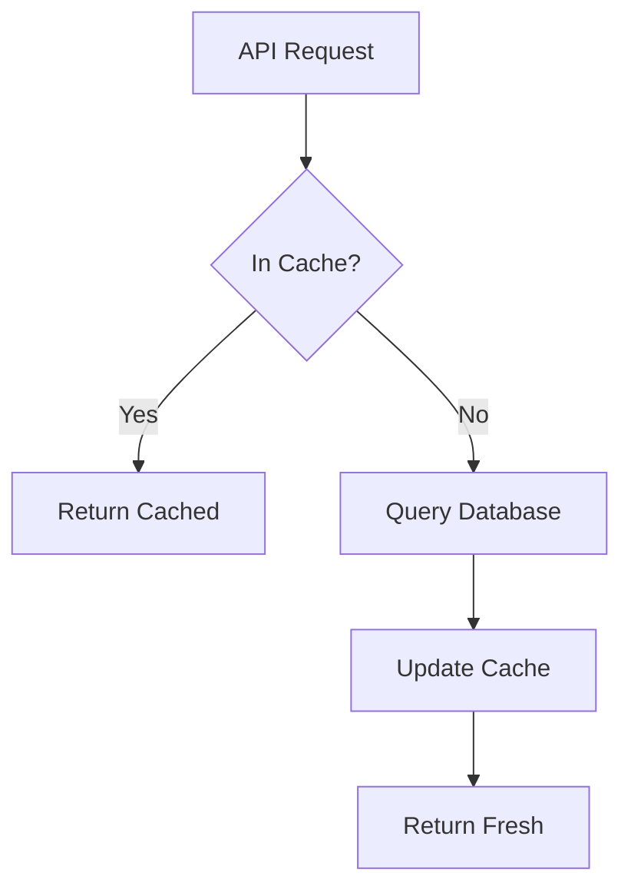

# DILIGO DMS - Container Architecture (C4 Level 2)

## 1. Container Diagram



---

## 2. Container Descriptions

### 2.1 Mobile Application (Android)

| Attribute | Details |
|-----------|---------|
| **Technology** | Kotlin 1.9.x, Jetpack Compose 1.5.x |
| **Architecture** | MVVM + Clean Architecture |
| **Deployment** | Google Play Store |
| **Size** | < 50 MB APK |
| **Min SDK** | Android 8.0 (API 26) |

**Key Capabilities:**
- GPS location tracking and reporting
- Check-in/Check-out with photo capture
- Order creation and management
- Offline data storage with Room DB
- Background sync with WorkManager
- Push notification handling

**Internal Structure:**
```
app/
├── presentation/          # UI Layer
│   ├── ui/               # Compose screens
│   ├── viewmodel/        # ViewModels
│   └── navigation/       # Navigation graphs
├── domain/               # Business Logic
│   ├── model/            # Domain models
│   ├── usecase/          # Use cases
│   └── repository/       # Repository interfaces
├── data/                 # Data Layer
│   ├── remote/           # API services
│   ├── local/            # Room database
│   ├── repository/       # Repository implementations
│   └── mapper/           # Data mappers
└── di/                   # Dependency Injection
```

### 2.2 Web Application (Angular)

| Attribute | Details |
|-----------|---------|
| **Technology** | Angular 17, TypeScript 5.x |
| **State Management** | NgRx 17 |
| **UI Framework** | Angular Material 17 |
| **Build Tool** | Angular CLI |
| **Deployment** | Azure Static Web Apps |

**Key Capabilities:**
- Real-time NVBH location monitoring
- Order approval workflows
- Customer and product management
- KPI dashboards and reports
- Inventory management
- AR/AP management

**Module Structure:**
```
src/app/
├── core/                 # Singleton services
│   ├── auth/            # Authentication
│   ├── http/            # HTTP interceptors
│   └── guards/          # Route guards
├── shared/              # Shared components
│   ├── components/      # Reusable UI
│   ├── directives/      # Custom directives
│   └── pipes/           # Custom pipes
├── features/            # Feature modules
│   ├── dashboard/       # Main dashboard
│   ├── monitoring/      # NVBH tracking
│   ├── orders/          # Order management
│   ├── inventory/       # Inventory
│   ├── customers/       # Customer management
│   ├── products/        # Product catalog
│   ├── reports/         # Reporting
│   └── admin/           # Administration
└── store/               # NgRx state
    ├── actions/
    ├── reducers/
    ├── effects/
    └── selectors/
```

### 2.3 API Gateway

| Attribute | Details |
|-----------|---------|
| **Technology** | Azure API Management |
| **Purpose** | Single entry point for all APIs |
| **Features** | Rate limiting, caching, authentication, logging |

**Policies:**
- JWT validation
- Rate limiting (1000 req/min per user)
- Response caching for GET requests
- Request/response transformation
- CORS handling

### 2.4 Core API (.NET)

| Attribute | Details |
|-----------|---------|
| **Technology** | .NET 8, ASP.NET Core Web API |
| **Architecture** | Clean Architecture |
| **ORM** | Entity Framework Core 8 |
| **Deployment** | Azure App Service / AKS |

**Project Structure:**
```
src/
├── Diligo.Api/                    # Presentation Layer
│   ├── Controllers/              # API Controllers
│   ├── Hubs/                     # SignalR Hubs
│   ├── Middleware/               # Custom middleware
│   └── Filters/                  # Action filters
├── Diligo.Application/           # Application Layer
│   ├── Commands/                 # CQRS Commands
│   ├── Queries/                  # CQRS Queries
│   ├── DTOs/                     # Data Transfer Objects
│   ├── Validators/               # FluentValidation
│   ├── Mappings/                 # AutoMapper profiles
│   └── Interfaces/               # Service interfaces
├── Diligo.Domain/                # Domain Layer
│   ├── Entities/                 # Domain entities
│   ├── ValueObjects/             # Value objects
│   ├── Events/                   # Domain events
│   ├── Enums/                    # Enumerations
│   └── Exceptions/               # Domain exceptions
├── Diligo.Infrastructure/        # Infrastructure Layer
│   ├── Persistence/              # EF Core context
│   ├── Repositories/             # Repository implementations
│   ├── Services/                 # External service clients
│   └── Identity/                 # Authentication
└── Diligo.Shared/                # Shared utilities
```

**API Modules:**
| Module | Endpoints | Description |
|--------|-----------|-------------|
| Auth | `/api/v1/auth/*` | Authentication, token management |
| Customers | `/api/v1/customers/*` | Customer CRUD, search |
| Products | `/api/v1/products/*` | Product catalog |
| Orders | `/api/v1/orders/*` | Order management |
| Visits | `/api/v1/visits/*` | Check-in/out, visits |
| Inventory | `/api/v1/inventory/*` | Stock management |
| Reports | `/api/v1/reports/*` | Report generation |
| Users | `/api/v1/users/*` | User management |
| Locations | `/api/v1/locations/*` | GPS tracking |

### 2.5 SignalR Hub

| Attribute | Details |
|-----------|---------|
| **Technology** | ASP.NET Core SignalR |
| **Protocol** | WebSocket with fallback |
| **Scaling** | Azure SignalR Service |

**Hub Methods:**
```csharp
public interface IDmsHub
{
    // Location updates
    Task LocationUpdated(LocationDto location);

    // Order notifications
    Task OrderCreated(OrderDto order);
    Task OrderStatusChanged(OrderStatusDto status);

    // Visit updates
    Task VisitStarted(VisitDto visit);
    Task VisitCompleted(VisitDto visit);

    // Alerts
    Task AlertReceived(AlertDto alert);
}
```

**Groups:**
- `distributor:{distributorId}` - All users in a distributor
- `supervisor:{supervisorId}` - Supervisor's team members
- `user:{userId}` - Individual user

### 2.6 Background Worker

| Attribute | Details |
|-----------|---------|
| **Technology** | .NET 8 Worker Service |
| **Scheduler** | Hangfire / Azure Functions |
| **Queue Consumer** | Azure Service Bus |

**Scheduled Jobs:**
| Job | Schedule | Purpose |
|-----|----------|---------|
| DataSyncJob | Every 5 min | Sync pending mobile data |
| ReportGenerationJob | Daily 6 AM | Generate daily reports |
| CleanupJob | Daily 2 AM | Clean old temp files |
| NotificationJob | Real-time | Process notification queue |
| InventoryAlertJob | Hourly | Check low stock alerts |

### 2.7 Database (SQL Server)

| Attribute | Details |
|-----------|---------|
| **Technology** | SQL Server 2022 Enterprise |
| **Deployment** | Azure SQL Database / SQL MI |
| **High Availability** | Always On / Zone redundant |

**Database Features:**
- Temporal tables for audit history
- Full-text search for product/customer search
- JSON columns for flexible metadata
- Partitioning for large tables (visits, orders)

### 2.8 Cache (Redis)

| Attribute | Details |
|-----------|---------|
| **Technology** | Redis 7.x |
| **Deployment** | Azure Cache for Redis |
| **Purpose** | Session, caching, pub/sub |

**Cache Strategies:**
| Data Type | TTL | Strategy |
|-----------|-----|----------|
| User sessions | 30 min | Sliding expiration |
| Master data (products) | 1 hour | Cache-aside |
| Reports | 5 min | Write-through |
| Real-time locations | 5 min | Write-through |

### 2.9 File Storage (Azure Blob)

| Attribute | Details |
|-----------|---------|
| **Technology** | Azure Blob Storage |
| **Redundancy** | GRS (Geo-redundant) |
| **Access** | SAS tokens |

**Containers:**
| Container | Purpose | Retention |
|-----------|---------|-----------|
| `photos` | Visit photos | 1 year |
| `products` | Product images | Permanent |
| `customers` | Customer photos | Permanent |
| `exports` | Excel exports | 30 days |
| `imports` | Data imports | 7 days |

### 2.10 Message Queue (Service Bus)

| Attribute | Details |
|-----------|---------|
| **Technology** | Azure Service Bus |
| **Purpose** | Async message processing |

**Queues & Topics:**
| Name | Type | Purpose |
|------|------|---------|
| `orders` | Queue | Order processing |
| `notifications` | Queue | Push notification sending |
| `sync` | Queue | Data synchronization |
| `events` | Topic | Domain events |

---

## 3. Container Interactions

### 3.1 Authentication Flow



### 3.2 Order Creation Flow



### 3.3 Location Tracking Flow



---

## 4. Scaling Strategy

### 4.1 Horizontal Scaling

| Container | Scaling Approach | Trigger |
|-----------|------------------|---------|
| Core API | Auto-scale pods | CPU > 70% or RPS > 500 |
| SignalR Hub | Azure SignalR Service | Connection count |
| Worker | Queue length-based | Messages > 1000 |
| Web App | CDN + Static hosting | N/A (static) |

### 4.2 Database Scaling



### 4.3 Caching Strategy



---

## 5. Resilience Patterns

### 5.1 Circuit Breaker
- Applied to external service calls (Google Maps, FCM)
- Uses Polly library in .NET
- States: Closed → Open → Half-Open

### 5.2 Retry with Backoff
- Max 3 retries with exponential backoff
- Applied to transient failures

### 5.3 Bulkhead
- Separate thread pools for critical operations
- Prevents cascade failures

### 5.4 Fallback
| Service | Fallback Behavior |
|---------|-------------------|
| Google Maps | Use cached coordinates |
| Redis Cache | Direct DB query |
| SignalR | HTTP polling |
| FCM | Queue for retry |

---

## 6. Monitoring & Observability

### 6.1 Metrics
| Metric | Source | Alert Threshold |
|--------|--------|-----------------|
| Request latency | API Gateway | > 3s (p95) |
| Error rate | All containers | > 1% |
| CPU usage | AKS nodes | > 80% |
| Memory usage | AKS nodes | > 85% |
| DB connections | SQL Server | > 80% pool |
| Queue depth | Service Bus | > 10000 |

### 6.2 Distributed Tracing
- Correlation ID propagation across containers
- Azure Application Insights
- OpenTelemetry integration

### 6.3 Logging
- Structured logging with Serilog
- Centralized in Azure Log Analytics
- Log levels: Debug, Info, Warning, Error, Critical
