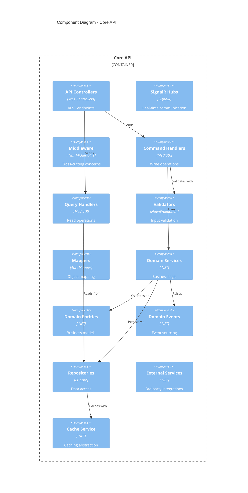
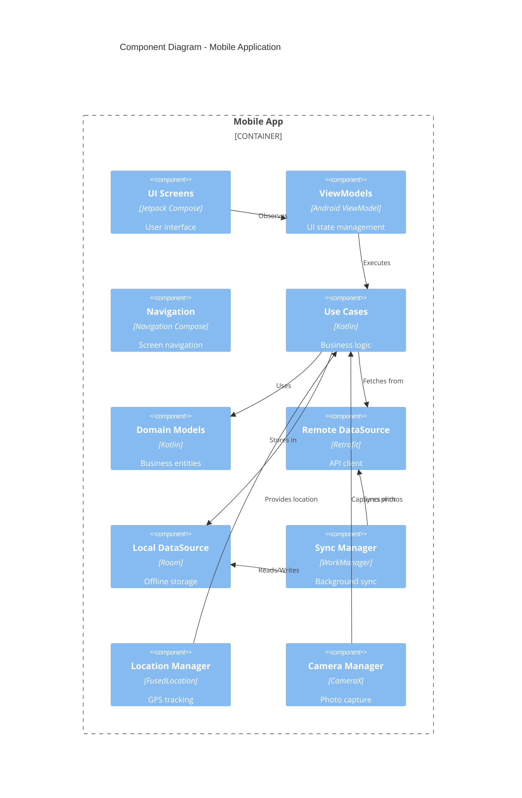
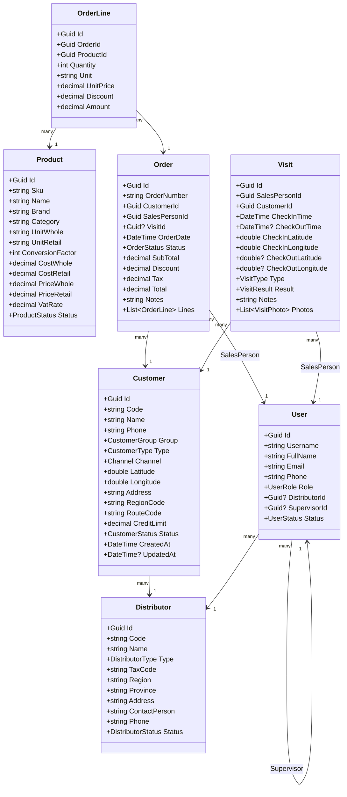
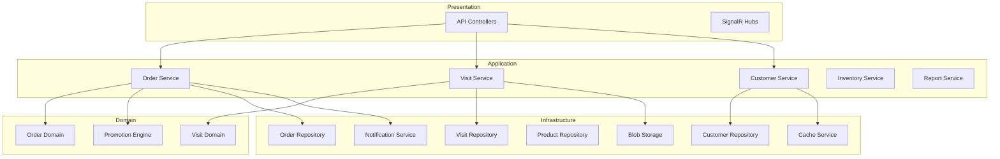

# DILIGO DMS - Component Architecture (C4 Level 3)

## 1. Core API Component Diagram



---

## 2. Mobile App Component Diagram



---

## 3. Detailed Component Specifications

### 3.1 API Controllers

#### AuthController
```csharp
[ApiController]
[Route("api/v1/auth")]
public class AuthController
{
    POST /login          // User authentication
    POST /refresh        // Refresh access token
    POST /logout         // Invalidate tokens
    POST /change-password // Change password
    POST /forgot-password // Password reset request
}
```

#### CustomersController
```csharp
[ApiController]
[Route("api/v1/customers")]
[Authorize]
public class CustomersController
{
    GET    /                  // List customers (paginated)
    GET    /{id}              // Get customer details
    POST   /                  // Create customer
    PUT    /{id}              // Update customer
    DELETE /{id}              // Soft delete customer
    GET    /{id}/visits       // Customer visit history
    GET    /{id}/orders       // Customer order history
    GET    /{id}/ar           // Customer AR balance
    POST   /search            // Advanced search
    POST   /import            // Bulk import
    GET    /export            // Export to Excel
}
```

#### OrdersController
```csharp
[ApiController]
[Route("api/v1/orders")]
[Authorize]
public class OrdersController
{
    GET    /                  // List orders (filtered)
    GET    /{id}              // Get order details
    POST   /                  // Create order
    PUT    /{id}              // Update order
    POST   /{id}/approve      // Approve order
    POST   /{id}/reject       // Reject order
    POST   /{id}/invoice      // Create invoice from order
    GET    /{id}/history      // Order status history
}
```

#### VisitsController
```csharp
[ApiController]
[Route("api/v1/visits")]
[Authorize]
public class VisitsController
{
    GET    /                  // List visits
    GET    /{id}              // Get visit details
    POST   /check-in          // Start visit
    POST   /{id}/check-out    // End visit
    POST   /{id}/photos       // Upload visit photos
    GET    /{id}/photos       // Get visit photos
}
```

#### LocationsController
```csharp
[ApiController]
[Route("api/v1/locations")]
[Authorize]
public class LocationsController
{
    POST   /                  // Report location (batch)
    GET    /current           // Get current locations of team
    GET    /history/{userId}  // Get location history
    GET    /route/{userId}    // Get daily route
}
```

#### InventoryController
```csharp
[ApiController]
[Route("api/v1/inventory")]
[Authorize]
public class InventoryController
{
    GET    /stock             // Get current stock
    POST   /receipt           // Create receipt (nhập kho)
    POST   /issue             // Create issue (xuất kho)
    POST   /transfer          // Transfer between warehouses
    GET    /movements         // Stock movement history
    GET    /alerts            // Low stock alerts
}
```

#### ReportsController
```csharp
[ApiController]
[Route("api/v1/reports")]
[Authorize]
public class ReportsController
{
    GET /sales/by-customer    // Sales by customer
    GET /sales/by-product     // Sales by product
    GET /sales/by-salesperson // Sales by NVBH
    GET /visits/summary       // Visit summary
    GET /kpi/dashboard        // KPI dashboard data
    GET /inventory/xnt        // Inventory XNT report
    POST /export              // Export report to Excel
}
```

### 3.2 Domain Entities



### 3.3 Use Cases (Application Layer)

#### Order Use Cases
```csharp
// Commands
public class CreateOrderCommand : IRequest<OrderDto>
{
    public Guid CustomerId { get; set; }
    public Guid? VisitId { get; set; }
    public List<OrderLineDto> Lines { get; set; }
    public string Notes { get; set; }
}

public class ApproveOrderCommand : IRequest<OrderDto>
{
    public Guid OrderId { get; set; }
    public string ApproverNotes { get; set; }
}

public class RejectOrderCommand : IRequest<OrderDto>
{
    public Guid OrderId { get; set; }
    public string RejectionReason { get; set; }
}

// Queries
public class GetOrdersQuery : IRequest<PagedResult<OrderDto>>
{
    public DateTime? FromDate { get; set; }
    public DateTime? ToDate { get; set; }
    public OrderStatus? Status { get; set; }
    public Guid? CustomerId { get; set; }
    public Guid? SalesPersonId { get; set; }
    public int Page { get; set; } = 1;
    public int PageSize { get; set; } = 20;
}

public class GetOrderByIdQuery : IRequest<OrderDto>
{
    public Guid OrderId { get; set; }
}
```

#### Visit Use Cases
```csharp
// Commands
public class CheckInCommand : IRequest<VisitDto>
{
    public Guid CustomerId { get; set; }
    public double Latitude { get; set; }
    public double Longitude { get; set; }
    public VisitType Type { get; set; }
}

public class CheckOutCommand : IRequest<VisitDto>
{
    public Guid VisitId { get; set; }
    public double Latitude { get; set; }
    public double Longitude { get; set; }
    public VisitResult Result { get; set; }
    public string Notes { get; set; }
}

public class UploadVisitPhotoCommand : IRequest<PhotoDto>
{
    public Guid VisitId { get; set; }
    public string AlbumType { get; set; }
    public IFormFile Photo { get; set; }
    public double Latitude { get; set; }
    public double Longitude { get; set; }
}
```

### 3.4 Mobile App Components

#### ViewModel Example (Kotlin)
```kotlin
@HiltViewModel
class OrderViewModel @Inject constructor(
    private val createOrderUseCase: CreateOrderUseCase,
    private val getProductsUseCase: GetProductsUseCase,
    private val getCustomerUseCase: GetCustomerUseCase
) : ViewModel() {

    private val _uiState = MutableStateFlow(OrderUiState())
    val uiState: StateFlow<OrderUiState> = _uiState.asStateFlow()

    fun loadProducts() {
        viewModelScope.launch {
            getProductsUseCase()
                .onSuccess { products ->
                    _uiState.update { it.copy(products = products) }
                }
                .onFailure { error ->
                    _uiState.update { it.copy(error = error.message) }
                }
        }
    }

    fun addOrderLine(product: Product, quantity: Int) {
        _uiState.update { state ->
            val lines = state.orderLines.toMutableList()
            lines.add(OrderLine(product, quantity))
            state.copy(orderLines = lines, total = calculateTotal(lines))
        }
    }

    fun submitOrder() {
        viewModelScope.launch {
            _uiState.update { it.copy(isLoading = true) }
            createOrderUseCase(
                customerId = uiState.value.customerId,
                visitId = uiState.value.visitId,
                lines = uiState.value.orderLines
            )
            .onSuccess { order ->
                _uiState.update { it.copy(isLoading = false, orderCreated = true) }
            }
            .onFailure { error ->
                _uiState.update { it.copy(isLoading = false, error = error.message) }
            }
        }
    }
}

data class OrderUiState(
    val customerId: String = "",
    val visitId: String? = null,
    val products: List<Product> = emptyList(),
    val orderLines: List<OrderLine> = emptyList(),
    val total: BigDecimal = BigDecimal.ZERO,
    val isLoading: Boolean = false,
    val error: String? = null,
    val orderCreated: Boolean = false
)
```

#### Repository Pattern (Kotlin)
```kotlin
interface OrderRepository {
    suspend fun getOrders(filter: OrderFilter): Result<List<Order>>
    suspend fun getOrderById(id: String): Result<Order>
    suspend fun createOrder(order: CreateOrderRequest): Result<Order>
    suspend fun syncPendingOrders(): Result<Int>
}

class OrderRepositoryImpl @Inject constructor(
    private val remoteDataSource: OrderRemoteDataSource,
    private val localDataSource: OrderLocalDataSource,
    private val networkMonitor: NetworkMonitor
) : OrderRepository {

    override suspend fun createOrder(order: CreateOrderRequest): Result<Order> {
        return if (networkMonitor.isOnline()) {
            // Online: Send to server immediately
            remoteDataSource.createOrder(order)
                .also { result ->
                    result.getOrNull()?.let { localDataSource.saveOrder(it) }
                }
        } else {
            // Offline: Store locally for later sync
            val localOrder = order.toLocalOrder(status = OrderStatus.PENDING_SYNC)
            localDataSource.saveOrder(localOrder)
            Result.success(localOrder)
        }
    }

    override suspend fun syncPendingOrders(): Result<Int> {
        val pendingOrders = localDataSource.getPendingOrders()
        var syncedCount = 0

        pendingOrders.forEach { order ->
            remoteDataSource.createOrder(order.toRequest())
                .onSuccess {
                    localDataSource.markAsSynced(order.id)
                    syncedCount++
                }
        }

        return Result.success(syncedCount)
    }
}
```

### 3.5 Web App Components (Angular)

#### State Management (NgRx)
```typescript
// orders.actions.ts
export const loadOrders = createAction(
  '[Orders] Load Orders',
  props<{ filter: OrderFilter }>()
);

export const loadOrdersSuccess = createAction(
  '[Orders] Load Orders Success',
  props<{ orders: Order[]; total: number }>()
);

export const loadOrdersFailure = createAction(
  '[Orders] Load Orders Failure',
  props<{ error: string }>()
);

export const approveOrder = createAction(
  '[Orders] Approve Order',
  props<{ orderId: string; notes?: string }>()
);

// orders.reducer.ts
export interface OrdersState {
  orders: Order[];
  selectedOrder: Order | null;
  loading: boolean;
  error: string | null;
  total: number;
}

const initialState: OrdersState = {
  orders: [],
  selectedOrder: null,
  loading: false,
  error: null,
  total: 0
};

export const ordersReducer = createReducer(
  initialState,
  on(loadOrders, (state) => ({ ...state, loading: true })),
  on(loadOrdersSuccess, (state, { orders, total }) => ({
    ...state,
    orders,
    total,
    loading: false
  })),
  on(loadOrdersFailure, (state, { error }) => ({
    ...state,
    error,
    loading: false
  }))
);

// orders.effects.ts
@Injectable()
export class OrdersEffects {
  loadOrders$ = createEffect(() =>
    this.actions$.pipe(
      ofType(loadOrders),
      switchMap(({ filter }) =>
        this.orderService.getOrders(filter).pipe(
          map(response => loadOrdersSuccess({
            orders: response.data,
            total: response.total
          })),
          catchError(error => of(loadOrdersFailure({ error: error.message })))
        )
      )
    )
  );

  constructor(
    private actions$: Actions,
    private orderService: OrderService
  ) {}
}
```

#### Component Example
```typescript
@Component({
  selector: 'app-order-list',
  template: `
    <div class="order-list">
      <app-order-filter (filterChange)="onFilterChange($event)"></app-order-filter>

      <mat-table [dataSource]="orders$ | async">
        <ng-container matColumnDef="orderNumber">
          <mat-header-cell *matHeaderCellDef>Order #</mat-header-cell>
          <mat-cell *matCellDef="let order">{{ order.orderNumber }}</mat-cell>
        </ng-container>

        <ng-container matColumnDef="customer">
          <mat-header-cell *matHeaderCellDef>Customer</mat-header-cell>
          <mat-cell *matCellDef="let order">{{ order.customer.name }}</mat-cell>
        </ng-container>

        <ng-container matColumnDef="status">
          <mat-header-cell *matHeaderCellDef>Status</mat-header-cell>
          <mat-cell *matCellDef="let order">
            <app-order-status-badge [status]="order.status"></app-order-status-badge>
          </mat-cell>
        </ng-container>

        <ng-container matColumnDef="actions">
          <mat-header-cell *matHeaderCellDef>Actions</mat-header-cell>
          <mat-cell *matCellDef="let order">
            <button mat-icon-button (click)="viewOrder(order)">
              <mat-icon>visibility</mat-icon>
            </button>
            <button mat-icon-button
                    *ngIf="order.status === 'Pending'"
                    (click)="approveOrder(order)">
              <mat-icon>check</mat-icon>
            </button>
          </mat-cell>
        </ng-container>

        <mat-header-row *matHeaderRowDef="displayedColumns"></mat-header-row>
        <mat-row *matRowDef="let row; columns: displayedColumns;"></mat-row>
      </mat-table>

      <mat-paginator [length]="total$ | async"
                     [pageSize]="20"
                     (page)="onPageChange($event)">
      </mat-paginator>
    </div>
  `
})
export class OrderListComponent implements OnInit {
  orders$ = this.store.select(selectOrders);
  total$ = this.store.select(selectOrdersTotal);
  displayedColumns = ['orderNumber', 'customer', 'status', 'actions'];

  constructor(private store: Store) {}

  ngOnInit() {
    this.store.dispatch(loadOrders({ filter: {} }));
  }

  onFilterChange(filter: OrderFilter) {
    this.store.dispatch(loadOrders({ filter }));
  }

  approveOrder(order: Order) {
    this.store.dispatch(approveOrder({ orderId: order.id }));
  }
}
```

---

## 4. Service Dependencies



---

## 5. Error Handling Strategy

### 5.1 Domain Exceptions
```csharp
public class DomainException : Exception
{
    public string Code { get; }
    public DomainException(string code, string message) : base(message)
    {
        Code = code;
    }
}

public class OrderExceedsCreditLimitException : DomainException
{
    public OrderExceedsCreditLimitException(decimal creditLimit, decimal orderAmount)
        : base("ORDER_EXCEEDS_CREDIT",
               $"Order amount {orderAmount} exceeds credit limit {creditLimit}")
    { }
}

public class CustomerNotInRouteException : DomainException
{
    public CustomerNotInRouteException(string customerId)
        : base("CUSTOMER_NOT_IN_ROUTE",
               $"Customer {customerId} is not in today's route")
    { }
}
```

### 5.2 Global Exception Handler
```csharp
public class GlobalExceptionHandler : IExceptionHandler
{
    public async ValueTask<bool> TryHandleAsync(
        HttpContext context,
        Exception exception,
        CancellationToken cancellationToken)
    {
        var (statusCode, response) = exception switch
        {
            DomainException de => (400, new ErrorResponse(de.Code, de.Message)),
            NotFoundException nf => (404, new ErrorResponse("NOT_FOUND", nf.Message)),
            UnauthorizedException => (401, new ErrorResponse("UNAUTHORIZED", "Authentication required")),
            ForbiddenException => (403, new ErrorResponse("FORBIDDEN", "Access denied")),
            _ => (500, new ErrorResponse("INTERNAL_ERROR", "An error occurred"))
        };

        context.Response.StatusCode = statusCode;
        await context.Response.WriteAsJsonAsync(response, cancellationToken);
        return true;
    }
}
```
