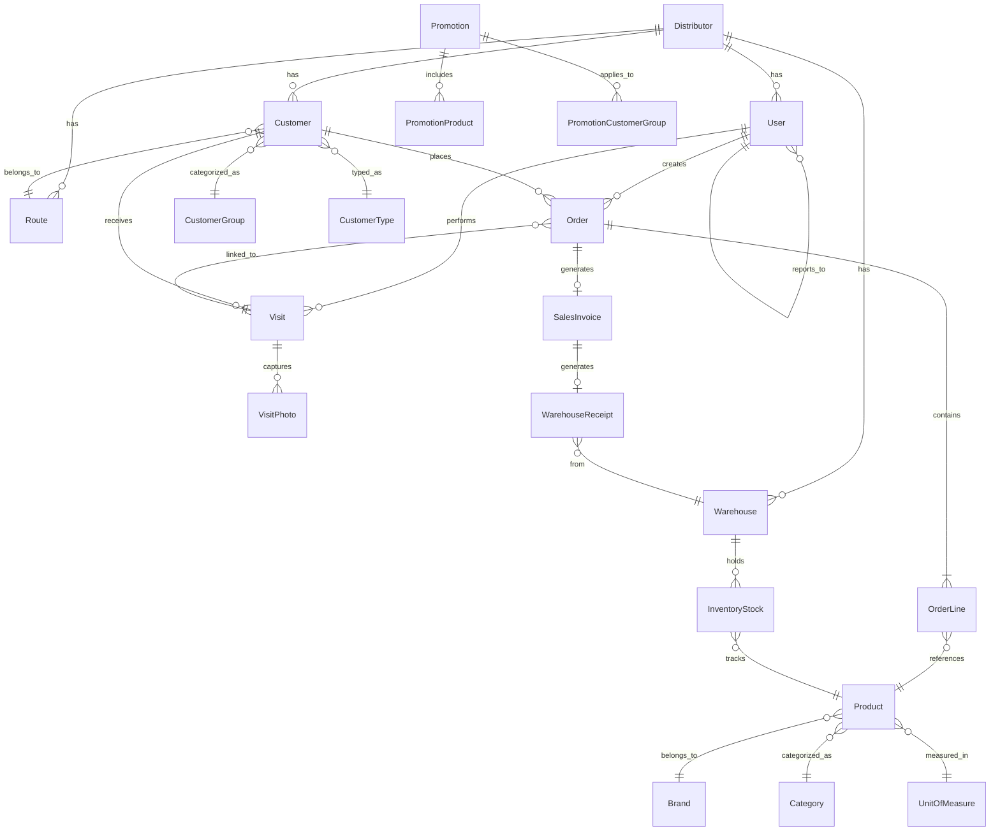
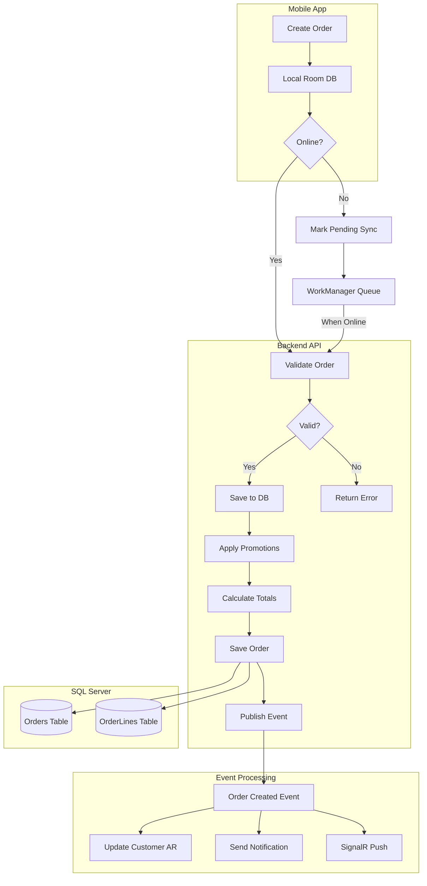
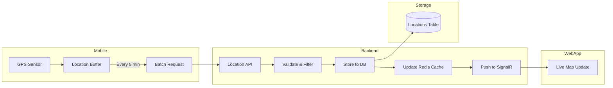
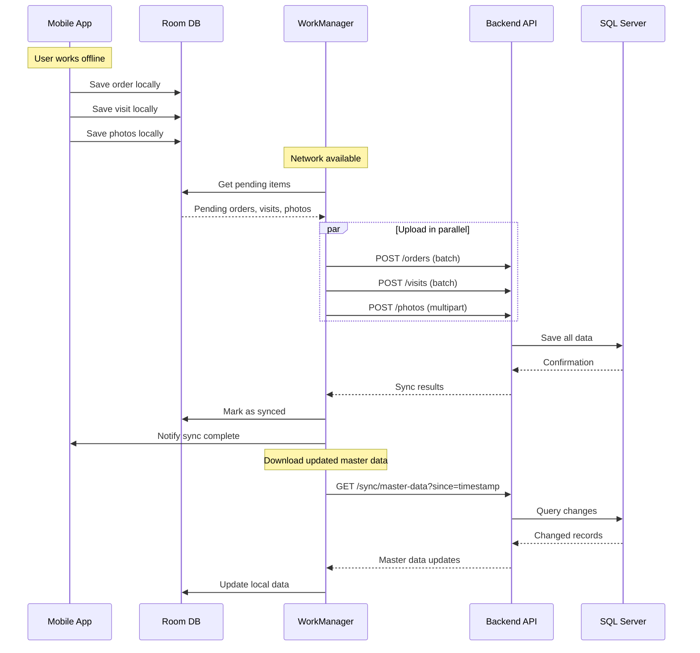
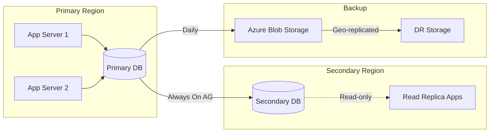
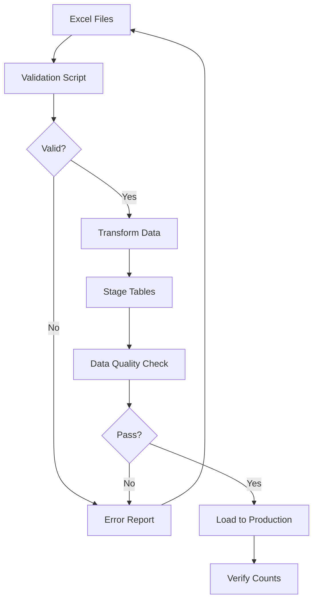

# DILIGO DMS - Data Architecture

## 1. Database Overview

### 1.1 Database Technology Stack

| Component | Technology | Purpose |
|-----------|------------|---------|
| **Primary Database** | SQL Server 2022 Enterprise | Transactional data storage |
| **Search** | SQL Server Full-Text Search | Product/Customer search |
| **Caching** | Redis 7.x | Session, lookup data |
| **File Storage** | Azure Blob Storage | Images, documents |

### 1.2 Database Design Principles

1. **Normalization**: 3NF for master data, denormalized for reporting
2. **Multi-tenancy**: Data isolation by Distributor (DistributorId)
3. **Soft Delete**: IsDeleted flag, no physical deletion
4. **Audit Trail**: Temporal tables for critical entities
5. **Optimistic Concurrency**: RowVersion for concurrent updates

---

## 2. Entity Relationship Diagram



---

## 3. Database Schema

### 3.1 Core Tables

#### Distributors (Nhà phân phối)
```sql
CREATE TABLE dbo.Distributors (
    Id UNIQUEIDENTIFIER PRIMARY KEY DEFAULT NEWSEQUENTIALID(),
    Code NVARCHAR(20) NOT NULL UNIQUE,
    Name NVARCHAR(200) NOT NULL,
    Type TINYINT NOT NULL, -- 1: NPP, 2: Đại lý, 3: Tổng thầu
    TaxCode NVARCHAR(20),
    GroupCode NVARCHAR(10), -- A, B, C, D
    Channel TINYINT NOT NULL, -- 1: GT, 2: MT
    Region NVARCHAR(50),
    Province NVARCHAR(50),
    Address NVARCHAR(500),
    ContactPerson NVARCHAR(100),
    Phone NVARCHAR(20),
    Email NVARCHAR(100),
    BankName NVARCHAR(100),
    BankAccount NVARCHAR(50),
    Status TINYINT NOT NULL DEFAULT 1, -- 1: Active, 0: Inactive
    CreatedAt DATETIME2 NOT NULL DEFAULT GETUTCDATE(),
    CreatedBy UNIQUEIDENTIFIER,
    UpdatedAt DATETIME2,
    UpdatedBy UNIQUEIDENTIFIER,
    IsDeleted BIT NOT NULL DEFAULT 0,
    RowVersion ROWVERSION,

    INDEX IX_Distributors_Code (Code),
    INDEX IX_Distributors_Status (Status) WHERE IsDeleted = 0
);
```

#### Users (Người dùng)
```sql
CREATE TABLE dbo.Users (
    Id UNIQUEIDENTIFIER PRIMARY KEY DEFAULT NEWSEQUENTIALID(),
    DistributorId UNIQUEIDENTIFIER NOT NULL,
    Username NVARCHAR(50) NOT NULL,
    PasswordHash NVARCHAR(256) NOT NULL,
    FullName NVARCHAR(100) NOT NULL,
    Email NVARCHAR(100),
    Phone NVARCHAR(20),
    Role TINYINT NOT NULL, -- 1: NVBH, 2: GSBH, 3: ASM, 4: RSM, 5: Admin
    SupervisorId UNIQUEIDENTIFIER,
    DeviceId NVARCHAR(100), -- Mobile device ID
    FcmToken NVARCHAR(500), -- Firebase token
    Status TINYINT NOT NULL DEFAULT 1,
    LastLoginAt DATETIME2,
    CreatedAt DATETIME2 NOT NULL DEFAULT GETUTCDATE(),
    UpdatedAt DATETIME2,
    IsDeleted BIT NOT NULL DEFAULT 0,
    RowVersion ROWVERSION,

    CONSTRAINT FK_Users_Distributor FOREIGN KEY (DistributorId)
        REFERENCES dbo.Distributors(Id),
    CONSTRAINT FK_Users_Supervisor FOREIGN KEY (SupervisorId)
        REFERENCES dbo.Users(Id),
    CONSTRAINT UQ_Users_Username UNIQUE (DistributorId, Username),

    INDEX IX_Users_DistributorId (DistributorId),
    INDEX IX_Users_SupervisorId (SupervisorId),
    INDEX IX_Users_Role (Role) WHERE IsDeleted = 0
);
```

#### Customers (Khách hàng)
```sql
CREATE TABLE dbo.Customers (
    Id UNIQUEIDENTIFIER PRIMARY KEY DEFAULT NEWSEQUENTIALID(),
    DistributorId UNIQUEIDENTIFIER NOT NULL,
    Code NVARCHAR(20) NOT NULL,
    Name NVARCHAR(200) NOT NULL,
    Phone NVARCHAR(20),
    ContactPerson NVARCHAR(100),
    GroupId UNIQUEIDENTIFIER, -- A, B, C, D, E
    TypeId UNIQUEIDENTIFIER, -- Tạp hóa, Hiệu thuốc, etc.
    Channel TINYINT NOT NULL, -- 1: GT, 2: MT
    Latitude FLOAT,
    Longitude FLOAT,
    Address NVARCHAR(500),
    Ward NVARCHAR(100),
    District NVARCHAR(100),
    Province NVARCHAR(100),
    RegionCode NVARCHAR(20),
    RouteId UNIQUEIDENTIFIER,
    CreditLimit DECIMAL(18, 2) DEFAULT 0,
    CurrentBalance DECIMAL(18, 2) DEFAULT 0, -- AR balance
    ImageUrl NVARCHAR(500),
    Notes NVARCHAR(MAX),
    Status TINYINT NOT NULL DEFAULT 1,
    CreatedAt DATETIME2 NOT NULL DEFAULT GETUTCDATE(),
    CreatedBy UNIQUEIDENTIFIER,
    UpdatedAt DATETIME2,
    UpdatedBy UNIQUEIDENTIFIER,
    IsDeleted BIT NOT NULL DEFAULT 0,
    RowVersion ROWVERSION,

    CONSTRAINT FK_Customers_Distributor FOREIGN KEY (DistributorId)
        REFERENCES dbo.Distributors(Id),
    CONSTRAINT FK_Customers_Route FOREIGN KEY (RouteId)
        REFERENCES dbo.Routes(Id),
    CONSTRAINT UQ_Customers_Code UNIQUE (DistributorId, Code),

    INDEX IX_Customers_DistributorId (DistributorId),
    INDEX IX_Customers_RouteId (RouteId),
    INDEX IX_Customers_Location (Latitude, Longitude),
    INDEX IX_Customers_Search (Name, Code, Phone) WHERE IsDeleted = 0
);

-- Full-text search
CREATE FULLTEXT INDEX ON dbo.Customers (Name, Address)
    KEY INDEX PK_Customers ON CustomersCatalog;
```

#### Products (Sản phẩm)
```sql
CREATE TABLE dbo.Products (
    Id UNIQUEIDENTIFIER PRIMARY KEY DEFAULT NEWSEQUENTIALID(),
    DistributorId UNIQUEIDENTIFIER NOT NULL,
    Sku NVARCHAR(50) NOT NULL,
    Name NVARCHAR(200) NOT NULL,
    BrandId UNIQUEIDENTIFIER,
    CategoryId UNIQUEIDENTIFIER,
    SupplierId UNIQUEIDENTIFIER,
    UnitWhole NVARCHAR(20), -- Đơn vị chẵn (thùng, hộp)
    UnitRetail NVARCHAR(20), -- Đơn vị lẻ (chai, gói)
    ConversionFactor INT DEFAULT 1, -- Hệ số quy đổi
    CostWhole DECIMAL(18, 2), -- Giá nhập chẵn
    CostRetail DECIMAL(18, 2), -- Giá nhập lẻ
    PriceWhole DECIMAL(18, 2), -- Giá bán chẵn
    PriceRetail DECIMAL(18, 2), -- Giá bán lẻ
    VatRate DECIMAL(5, 2) DEFAULT 0,
    ImageUrl NVARCHAR(500),
    Barcode NVARCHAR(50),
    Status TINYINT NOT NULL DEFAULT 1,
    CreatedAt DATETIME2 NOT NULL DEFAULT GETUTCDATE(),
    UpdatedAt DATETIME2,
    IsDeleted BIT NOT NULL DEFAULT 0,
    RowVersion ROWVERSION,

    CONSTRAINT FK_Products_Distributor FOREIGN KEY (DistributorId)
        REFERENCES dbo.Distributors(Id),
    CONSTRAINT UQ_Products_Sku UNIQUE (DistributorId, Sku),

    INDEX IX_Products_DistributorId (DistributorId),
    INDEX IX_Products_BrandId (BrandId),
    INDEX IX_Products_CategoryId (CategoryId),
    INDEX IX_Products_Barcode (Barcode)
);

CREATE FULLTEXT INDEX ON dbo.Products (Name, Sku)
    KEY INDEX PK_Products ON ProductsCatalog;
```

### 3.2 Transactional Tables

#### Orders (Đơn hàng)
```sql
CREATE TABLE dbo.Orders (
    Id UNIQUEIDENTIFIER PRIMARY KEY DEFAULT NEWSEQUENTIALID(),
    DistributorId UNIQUEIDENTIFIER NOT NULL,
    OrderNumber NVARCHAR(20) NOT NULL,
    CustomerId UNIQUEIDENTIFIER NOT NULL,
    SalesPersonId UNIQUEIDENTIFIER NOT NULL,
    VisitId UNIQUEIDENTIFIER,
    OrderDate DATETIME2 NOT NULL,
    Status TINYINT NOT NULL DEFAULT 1, -- 1: Pending, 2: Approved, 3: Rejected, 4: Invoiced
    SubTotal DECIMAL(18, 2) NOT NULL DEFAULT 0,
    DiscountAmount DECIMAL(18, 2) DEFAULT 0,
    TaxAmount DECIMAL(18, 2) DEFAULT 0,
    TotalAmount DECIMAL(18, 2) NOT NULL DEFAULT 0,
    Notes NVARCHAR(MAX),
    ApprovedBy UNIQUEIDENTIFIER,
    ApprovedAt DATETIME2,
    RejectionReason NVARCHAR(500),
    DeviceId NVARCHAR(100), -- Source device
    SyncedAt DATETIME2, -- When synced from mobile
    CreatedAt DATETIME2 NOT NULL DEFAULT GETUTCDATE(),
    UpdatedAt DATETIME2,
    RowVersion ROWVERSION,

    CONSTRAINT FK_Orders_Distributor FOREIGN KEY (DistributorId)
        REFERENCES dbo.Distributors(Id),
    CONSTRAINT FK_Orders_Customer FOREIGN KEY (CustomerId)
        REFERENCES dbo.Customers(Id),
    CONSTRAINT FK_Orders_SalesPerson FOREIGN KEY (SalesPersonId)
        REFERENCES dbo.Users(Id),
    CONSTRAINT FK_Orders_Visit FOREIGN KEY (VisitId)
        REFERENCES dbo.Visits(Id),
    CONSTRAINT UQ_Orders_Number UNIQUE (DistributorId, OrderNumber),

    INDEX IX_Orders_DistributorId (DistributorId),
    INDEX IX_Orders_CustomerId (CustomerId),
    INDEX IX_Orders_SalesPersonId (SalesPersonId),
    INDEX IX_Orders_Status (Status),
    INDEX IX_Orders_OrderDate (OrderDate DESC)
);
```

#### OrderLines (Chi tiết đơn hàng)
```sql
CREATE TABLE dbo.OrderLines (
    Id UNIQUEIDENTIFIER PRIMARY KEY DEFAULT NEWSEQUENTIALID(),
    OrderId UNIQUEIDENTIFIER NOT NULL,
    ProductId UNIQUEIDENTIFIER NOT NULL,
    Quantity INT NOT NULL,
    Unit NVARCHAR(20) NOT NULL,
    UnitPrice DECIMAL(18, 2) NOT NULL,
    DiscountPercent DECIMAL(5, 2) DEFAULT 0,
    DiscountAmount DECIMAL(18, 2) DEFAULT 0,
    Amount DECIMAL(18, 2) NOT NULL,
    PromotionId UNIQUEIDENTIFIER, -- Applied promotion
    Notes NVARCHAR(500),

    CONSTRAINT FK_OrderLines_Order FOREIGN KEY (OrderId)
        REFERENCES dbo.Orders(Id) ON DELETE CASCADE,
    CONSTRAINT FK_OrderLines_Product FOREIGN KEY (ProductId)
        REFERENCES dbo.Products(Id),

    INDEX IX_OrderLines_OrderId (OrderId),
    INDEX IX_OrderLines_ProductId (ProductId)
);
```

#### Visits (Viếng thăm)
```sql
CREATE TABLE dbo.Visits (
    Id UNIQUEIDENTIFIER PRIMARY KEY DEFAULT NEWSEQUENTIALID(),
    DistributorId UNIQUEIDENTIFIER NOT NULL,
    SalesPersonId UNIQUEIDENTIFIER NOT NULL,
    CustomerId UNIQUEIDENTIFIER NOT NULL,
    RouteId UNIQUEIDENTIFIER,
    VisitDate DATE NOT NULL,
    CheckInTime DATETIME2 NOT NULL,
    CheckInLatitude FLOAT NOT NULL,
    CheckInLongitude FLOAT NOT NULL,
    CheckInDistance FLOAT, -- Distance from customer location
    CheckOutTime DATETIME2,
    CheckOutLatitude FLOAT,
    CheckOutLongitude FLOAT,
    Duration INT, -- Duration in minutes
    VisitType TINYINT NOT NULL, -- 1: In-route, 2: Off-route
    Result TINYINT, -- 1: HasOrder, 2: NoOrder, 3: Closed, 4: OwnerAway
    HasPhotos BIT DEFAULT 0,
    Notes NVARCHAR(MAX),
    DeviceId NVARCHAR(100),
    SyncedAt DATETIME2,
    CreatedAt DATETIME2 NOT NULL DEFAULT GETUTCDATE(),

    CONSTRAINT FK_Visits_Distributor FOREIGN KEY (DistributorId)
        REFERENCES dbo.Distributors(Id),
    CONSTRAINT FK_Visits_SalesPerson FOREIGN KEY (SalesPersonId)
        REFERENCES dbo.Users(Id),
    CONSTRAINT FK_Visits_Customer FOREIGN KEY (CustomerId)
        REFERENCES dbo.Customers(Id),

    INDEX IX_Visits_DistributorId (DistributorId),
    INDEX IX_Visits_SalesPersonId (SalesPersonId),
    INDEX IX_Visits_CustomerId (CustomerId),
    INDEX IX_Visits_VisitDate (VisitDate DESC),
    INDEX IX_Visits_SalesPersonDate (SalesPersonId, VisitDate)
);
```

#### VisitPhotos (Hình ảnh viếng thăm)
```sql
CREATE TABLE dbo.VisitPhotos (
    Id UNIQUEIDENTIFIER PRIMARY KEY DEFAULT NEWSEQUENTIALID(),
    VisitId UNIQUEIDENTIFIER NOT NULL,
    AlbumType NVARCHAR(50) NOT NULL, -- Trưng bày, Mặt tiền, POSM, etc.
    ImageUrl NVARCHAR(500) NOT NULL,
    ThumbnailUrl NVARCHAR(500),
    Latitude FLOAT,
    Longitude FLOAT,
    CapturedAt DATETIME2 NOT NULL,
    FileSize INT,
    CreatedAt DATETIME2 NOT NULL DEFAULT GETUTCDATE(),

    CONSTRAINT FK_VisitPhotos_Visit FOREIGN KEY (VisitId)
        REFERENCES dbo.Visits(Id) ON DELETE CASCADE,

    INDEX IX_VisitPhotos_VisitId (VisitId),
    INDEX IX_VisitPhotos_AlbumType (AlbumType)
);
```

#### Locations (Vị trí GPS)
```sql
CREATE TABLE dbo.Locations (
    Id BIGINT IDENTITY(1,1) PRIMARY KEY,
    UserId UNIQUEIDENTIFIER NOT NULL,
    Latitude FLOAT NOT NULL,
    Longitude FLOAT NOT NULL,
    Accuracy FLOAT,
    Altitude FLOAT,
    Speed FLOAT,
    Bearing FLOAT,
    BatteryLevel INT,
    IsMoving BIT,
    RecordedAt DATETIME2 NOT NULL,
    SyncedAt DATETIME2 NOT NULL DEFAULT GETUTCDATE(),

    CONSTRAINT FK_Locations_User FOREIGN KEY (UserId)
        REFERENCES dbo.Users(Id),

    INDEX IX_Locations_UserId_RecordedAt (UserId, RecordedAt DESC)
) WITH (DATA_COMPRESSION = PAGE);

-- Partition by month for large datasets
CREATE PARTITION FUNCTION PF_Locations_Monthly (DATETIME2)
AS RANGE RIGHT FOR VALUES (
    '2026-01-01', '2026-02-01', '2026-03-01', '2026-04-01',
    '2026-05-01', '2026-06-01', '2026-07-01', '2026-08-01',
    '2026-09-01', '2026-10-01', '2026-11-01', '2026-12-01'
);
```

### 3.3 Inventory Tables

#### Warehouses (Kho hàng)
```sql
CREATE TABLE dbo.Warehouses (
    Id UNIQUEIDENTIFIER PRIMARY KEY DEFAULT NEWSEQUENTIALID(),
    DistributorId UNIQUEIDENTIFIER NOT NULL,
    Code NVARCHAR(20) NOT NULL,
    Name NVARCHAR(100) NOT NULL,
    Address NVARCHAR(500),
    Type TINYINT NOT NULL DEFAULT 1, -- 1: Main, 2: Transit
    Status TINYINT NOT NULL DEFAULT 1,
    CreatedAt DATETIME2 NOT NULL DEFAULT GETUTCDATE(),
    IsDeleted BIT NOT NULL DEFAULT 0,

    CONSTRAINT FK_Warehouses_Distributor FOREIGN KEY (DistributorId)
        REFERENCES dbo.Distributors(Id),
    CONSTRAINT UQ_Warehouses_Code UNIQUE (DistributorId, Code)
);
```

#### InventoryStock (Tồn kho)
```sql
CREATE TABLE dbo.InventoryStock (
    Id UNIQUEIDENTIFIER PRIMARY KEY DEFAULT NEWSEQUENTIALID(),
    WarehouseId UNIQUEIDENTIFIER NOT NULL,
    ProductId UNIQUEIDENTIFIER NOT NULL,
    QuantityOnHand INT NOT NULL DEFAULT 0,
    QuantityReserved INT NOT NULL DEFAULT 0,
    QuantityAvailable AS (QuantityOnHand - QuantityReserved),
    ReorderLevel INT,
    LastUpdatedAt DATETIME2 NOT NULL DEFAULT GETUTCDATE(),
    RowVersion ROWVERSION,

    CONSTRAINT FK_InventoryStock_Warehouse FOREIGN KEY (WarehouseId)
        REFERENCES dbo.Warehouses(Id),
    CONSTRAINT FK_InventoryStock_Product FOREIGN KEY (ProductId)
        REFERENCES dbo.Products(Id),
    CONSTRAINT UQ_InventoryStock UNIQUE (WarehouseId, ProductId),

    INDEX IX_InventoryStock_ProductId (ProductId)
);
```

#### InventoryMovements (Phiếu xuất nhập kho)
```sql
CREATE TABLE dbo.InventoryMovements (
    Id UNIQUEIDENTIFIER PRIMARY KEY DEFAULT NEWSEQUENTIALID(),
    DistributorId UNIQUEIDENTIFIER NOT NULL,
    MovementNumber NVARCHAR(20) NOT NULL,
    MovementType TINYINT NOT NULL, -- 1: Receipt, 2: Issue, 3: Transfer
    WarehouseId UNIQUEIDENTIFIER NOT NULL,
    ToWarehouseId UNIQUEIDENTIFIER, -- For transfers
    ReferenceType NVARCHAR(50), -- Order, Return, Adjustment
    ReferenceId UNIQUEIDENTIFIER,
    MovementDate DATETIME2 NOT NULL,
    Status TINYINT NOT NULL DEFAULT 1,
    Notes NVARCHAR(MAX),
    CreatedBy UNIQUEIDENTIFIER NOT NULL,
    CreatedAt DATETIME2 NOT NULL DEFAULT GETUTCDATE(),
    ApprovedBy UNIQUEIDENTIFIER,
    ApprovedAt DATETIME2,

    CONSTRAINT FK_InventoryMovements_Distributor FOREIGN KEY (DistributorId)
        REFERENCES dbo.Distributors(Id),
    CONSTRAINT FK_InventoryMovements_Warehouse FOREIGN KEY (WarehouseId)
        REFERENCES dbo.Warehouses(Id),

    INDEX IX_InventoryMovements_DistributorId (DistributorId),
    INDEX IX_InventoryMovements_MovementDate (MovementDate DESC)
);
```

---

## 4. Data Flow Diagrams

### 4.1 Order Data Flow



### 4.2 Location Tracking Data Flow



### 4.3 Sync Data Flow (Offline Mode)



---

## 5. Indexing Strategy

### 5.1 Clustered Indexes
- Primary keys use `NEWSEQUENTIALID()` for better insert performance
- Timestamp-based tables (Locations) use identity columns

### 5.2 Non-Clustered Indexes
| Table | Index | Columns | Purpose |
|-------|-------|---------|---------|
| Customers | IX_Search | (Name, Code, Phone) | Quick lookup |
| Orders | IX_Status_Date | (Status, OrderDate) | Status filtering |
| Visits | IX_SalesPersonDate | (SalesPersonId, VisitDate) | Daily visits query |
| Locations | IX_UserRecorded | (UserId, RecordedAt DESC) | Track history |

### 5.3 Full-Text Indexes
- Customers: Name, Address
- Products: Name, Sku

### 5.4 Filtered Indexes
```sql
-- Only active records
CREATE INDEX IX_Customers_Active
ON dbo.Customers (Name, Code)
WHERE IsDeleted = 0 AND Status = 1;

-- Pending orders only
CREATE INDEX IX_Orders_Pending
ON dbo.Orders (OrderDate DESC)
WHERE Status = 1;
```

---

## 6. Data Retention & Archival

### 6.1 Retention Policies

| Data Type | Hot Storage | Warm Storage | Archive |
|-----------|-------------|--------------|---------|
| Master Data | Forever | - | - |
| Orders | 2 years | 5 years | 10 years |
| Visits | 1 year | 3 years | 5 years |
| Locations | 3 months | 1 year | 3 years |
| Photos | 1 year | 3 years | 5 years |
| Audit Logs | 1 year | 3 years | 7 years |

### 6.2 Archival Strategy

```sql
-- Monthly archival job for Locations
CREATE PROCEDURE dbo.ArchiveOldLocations
AS
BEGIN
    DECLARE @CutoffDate DATETIME2 = DATEADD(MONTH, -3, GETUTCDATE());

    -- Move to archive table
    INSERT INTO dbo.LocationsArchive
    SELECT * FROM dbo.Locations
    WHERE RecordedAt < @CutoffDate;

    -- Delete from main table
    DELETE FROM dbo.Locations
    WHERE RecordedAt < @CutoffDate;
END;
```

---

## 7. Backup & Recovery

### 7.1 Backup Strategy

| Backup Type | Frequency | Retention |
|-------------|-----------|-----------|
| Full Backup | Daily | 30 days |
| Differential | Every 4 hours | 7 days |
| Transaction Log | Every 15 minutes | 3 days |

### 7.2 Recovery Objectives

| Metric | Target |
|--------|--------|
| RTO (Recovery Time Objective) | < 4 hours |
| RPO (Recovery Point Objective) | < 15 minutes |

### 7.3 High Availability



---

## 8. Data Migration

### 8.1 Initial Data Load



### 8.2 Migration Scripts

```sql
-- Example: Migrate customers from CSV
CREATE PROCEDURE dbo.ImportCustomers
    @DistributorId UNIQUEIDENTIFIER,
    @ImportBatchId UNIQUEIDENTIFIER
AS
BEGIN
    SET XACT_ABORT ON;
    BEGIN TRANSACTION;

    -- Insert from staging table
    INSERT INTO dbo.Customers (
        DistributorId, Code, Name, Phone, Address,
        Latitude, Longitude, GroupId, TypeId, Status
    )
    SELECT
        @DistributorId,
        stg.CustomerCode,
        stg.CustomerName,
        stg.Phone,
        stg.Address,
        TRY_CAST(stg.Latitude AS FLOAT),
        TRY_CAST(stg.Longitude AS FLOAT),
        cg.Id,
        ct.Id,
        1 -- Active
    FROM dbo.CustomerImportStaging stg
    LEFT JOIN dbo.CustomerGroups cg ON cg.Code = stg.GroupCode
    LEFT JOIN dbo.CustomerTypes ct ON ct.Code = stg.TypeCode
    WHERE stg.ImportBatchId = @ImportBatchId
        AND stg.IsValid = 1;

    COMMIT TRANSACTION;
END;
```

---

## 9. Performance Optimization

### 9.1 Query Optimization Guidelines

1. **Use Parameterized Queries**: Prevent SQL injection and enable plan reuse
2. **Avoid SELECT ***: Only select needed columns
3. **Use Pagination**: OFFSET-FETCH for large result sets
4. **Index Hints**: Use sparingly when optimizer chooses wrong plan

### 9.2 Common Query Patterns

```sql
-- Paginated orders with customer info
SELECT
    o.Id, o.OrderNumber, o.OrderDate, o.Status, o.TotalAmount,
    c.Code AS CustomerCode, c.Name AS CustomerName,
    u.FullName AS SalesPersonName
FROM dbo.Orders o
INNER JOIN dbo.Customers c ON c.Id = o.CustomerId
INNER JOIN dbo.Users u ON u.Id = o.SalesPersonId
WHERE o.DistributorId = @DistributorId
    AND o.OrderDate >= @FromDate
    AND o.OrderDate < @ToDate
    AND (@Status IS NULL OR o.Status = @Status)
ORDER BY o.OrderDate DESC
OFFSET @Offset ROWS FETCH NEXT @PageSize ROWS ONLY;

-- Daily visit summary
SELECT
    v.SalesPersonId,
    u.FullName,
    COUNT(*) AS TotalVisits,
    SUM(CASE WHEN v.VisitType = 1 THEN 1 ELSE 0 END) AS InRouteVisits,
    SUM(CASE WHEN v.Result = 1 THEN 1 ELSE 0 END) AS VisitsWithOrder,
    SUM(CASE WHEN v.HasPhotos = 1 THEN 1 ELSE 0 END) AS VisitsWithPhotos
FROM dbo.Visits v
INNER JOIN dbo.Users u ON u.Id = v.SalesPersonId
WHERE v.DistributorId = @DistributorId
    AND v.VisitDate = @Date
GROUP BY v.SalesPersonId, u.FullName;
```

### 9.3 Caching Strategy

| Data Type | Cache Key Pattern | TTL | Invalidation |
|-----------|-------------------|-----|--------------|
| Products | `products:{distributorId}` | 1 hour | On product update |
| Customers | `customer:{customerId}` | 30 min | On customer update |
| User Session | `session:{userId}` | 30 min | On logout/timeout |
| Route Customers | `route:{routeId}:customers` | 1 hour | On route update |
