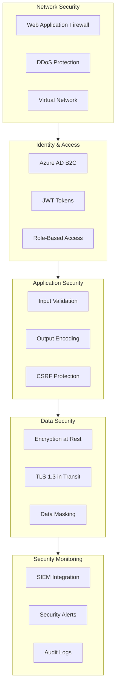
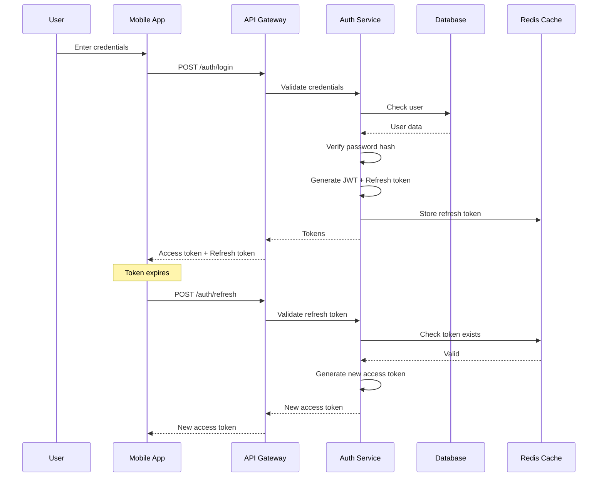
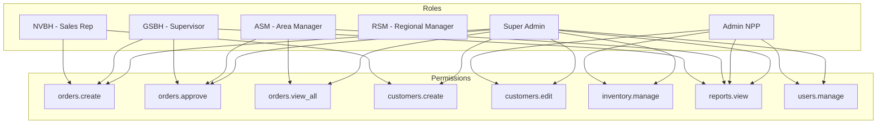
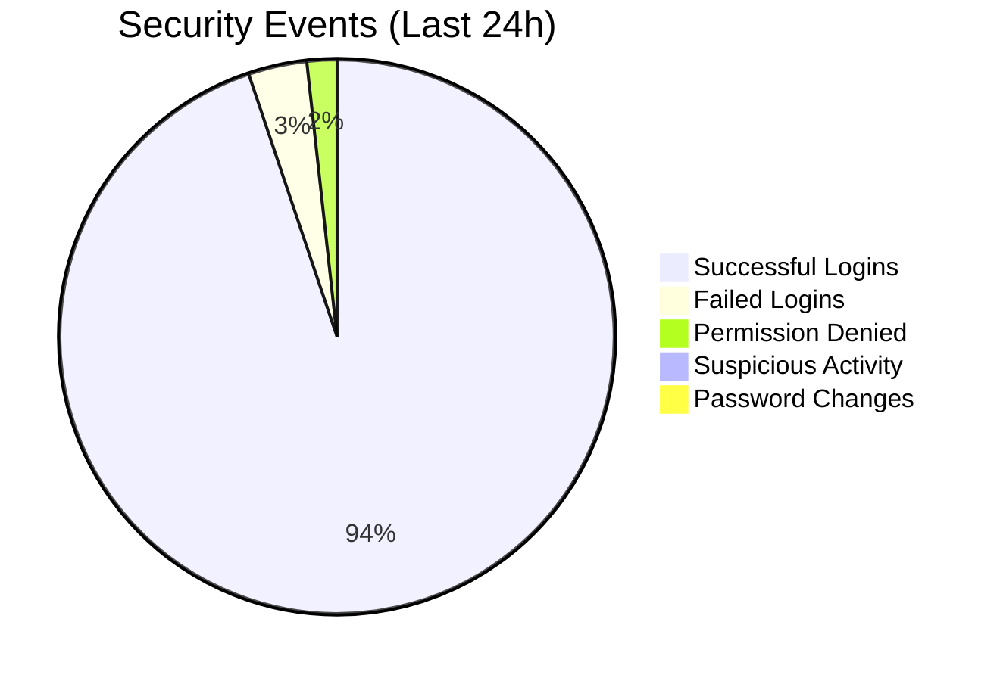
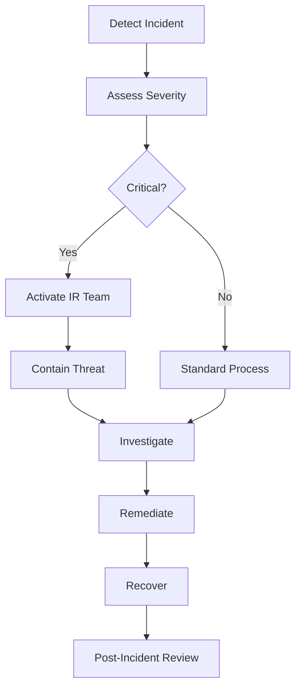

# DILIGO DMS - Security Architecture

## 1. Security Overview

### 1.1 Security Principles

| Principle | Implementation |
|-----------|----------------|
| **Defense in Depth** | Multiple layers of security controls |
| **Least Privilege** | Minimal access rights for users and services |
| **Zero Trust** | Verify all requests, never trust by default |
| **Secure by Default** | Security enabled out of the box |
| **Audit Everything** | Comprehensive logging of all actions |

### 1.2 Security Architecture Layers



---

## 2. Authentication Architecture

### 2.1 Authentication Flow



### 2.2 JWT Token Structure

```json
// Access Token (15 minutes expiry)
{
  "header": {
    "alg": "RS256",
    "typ": "JWT",
    "kid": "key-id-123"
  },
  "payload": {
    "sub": "user-uuid",
    "iss": "https://api.diligo-dms.com",
    "aud": "diligo-dms",
    "exp": 1706889600,
    "iat": 1706888700,
    "jti": "unique-token-id",
    "role": "NVBH",
    "distributorId": "distributor-uuid",
    "supervisorId": "supervisor-uuid",
    "permissions": ["orders.create", "visits.create", "customers.read"]
  }
}

// Refresh Token (7 days expiry, stored in Redis)
{
  "tokenId": "refresh-token-uuid",
  "userId": "user-uuid",
  "deviceId": "device-fingerprint",
  "createdAt": "2026-02-02T10:00:00Z",
  "expiresAt": "2026-02-09T10:00:00Z"
}
```

### 2.3 Password Policy

| Requirement | Value |
|-------------|-------|
| Minimum length | 8 characters |
| Uppercase letters | At least 1 |
| Lowercase letters | At least 1 |
| Numbers | At least 1 |
| Special characters | At least 1 |
| Password history | Last 5 passwords |
| Maximum age | 90 days |
| Lockout threshold | 5 failed attempts |
| Lockout duration | 15 minutes |

### 2.4 Password Hashing

```csharp
public class PasswordHasher
{
    private const int SaltSize = 16;
    private const int KeySize = 32;
    private const int Iterations = 100000;

    public string HashPassword(string password)
    {
        using var rng = RandomNumberGenerator.Create();
        var salt = new byte[SaltSize];
        rng.GetBytes(salt);

        using var pbkdf2 = new Rfc2898DeriveBytes(
            password,
            salt,
            Iterations,
            HashAlgorithmName.SHA256);

        var hash = pbkdf2.GetBytes(KeySize);

        return $"{Convert.ToBase64String(salt)}.{Convert.ToBase64String(hash)}";
    }

    public bool VerifyPassword(string password, string hashedPassword)
    {
        var parts = hashedPassword.Split('.');
        var salt = Convert.FromBase64String(parts[0]);
        var hash = Convert.FromBase64String(parts[1]);

        using var pbkdf2 = new Rfc2898DeriveBytes(
            password,
            salt,
            Iterations,
            HashAlgorithmName.SHA256);

        var computedHash = pbkdf2.GetBytes(KeySize);
        return CryptographicOperations.FixedTimeEquals(hash, computedHash);
    }
}
```

---

## 3. Authorization Architecture

### 3.1 Role-Based Access Control (RBAC)



### 3.2 Permission Matrix

| Permission | NVBH | GSBH | ASM | RSM | Admin | SuperAdmin |
|------------|------|------|-----|-----|-------|------------|
| orders.create | ✓ | ✓ | - | - | ✓ | ✓ |
| orders.view_own | ✓ | ✓ | - | - | - | ✓ |
| orders.view_team | - | ✓ | ✓ | ✓ | - | ✓ |
| orders.view_all | - | - | - | - | ✓ | ✓ |
| orders.approve | - | ✓ | ✓ | - | ✓ | ✓ |
| visits.create | ✓ | ✓ | - | - | - | ✓ |
| visits.view_team | - | ✓ | ✓ | ✓ | - | ✓ |
| customers.create | ✓ | ✓ | - | - | ✓ | ✓ |
| customers.edit | - | - | - | - | ✓ | ✓ |
| products.manage | - | - | - | - | ✓ | ✓ |
| inventory.manage | - | - | - | - | ✓ | ✓ |
| reports.view | - | ✓ | ✓ | ✓ | ✓ | ✓ |
| users.manage | - | - | - | - | ✓ | ✓ |

### 3.3 Data-Level Authorization

```csharp
// Filter data by user's access level
public class DataAuthorizationFilter
{
    public IQueryable<Order> ApplyFilter(IQueryable<Order> query, ClaimsPrincipal user)
    {
        var distributorId = user.GetDistributorId();
        var role = user.GetRole();
        var userId = user.GetUserId();

        // Always filter by distributor (tenant isolation)
        query = query.Where(o => o.DistributorId == distributorId);

        return role switch
        {
            Role.NVBH => query.Where(o => o.SalesPersonId == userId),
            Role.GSBH => query.Where(o => o.SalesPerson.SupervisorId == userId
                                      || o.SalesPersonId == userId),
            Role.ASM => query.Where(o => IsInManagedArea(o, user)),
            Role.RSM => query.Where(o => IsInManagedRegion(o, user)),
            Role.Admin => query, // All orders in distributor
            _ => query.Where(o => false) // No access
        };
    }
}
```

### 3.4 Authorization Middleware

```csharp
[AttributeUsage(AttributeTargets.Method | AttributeTargets.Class)]
public class RequirePermissionAttribute : AuthorizeAttribute, IAuthorizationFilter
{
    public string Permission { get; }

    public RequirePermissionAttribute(string permission)
    {
        Permission = permission;
    }

    public void OnAuthorization(AuthorizationFilterContext context)
    {
        var user = context.HttpContext.User;
        if (!user.HasPermission(Permission))
        {
            context.Result = new ForbidResult();
        }
    }
}

// Usage
[ApiController]
[Route("api/v1/orders")]
public class OrdersController : ControllerBase
{
    [HttpPost]
    [RequirePermission("orders.create")]
    public async Task<IActionResult> Create([FromBody] CreateOrderRequest request)
    {
        // ...
    }

    [HttpPost("{id}/approve")]
    [RequirePermission("orders.approve")]
    public async Task<IActionResult> Approve(Guid id)
    {
        // ...
    }
}
```

---

## 4. API Security

### 4.1 API Security Controls

| Control | Implementation |
|---------|----------------|
| Authentication | JWT Bearer tokens |
| Authorization | RBAC + Data-level filtering |
| Rate Limiting | 1000 req/min per user |
| Input Validation | FluentValidation |
| Output Encoding | JSON serialization with encoding |
| CORS | Whitelist allowed origins |
| HTTPS Only | TLS 1.3 enforced |

### 4.2 Rate Limiting Configuration

```csharp
builder.Services.AddRateLimiter(options =>
{
    options.GlobalLimiter = PartitionedRateLimiter.Create<HttpContext, string>(context =>
    {
        var userId = context.User?.GetUserId() ?? context.Connection.RemoteIpAddress?.ToString();

        return RateLimitPartition.GetFixedWindowLimiter(
            partitionKey: userId,
            factory: _ => new FixedWindowRateLimiterOptions
            {
                PermitLimit = 1000,
                Window = TimeSpan.FromMinutes(1),
                QueueProcessingOrder = QueueProcessingOrder.OldestFirst,
                QueueLimit = 100
            });
    });

    options.OnRejected = async (context, token) =>
    {
        context.HttpContext.Response.StatusCode = 429;
        await context.HttpContext.Response.WriteAsJsonAsync(new
        {
            error = "Too many requests",
            retryAfter = context.Lease.TryGetMetadata(MetadataName.RetryAfter, out var retryAfter)
                ? retryAfter.TotalSeconds
                : 60
        });
    };
});
```

### 4.3 Input Validation

```csharp
public class CreateOrderValidator : AbstractValidator<CreateOrderRequest>
{
    public CreateOrderValidator()
    {
        RuleFor(x => x.CustomerId)
            .NotEmpty()
            .WithMessage("Customer ID is required");

        RuleFor(x => x.Lines)
            .NotEmpty()
            .WithMessage("Order must have at least one line");

        RuleForEach(x => x.Lines).ChildRules(line =>
        {
            line.RuleFor(l => l.ProductId)
                .NotEmpty();

            line.RuleFor(l => l.Quantity)
                .GreaterThan(0)
                .WithMessage("Quantity must be positive");

            line.RuleFor(l => l.UnitPrice)
                .GreaterThanOrEqualTo(0)
                .WithMessage("Unit price cannot be negative");
        });

        RuleFor(x => x.Notes)
            .MaximumLength(1000)
            .WithMessage("Notes cannot exceed 1000 characters");
    }
}
```

### 4.4 SQL Injection Prevention

```csharp
// GOOD: Parameterized query with EF Core
var orders = await _context.Orders
    .Where(o => o.CustomerId == customerId && o.Status == status)
    .ToListAsync();

// BAD: String concatenation (NEVER do this)
// var orders = await _context.Orders
//     .FromSqlRaw($"SELECT * FROM Orders WHERE CustomerId = '{customerId}'")
//     .ToListAsync();

// GOOD: If raw SQL needed, use parameters
var orders = await _context.Orders
    .FromSqlInterpolated($"SELECT * FROM Orders WHERE CustomerId = {customerId}")
    .ToListAsync();
```

---

## 5. Mobile Security

### 5.1 Mobile Security Controls

| Control | Android Implementation |
|---------|------------------------|
| Certificate Pinning | OkHttp CertificatePinner |
| Root Detection | RootBeer library |
| Secure Storage | EncryptedSharedPreferences |
| Biometric Auth | BiometricPrompt |
| Code Obfuscation | R8/ProGuard |
| Tamper Detection | SafetyNet Attestation |

### 5.2 Certificate Pinning

```kotlin
class ApiClient @Inject constructor() {

    private val certificatePinner = CertificatePinner.Builder()
        .add("api.diligo-dms.com", "sha256/AAAAAAAAAAAAAAAAAAAAAAAAAAAAAAAAAAAAAAAAAAA=")
        .add("api.diligo-dms.com", "sha256/BBBBBBBBBBBBBBBBBBBBBBBBBBBBBBBBBBBBBBBBBBB=")
        .build()

    val okHttpClient = OkHttpClient.Builder()
        .certificatePinner(certificatePinner)
        .addInterceptor(AuthInterceptor())
        .build()
}
```

### 5.3 Secure Token Storage

```kotlin
class SecureTokenStorage @Inject constructor(
    @ApplicationContext private val context: Context
) {
    private val masterKey = MasterKey.Builder(context)
        .setKeyScheme(MasterKey.KeyScheme.AES256_GCM)
        .build()

    private val encryptedPrefs = EncryptedSharedPreferences.create(
        context,
        "secure_prefs",
        masterKey,
        EncryptedSharedPreferences.PrefKeyEncryptionScheme.AES256_SIV,
        EncryptedSharedPreferences.PrefValueEncryptionScheme.AES256_GCM
    )

    fun saveToken(accessToken: String, refreshToken: String) {
        encryptedPrefs.edit()
            .putString("access_token", accessToken)
            .putString("refresh_token", refreshToken)
            .apply()
    }

    fun getAccessToken(): String? = encryptedPrefs.getString("access_token", null)
    fun getRefreshToken(): String? = encryptedPrefs.getString("refresh_token", null)

    fun clearTokens() {
        encryptedPrefs.edit().clear().apply()
    }
}
```

### 5.4 Root Detection

```kotlin
class SecurityChecker @Inject constructor(
    @ApplicationContext private val context: Context
) {
    private val rootBeer = RootBeer(context)

    fun isDeviceSecure(): Boolean {
        return !rootBeer.isRooted &&
               !isEmulator() &&
               !isDebuggable()
    }

    private fun isEmulator(): Boolean {
        return Build.FINGERPRINT.contains("generic") ||
               Build.MODEL.contains("Emulator") ||
               Build.MANUFACTURER.contains("Genymotion")
    }

    private fun isDebuggable(): Boolean {
        return (context.applicationInfo.flags and ApplicationInfo.FLAG_DEBUGGABLE) != 0
    }
}
```

---

## 6. Data Encryption

### 6.1 Encryption at Rest

| Data Type | Encryption Method |
|-----------|-------------------|
| SQL Server Database | TDE (Transparent Data Encryption) |
| Azure Blob Storage | SSE with Microsoft-managed keys |
| Redis Cache | Azure managed encryption |
| Mobile Local DB | SQLCipher |
| Sensitive Fields | Column-level encryption |

### 6.2 TDE Configuration (SQL Server)

```sql
-- Create master key
CREATE MASTER KEY ENCRYPTION BY PASSWORD = 'StrongPassword123!';

-- Create certificate
CREATE CERTIFICATE TDECert WITH SUBJECT = 'TDE Certificate';

-- Create database encryption key
USE DiligoDMS;
CREATE DATABASE ENCRYPTION KEY
WITH ALGORITHM = AES_256
ENCRYPTION BY SERVER CERTIFICATE TDECert;

-- Enable TDE
ALTER DATABASE DiligoDMS SET ENCRYPTION ON;
```

### 6.3 Column-Level Encryption

```csharp
public class EncryptionService
{
    private readonly byte[] _key;
    private readonly byte[] _iv;

    public string Encrypt(string plainText)
    {
        using var aes = Aes.Create();
        aes.Key = _key;
        aes.IV = _iv;

        using var encryptor = aes.CreateEncryptor();
        var plainBytes = Encoding.UTF8.GetBytes(plainText);
        var cipherBytes = encryptor.TransformFinalBlock(plainBytes, 0, plainBytes.Length);

        return Convert.ToBase64String(cipherBytes);
    }

    public string Decrypt(string cipherText)
    {
        using var aes = Aes.Create();
        aes.Key = _key;
        aes.IV = _iv;

        using var decryptor = aes.CreateDecryptor();
        var cipherBytes = Convert.FromBase64String(cipherText);
        var plainBytes = decryptor.TransformFinalBlock(cipherBytes, 0, cipherBytes.Length);

        return Encoding.UTF8.GetString(plainBytes);
    }
}
```

### 6.4 Encryption in Transit

- TLS 1.3 for all HTTPS connections
- Strong cipher suites only
- HSTS enabled with 1-year max-age

```csharp
// Kestrel TLS configuration
builder.WebHost.ConfigureKestrel(options =>
{
    options.ConfigureHttpsDefaults(https =>
    {
        https.SslProtocols = SslProtocols.Tls13 | SslProtocols.Tls12;
    });
});

// HSTS configuration
app.UseHsts();
```

---

## 7. Audit & Logging

### 7.1 Audit Events

| Event Category | Events |
|----------------|--------|
| Authentication | Login, Logout, Failed Login, Password Change |
| Authorization | Access Denied, Permission Change |
| Data Access | Read, Create, Update, Delete |
| System | Config Change, Service Start/Stop |

### 7.2 Audit Log Schema

```sql
CREATE TABLE dbo.AuditLogs (
    Id BIGINT IDENTITY(1,1) PRIMARY KEY,
    Timestamp DATETIME2 NOT NULL DEFAULT GETUTCDATE(),
    EventType NVARCHAR(50) NOT NULL,
    EventCategory NVARCHAR(50) NOT NULL,
    UserId UNIQUEIDENTIFIER,
    UserName NVARCHAR(100),
    DistributorId UNIQUEIDENTIFIER,
    IpAddress NVARCHAR(50),
    UserAgent NVARCHAR(500),
    ResourceType NVARCHAR(50),
    ResourceId NVARCHAR(100),
    Action NVARCHAR(50),
    OldValues NVARCHAR(MAX), -- JSON
    NewValues NVARCHAR(MAX), -- JSON
    Result NVARCHAR(20), -- Success, Failure
    ErrorMessage NVARCHAR(500),
    CorrelationId UNIQUEIDENTIFIER,

    INDEX IX_AuditLogs_Timestamp (Timestamp DESC),
    INDEX IX_AuditLogs_UserId (UserId, Timestamp DESC),
    INDEX IX_AuditLogs_ResourceType (ResourceType, ResourceId)
);
```

### 7.3 Audit Logging Implementation

```csharp
public class AuditService : IAuditService
{
    private readonly ApplicationDbContext _context;
    private readonly IHttpContextAccessor _httpContextAccessor;

    public async Task LogAsync(AuditEvent auditEvent)
    {
        var httpContext = _httpContextAccessor.HttpContext;
        var user = httpContext?.User;

        var log = new AuditLog
        {
            Timestamp = DateTime.UtcNow,
            EventType = auditEvent.EventType,
            EventCategory = auditEvent.Category,
            UserId = user?.GetUserId(),
            UserName = user?.Identity?.Name,
            DistributorId = user?.GetDistributorId(),
            IpAddress = httpContext?.Connection.RemoteIpAddress?.ToString(),
            UserAgent = httpContext?.Request.Headers["User-Agent"],
            ResourceType = auditEvent.ResourceType,
            ResourceId = auditEvent.ResourceId,
            Action = auditEvent.Action,
            OldValues = auditEvent.OldValues != null ? JsonSerializer.Serialize(auditEvent.OldValues) : null,
            NewValues = auditEvent.NewValues != null ? JsonSerializer.Serialize(auditEvent.NewValues) : null,
            Result = auditEvent.IsSuccess ? "Success" : "Failure",
            ErrorMessage = auditEvent.ErrorMessage,
            CorrelationId = Activity.Current?.TraceId.ToString()
        };

        _context.AuditLogs.Add(log);
        await _context.SaveChangesAsync();
    }
}
```

---

## 8. Security Monitoring

### 8.1 Security Alerts

| Alert | Condition | Severity |
|-------|-----------|----------|
| Brute Force Attack | > 10 failed logins in 5 min | High |
| Suspicious IP | Login from blocked country | High |
| Privilege Escalation | Role change detected | Medium |
| Mass Data Export | > 1000 records exported | Medium |
| After Hours Access | Login outside business hours | Low |
| New Device | Login from new device | Low |

### 8.2 SIEM Integration

```csharp
// Serilog sink to Azure Sentinel
Log.Logger = new LoggerConfiguration()
    .WriteTo.AzureAnalytics(
        workspaceId: config["AzureLogAnalytics:WorkspaceId"],
        authenticationId: config["AzureLogAnalytics:AuthenticationId"],
        logName: "DiligoDMS_SecurityLogs")
    .Enrich.WithProperty("Application", "DiligoDMS")
    .Enrich.WithProperty("Environment", environment)
    .CreateLogger();
```

### 8.3 Security Dashboard Metrics



---

## 9. Compliance

### 9.1 Data Privacy

| Requirement | Implementation |
|-------------|----------------|
| Data Minimization | Only collect necessary data |
| Purpose Limitation | Data used only for stated purposes |
| Data Retention | Automated deletion after retention period |
| Right to Access | Export user data API |
| Right to Deletion | Soft delete with anonymization |

### 9.2 Security Compliance Checklist

- [x] HTTPS enforced for all endpoints
- [x] Password hashing with PBKDF2
- [x] JWT token expiration (15 min)
- [x] SQL injection prevention (parameterized queries)
- [x] XSS prevention (output encoding)
- [x] CSRF protection (Angular built-in)
- [x] Rate limiting enabled
- [x] Audit logging implemented
- [x] Encryption at rest (TDE)
- [x] Encryption in transit (TLS 1.3)
- [x] Secure headers configured
- [x] CORS properly configured
- [x] Dependency vulnerability scanning
- [x] Security testing in CI/CD

---

## 10. Incident Response

### 10.1 Security Incident Categories

| Category | Examples | Response Time |
|----------|----------|---------------|
| Critical | Data breach, system compromise | < 1 hour |
| High | Brute force attack, privilege escalation | < 4 hours |
| Medium | Suspicious activity, policy violation | < 24 hours |
| Low | Audit finding, minor vulnerability | < 1 week |

### 10.2 Incident Response Workflow


