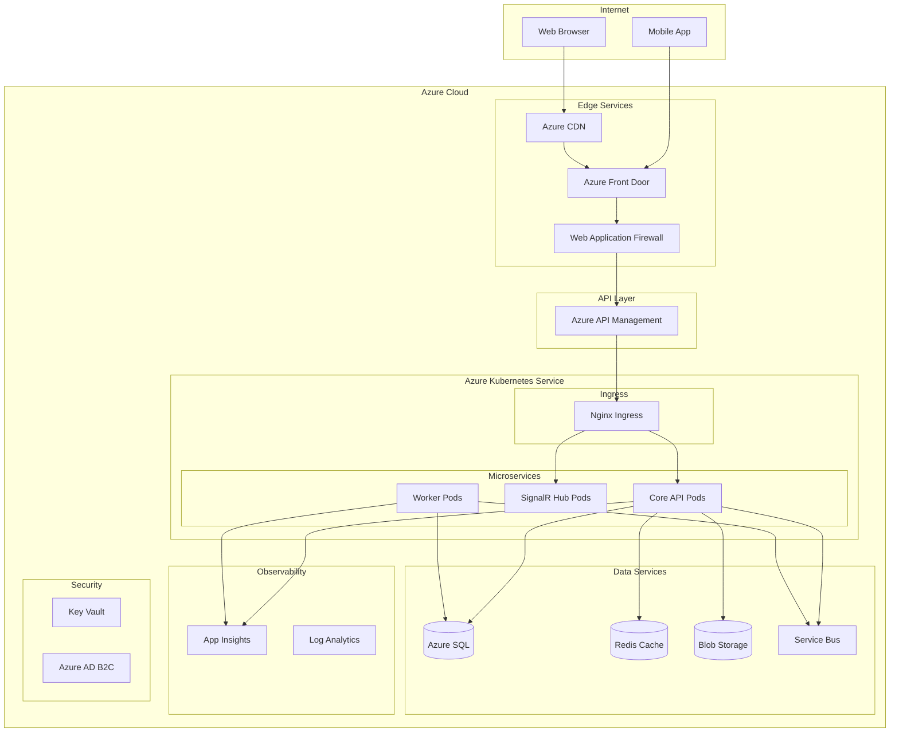
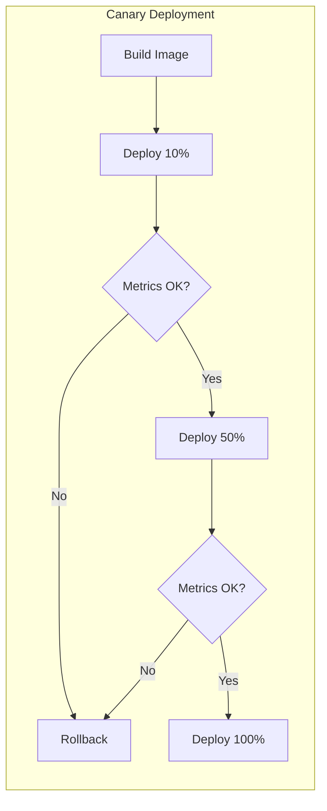
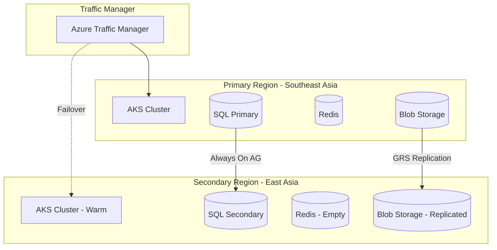

# DILIGO DMS - Deployment Architecture

## 1. Infrastructure Overview

### 1.1 Cloud Platform: Microsoft Azure

| Service | Azure Resource | Purpose |
|---------|----------------|---------|
| Compute | Azure Kubernetes Service (AKS) | Container orchestration |
| Database | Azure SQL Database | Primary database |
| Cache | Azure Cache for Redis | Distributed caching |
| Storage | Azure Blob Storage | File storage |
| CDN | Azure CDN | Static content delivery |
| API Gateway | Azure API Management | API gateway |
| Messaging | Azure Service Bus | Message queue |
| Real-time | Azure SignalR Service | WebSocket scaling |
| Monitoring | Azure Monitor + App Insights | Observability |
| Security | Azure Key Vault | Secrets management |

### 1.2 Deployment Diagram



---

## 2. Kubernetes Architecture

### 2.1 Cluster Configuration

```yaml
# AKS Cluster Configuration
apiVersion: containerservice.azure.com/v1
kind: ManagedCluster
metadata:
  name: diligo-dms-aks
  location: southeastasia
spec:
  kubernetesVersion: "1.28"
  dnsPrefix: diligo-dms
  networkProfile:
    networkPlugin: azure
    networkPolicy: calico
    loadBalancerSku: standard
  agentPoolProfiles:
    - name: system
      count: 3
      vmSize: Standard_D4s_v4
      mode: System
      availabilityZones: ["1", "2", "3"]
    - name: apps
      count: 5
      vmSize: Standard_D8s_v4
      mode: User
      availabilityZones: ["1", "2", "3"]
      enableAutoScaling: true
      minCount: 3
      maxCount: 10
```

### 2.2 Namespace Structure

```
diligo-dms/
├── production/
│   ├── core-api
│   ├── signalr
│   ├── workers
│   └── jobs
├── staging/
│   └── (mirror of production)
└── shared/
    ├── ingress
    ├── monitoring
    └── cert-manager
```

### 2.3 Core API Deployment

```yaml
apiVersion: apps/v1
kind: Deployment
metadata:
  name: core-api
  namespace: production
spec:
  replicas: 3
  selector:
    matchLabels:
      app: core-api
  template:
    metadata:
      labels:
        app: core-api
    spec:
      containers:
        - name: core-api
          image: diligo.azurecr.io/core-api:1.0.0
          ports:
            - containerPort: 8080
          resources:
            requests:
              memory: "512Mi"
              cpu: "250m"
            limits:
              memory: "2Gi"
              cpu: "1000m"
          env:
            - name: ASPNETCORE_ENVIRONMENT
              value: "Production"
            - name: ConnectionStrings__DefaultConnection
              valueFrom:
                secretKeyRef:
                  name: db-secrets
                  key: connection-string
            - name: Redis__ConnectionString
              valueFrom:
                secretKeyRef:
                  name: redis-secrets
                  key: connection-string
          livenessProbe:
            httpGet:
              path: /health/live
              port: 8080
            initialDelaySeconds: 30
            periodSeconds: 10
          readinessProbe:
            httpGet:
              path: /health/ready
              port: 8080
            initialDelaySeconds: 5
            periodSeconds: 5
      affinity:
        podAntiAffinity:
          preferredDuringSchedulingIgnoredDuringExecution:
            - weight: 100
              podAffinityTerm:
                labelSelector:
                  matchLabels:
                    app: core-api
                topologyKey: topology.kubernetes.io/zone
---
apiVersion: v1
kind: Service
metadata:
  name: core-api
  namespace: production
spec:
  selector:
    app: core-api
  ports:
    - port: 80
      targetPort: 8080
  type: ClusterIP
---
apiVersion: autoscaling/v2
kind: HorizontalPodAutoscaler
metadata:
  name: core-api-hpa
  namespace: production
spec:
  scaleTargetRef:
    apiVersion: apps/v1
    kind: Deployment
    name: core-api
  minReplicas: 3
  maxReplicas: 20
  metrics:
    - type: Resource
      resource:
        name: cpu
        target:
          type: Utilization
          averageUtilization: 70
    - type: Resource
      resource:
        name: memory
        target:
          type: Utilization
          averageUtilization: 80
```

### 2.4 SignalR Hub Deployment

```yaml
apiVersion: apps/v1
kind: Deployment
metadata:
  name: signalr-hub
  namespace: production
spec:
  replicas: 2
  selector:
    matchLabels:
      app: signalr-hub
  template:
    metadata:
      labels:
        app: signalr-hub
    spec:
      containers:
        - name: signalr-hub
          image: diligo.azurecr.io/signalr-hub:1.0.0
          ports:
            - containerPort: 8080
          env:
            - name: Azure__SignalR__ConnectionString
              valueFrom:
                secretKeyRef:
                  name: signalr-secrets
                  key: connection-string
          resources:
            requests:
              memory: "256Mi"
              cpu: "100m"
            limits:
              memory: "1Gi"
              cpu: "500m"
```

### 2.5 Background Worker Deployment

```yaml
apiVersion: apps/v1
kind: Deployment
metadata:
  name: background-worker
  namespace: production
spec:
  replicas: 2
  selector:
    matchLabels:
      app: background-worker
  template:
    metadata:
      labels:
        app: background-worker
    spec:
      containers:
        - name: worker
          image: diligo.azurecr.io/worker:1.0.0
          env:
            - name: ServiceBus__ConnectionString
              valueFrom:
                secretKeyRef:
                  name: servicebus-secrets
                  key: connection-string
          resources:
            requests:
              memory: "256Mi"
              cpu: "100m"
            limits:
              memory: "1Gi"
              cpu: "500m"
```

---

## 3. Database Deployment

### 3.1 Azure SQL Configuration

```bicep
resource sqlServer 'Microsoft.Sql/servers@2022-05-01-preview' = {
  name: 'diligo-dms-sql'
  location: 'southeastasia'
  properties: {
    administratorLogin: 'sqladmin'
    administratorLoginPassword: sqlAdminPassword
    version: '12.0'
    minimalTlsVersion: '1.2'
  }
}

resource sqlDatabase 'Microsoft.Sql/servers/databases@2022-05-01-preview' = {
  parent: sqlServer
  name: 'DiligoDMS'
  location: 'southeastasia'
  sku: {
    name: 'GP_Gen5'
    tier: 'GeneralPurpose'
    capacity: 4
  }
  properties: {
    collation: 'SQL_Latin1_General_CP1_CI_AS'
    maxSizeBytes: 107374182400 // 100 GB
    zoneRedundant: true
    readScale: 'Enabled'
    highAvailabilityReplicaCount: 1
  }
}

resource sqlFailoverGroup 'Microsoft.Sql/servers/failoverGroups@2022-05-01-preview' = {
  parent: sqlServer
  name: 'diligo-dms-fog'
  properties: {
    readWriteEndpoint: {
      failoverPolicy: 'Automatic'
      failoverWithDataLossGracePeriodMinutes: 60
    }
    partnerServers: [
      {
        id: secondaryServer.id
      }
    ]
    databases: [
      sqlDatabase.id
    ]
  }
}
```

### 3.2 Connection Resilience

```csharp
// EF Core with retry policy
services.AddDbContext<ApplicationDbContext>(options =>
{
    options.UseSqlServer(connectionString, sqlOptions =>
    {
        sqlOptions.EnableRetryOnFailure(
            maxRetryCount: 5,
            maxRetryDelay: TimeSpan.FromSeconds(30),
            errorNumbersToAdd: null);

        sqlOptions.CommandTimeout(30);
    });
});
```

---

## 4. CDN & Static Content

### 4.1 Azure CDN Configuration

```bicep
resource cdnProfile 'Microsoft.Cdn/profiles@2021-06-01' = {
  name: 'diligo-dms-cdn'
  location: 'global'
  sku: {
    name: 'Standard_Microsoft'
  }
}

resource cdnEndpoint 'Microsoft.Cdn/profiles/endpoints@2021-06-01' = {
  parent: cdnProfile
  name: 'diligo-dms-web'
  location: 'global'
  properties: {
    originHostHeader: 'diligodmsweb.blob.core.windows.net'
    isHttpAllowed: false
    isHttpsAllowed: true
    origins: [
      {
        name: 'blob-origin'
        properties: {
          hostName: 'diligodmsweb.blob.core.windows.net'
          httpPort: 80
          httpsPort: 443
        }
      }
    ]
    deliveryPolicy: {
      rules: [
        {
          name: 'CacheRule'
          order: 1
          conditions: [
            {
              name: 'UrlFileExtension'
              parameters: {
                operator: 'Equal'
                matchValues: ['js', 'css', 'png', 'jpg', 'woff2']
              }
            }
          ]
          actions: [
            {
              name: 'CacheExpiration'
              parameters: {
                cacheBehavior: 'Override'
                cacheType: 'All'
                cacheDuration: '7.00:00:00' // 7 days
              }
            }
          ]
        }
      ]
    }
  }
}
```

---

## 5. CI/CD Pipeline

### 5.1 Azure DevOps Pipeline

```yaml
# azure-pipelines.yml
trigger:
  branches:
    include:
      - main
      - develop

stages:
  - stage: Build
    jobs:
      - job: BuildAPI
        pool:
          vmImage: 'ubuntu-latest'
        steps:
          - task: DotNetCoreCLI@2
            inputs:
              command: 'restore'
              projects: '**/*.csproj'

          - task: DotNetCoreCLI@2
            inputs:
              command: 'build'
              projects: '**/*.csproj'
              arguments: '--configuration Release'

          - task: DotNetCoreCLI@2
            inputs:
              command: 'test'
              projects: '**/*Tests.csproj'
              arguments: '--configuration Release --collect:"XPlat Code Coverage"'

          - task: Docker@2
            inputs:
              containerRegistry: 'diligo-acr'
              repository: 'core-api'
              command: 'buildAndPush'
              Dockerfile: 'src/Diligo.Api/Dockerfile'
              tags: |
                $(Build.BuildId)
                latest

      - job: BuildMobile
        pool:
          vmImage: 'macos-latest'
        steps:
          - task: JavaToolInstaller@0
            inputs:
              versionSpec: '17'

          - script: |
              cd mobile
              ./gradlew assembleRelease
            displayName: 'Build Android APK'

          - task: AndroidSigning@3
            inputs:
              apkFiles: '**/*.apk'
              keystoreFile: 'release-keystore.jks'

          - task: PublishBuildArtifacts@1
            inputs:
              PathtoPublish: 'mobile/app/build/outputs/apk/release'
              ArtifactName: 'android-release'

      - job: BuildWeb
        pool:
          vmImage: 'ubuntu-latest'
        steps:
          - task: NodeTool@0
            inputs:
              versionSpec: '20.x'

          - script: |
              cd web
              npm ci
              npm run build:prod
            displayName: 'Build Angular App'

          - task: PublishBuildArtifacts@1
            inputs:
              PathtoPublish: 'web/dist/diligo-dms'
              ArtifactName: 'web-dist'

  - stage: DeployStaging
    dependsOn: Build
    condition: and(succeeded(), eq(variables['Build.SourceBranch'], 'refs/heads/develop'))
    jobs:
      - deployment: DeployToStaging
        environment: 'staging'
        strategy:
          runOnce:
            deploy:
              steps:
                - task: KubernetesManifest@0
                  inputs:
                    action: 'deploy'
                    kubernetesServiceConnection: 'aks-staging'
                    namespace: 'staging'
                    manifests: |
                      k8s/staging/*.yaml
                    containers: |
                      diligo.azurecr.io/core-api:$(Build.BuildId)

  - stage: DeployProduction
    dependsOn: Build
    condition: and(succeeded(), eq(variables['Build.SourceBranch'], 'refs/heads/main'))
    jobs:
      - deployment: DeployToProduction
        environment: 'production'
        strategy:
          canary:
            increments: [10, 50]
            deploy:
              steps:
                - task: KubernetesManifest@0
                  inputs:
                    action: 'deploy'
                    kubernetesServiceConnection: 'aks-production'
                    namespace: 'production'
                    strategy: canary
                    percentage: $(strategy.increment)
                    manifests: |
                      k8s/production/*.yaml
```

### 5.2 Deployment Strategy



---

## 6. Environment Configuration

### 6.1 Environment Variables

| Variable | Development | Staging | Production |
|----------|-------------|---------|------------|
| ASPNETCORE_ENVIRONMENT | Development | Staging | Production |
| LogLevel | Debug | Information | Warning |
| EnableSwagger | true | true | false |
| EnableDetailedErrors | true | false | false |
| RateLimitPerMinute | 10000 | 5000 | 1000 |

### 6.2 Secret Management

```yaml
# External Secrets Operator
apiVersion: external-secrets.io/v1beta1
kind: ExternalSecret
metadata:
  name: db-secrets
  namespace: production
spec:
  refreshInterval: 1h
  secretStoreRef:
    name: azure-keyvault
    kind: SecretStore
  target:
    name: db-secrets
    creationPolicy: Owner
  data:
    - secretKey: connection-string
      remoteRef:
        key: diligo-dms-sql-connection
```

---

## 7. Monitoring & Observability

### 7.1 Application Insights Configuration

```csharp
// Program.cs
builder.Services.AddApplicationInsightsTelemetry(options =>
{
    options.ConnectionString = configuration["ApplicationInsights:ConnectionString"];
    options.EnableAdaptiveSampling = true;
});

builder.Services.ConfigureTelemetryModule<DependencyTrackingTelemetryModule>((module, o) =>
{
    module.EnableSqlCommandTextInstrumentation = true;
});
```

### 7.2 Prometheus Metrics

```yaml
apiVersion: monitoring.coreos.com/v1
kind: ServiceMonitor
metadata:
  name: core-api-monitor
  namespace: production
spec:
  selector:
    matchLabels:
      app: core-api
  endpoints:
    - port: metrics
      interval: 15s
      path: /metrics
```

### 7.3 Alert Rules

```yaml
apiVersion: monitoring.coreos.com/v1
kind: PrometheusRule
metadata:
  name: diligo-dms-alerts
  namespace: production
spec:
  groups:
    - name: api-alerts
      rules:
        - alert: HighErrorRate
          expr: sum(rate(http_requests_total{status=~"5.."}[5m])) / sum(rate(http_requests_total[5m])) > 0.01
          for: 5m
          labels:
            severity: critical
          annotations:
            summary: "High error rate detected"
            description: "Error rate is above 1% for 5 minutes"

        - alert: HighLatency
          expr: histogram_quantile(0.95, sum(rate(http_request_duration_seconds_bucket[5m])) by (le)) > 3
          for: 5m
          labels:
            severity: warning
          annotations:
            summary: "High latency detected"
            description: "95th percentile latency is above 3 seconds"

        - alert: PodRestarts
          expr: increase(kube_pod_container_status_restarts_total{namespace="production"}[1h]) > 5
          for: 5m
          labels:
            severity: warning
          annotations:
            summary: "Pod restarting frequently"
```

---

## 8. Disaster Recovery

### 8.1 DR Architecture



### 8.2 Recovery Procedures

| Scenario | RTO | RPO | Procedure |
|----------|-----|-----|-----------|
| Pod Failure | < 1 min | 0 | Auto-restart by K8s |
| Node Failure | < 5 min | 0 | Pod rescheduling |
| AZ Failure | < 15 min | 0 | Multi-AZ failover |
| Region Failure | < 4 hours | < 1 hour | DR site activation |
| Data Corruption | < 4 hours | PITR | Point-in-time restore |

### 8.3 Backup Schedule

```yaml
# Velero backup schedule
apiVersion: velero.io/v1
kind: Schedule
metadata:
  name: daily-backup
  namespace: velero
spec:
  schedule: "0 2 * * *"  # 2 AM daily
  template:
    includedNamespaces:
      - production
    storageLocation: azure-backup
    ttl: 720h  # 30 days
```

---

## 9. Cost Optimization

### 9.1 Resource Sizing

| Service | Size | Monthly Est. (USD) |
|---------|------|-------------------|
| AKS (5 nodes D8s_v4) | 8 vCPU, 32 GB each | $1,200 |
| Azure SQL (GP Gen5 4 vCore) | Zone redundant | $800 |
| Redis Cache (P1) | 6 GB | $200 |
| Blob Storage (100 GB) | LRS + CDN | $50 |
| SignalR Service | Standard | $100 |
| Service Bus | Standard | $50 |
| API Management | Developer | $50 |
| App Insights | 10 GB/month | $50 |
| **Total** | | **~$2,500/month** |

### 9.2 Auto-Scaling Strategy

- Scale up during business hours (8 AM - 6 PM)
- Scale down during off-hours
- Aggressive scaling for peak periods (end of month)

```yaml
apiVersion: autoscaling/v2
kind: HorizontalPodAutoscaler
metadata:
  name: core-api-hpa
spec:
  behavior:
    scaleUp:
      stabilizationWindowSeconds: 60
      policies:
        - type: Percent
          value: 100
          periodSeconds: 60
    scaleDown:
      stabilizationWindowSeconds: 300
      policies:
        - type: Percent
          value: 10
          periodSeconds: 60
```
