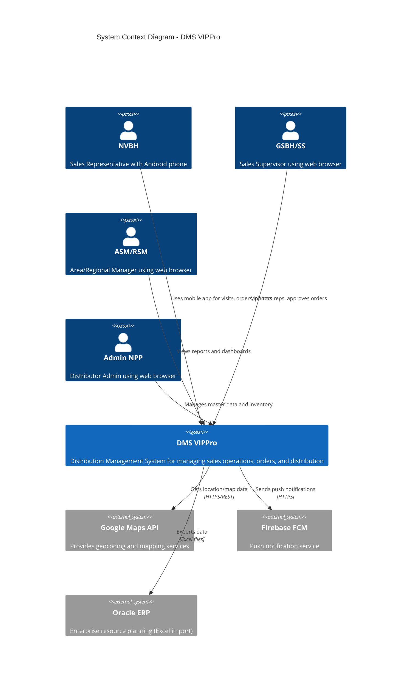

# DMS VIPPro - System Context (C4 Level 1)

## Distribution Management System - System Context Diagram

**Version:** 2.0
**Last Updated:** 2026-02-04
**PRD Reference:** PRD-v2.md (v2.3)

---

## 1. System Context Overview

The System Context diagram shows DMS VIPPro as a black box, highlighting its relationships with users and external systems.

```
┌─────────────────────────────────────────────────────────────────────────────────────────┐
│                              DMS VIPPro - SYSTEM CONTEXT                                │
├─────────────────────────────────────────────────────────────────────────────────────────┤
│                                                                                         │
│  ┌──────────────┐  ┌──────────────┐  ┌──────────────┐  ┌──────────────┐                │
│  │    NVBH      │  │   GSBH/SS    │  │   ASM/RSM    │  │  Admin NPP   │                │
│  │  Sales Rep   │  │  Supervisor  │  │   Managers   │  │  NPP Admin   │                │
│  │  (Mobile)    │  │    (Web)     │  │    (Web)     │  │    (Web)     │                │
│  └──────┬───────┘  └──────┬───────┘  └──────┬───────┘  └──────┬───────┘                │
│         │                 │                 │                 │                         │
│         │  Check-in       │  Monitor        │  Reports        │  Master Data            │
│         │  Orders         │  Approve        │  Analytics      │  Inventory              │
│         │  Photos         │  KPIs           │  Dashboard      │  Receivables            │
│         │                 │                 │                 │                         │
│         └────────────────┬┴─────────────────┴─────────────────┘                         │
│                          │                                                              │
│                          ▼                                                              │
│         ┌────────────────────────────────────────────────────┐                         │
│         │                                                    │                         │
│         │              DMS VIPPro                            │                         │
│         │                                                    │                         │
│         │  Distribution Management System                    │                         │
│         │                                                    │                         │
│         │  - GPS tracking of sales reps                      │                         │
│         │  - Customer visit management                       │                         │
│         │  - Order processing                                │                         │
│         │  - Inventory management                            │                         │
│         │  - KPI monitoring                                  │                         │
│         │  - Reporting & analytics                           │                         │
│         │                                                    │                         │
│         └───────────────────────┬────────────────────────────┘                         │
│                                 │                                                       │
│         ┌───────────────────────┼───────────────────────────┐                          │
│         │                       │                           │                          │
│         ▼                       ▼                           ▼                          │
│  ┌──────────────┐      ┌──────────────┐            ┌──────────────┐                   │
│  │ Google Maps  │      │  Firebase    │            │  Oracle ERP  │                   │
│  │     API      │      │     FCM      │            │   (Export)   │                   │
│  │              │      │              │            │              │                   │
│  │ GPS/Mapping  │      │    Push      │            │   Excel      │                   │
│  │  Services    │      │ Notifications│            │   Export     │                   │
│  └──────────────┘      └──────────────┘            └──────────────┘                   │
│                                                                                         │
│   [External System]     [External System]           [External System]                   │
│                                                                                         │
└─────────────────────────────────────────────────────────────────────────────────────────┘
```

---

## 2. Actors (Users)

### 2.1 Primary Actors

| Actor | Vietnamese | Description | Channel |
|-------|-----------|-------------|---------|
| **Sales Representative** | Nhân viên bán hàng (NVBH) | Field sales staff who visit customers, take orders (Pre-sales/Van-sales), capture product displays | Android Mobile App |
| **Sales Supervisor** | Giám sát bán hàng (GSBH/SS) | Direct supervisors who monitor sales reps, approve orders, track KPIs. **v2.0:** Can create NPP, manage routes, assign KPIs via mobile | Web + Mobile App |
| **Area Sales Manager** | ASM | Regional managers who oversee multiple supervisors and territories | Web Application |
| **Regional Sales Manager** | RSM | Senior managers with oversight of large regions | Web Application |
| **Distributor Admin** | Admin NPP | Administrators who manage master data, inventory, and receivables | Web Application |

### 2.2 Actor Responsibilities

```
┌─────────────────────────────────────────────────────────────────────────────┐
│                         ACTOR HIERARCHY & PERMISSIONS                        │
├─────────────────────────────────────────────────────────────────────────────┤
│                                                                             │
│  RSM (Regional Sales Manager)                                               │
│  ├── View all regions dashboard                                             │
│  ├── Cross-region reports and analytics                                     │
│  └── Strategic KPI overview                                                 │
│       │                                                                     │
│       ▼                                                                     │
│  ASM (Area Sales Manager)                                                   │
│  ├── View area-level reports                                                │
│  ├── Route management                                                       │
│  └── Performance analytics                                                  │
│       │                                                                     │
│       ▼                                                                     │
│  GSBH/SS (Sales Supervisor)                                                 │
│  ├── Real-time GPS monitoring of NVBH                                       │
│  ├── Order approval/rejection                                               │
│  ├── Visit supervision                                                      │
│  ├── Daily KPI tracking                                                     │
│  ├── [MOBILE v2.0] Create new NPP (Mở mới NPP)                              │
│  ├── [MOBILE v2.0] Route management (Quản lý tuyến)                         │
│  └── [MOBILE v2.0] Assign KPI to employees (Chia KPI)                       │
│       │                                                                     │
│       ▼                                                                     │
│  NVBH (Sales Representative)                                                │
│  ├── Customer visits (check-in/check-out)                                   │
│  ├── Order creation (Pre-sales: order for later delivery)                   │
│  ├── Order creation (Van-sales: sell & deliver immediately)                 │
│  ├── Photo capture                                                          │
│  └── Attendance (clock in/out)                                              │
│                                                                             │
│  Admin NPP (Distributor Admin) ─── Parallel Role                            │
│  ├── Master data management (Customers, Products, Distributors)             │
│  ├── Inventory management (Stock in/out/transfer)                           │
│  ├── Receivables management                                                 │
│  └── Order processing and invoicing                                         │
│                                                                             │
└─────────────────────────────────────────────────────────────────────────────┘
```

---

## 3. External Systems

### 3.1 Google Maps API

| Aspect | Details |
|--------|---------|
| **Purpose** | Geocoding, reverse geocoding, map display, distance calculation |
| **Integration** | REST API calls from mobile app and web |
| **Data Flow** | GPS coordinates → Address lookup; Route visualization |
| **Authentication** | API Key (restricted by package/domain) |

### 3.2 Firebase Cloud Messaging (FCM)

| Aspect | Details |
|--------|---------|
| **Purpose** | Push notifications to mobile devices |
| **Integration** | Server-side SDK integration |
| **Data Flow** | API → FCM → Mobile device |
| **Use Cases** | Order status updates, announcements, alerts |

### 3.3 Oracle ERP (Export Only)

| Aspect | Details |
|--------|---------|
| **Purpose** | Financial data synchronization |
| **Integration** | Excel file export (one-way) |
| **Data Flow** | DMS VIPPro → Excel → Oracle ERP (manual import) |
| **Scope** | Sales invoices, inventory movements |

---

## 4. System Boundaries

### 4.1 In-Scope

| Capability | Description |
|------------|-------------|
| **GPS Tracking** | Real-time location monitoring of sales reps |
| **Visit Management** | Check-in/check-out with photo capture |
| **Order Management** | Order creation, approval, fulfillment workflow |
| **Inventory** | Stock in, stock out, transfer, stock levels |
| **Customer Management** | Customer master data, visit history |
| **Product Management** | Product catalog, pricing, promotions |
| **Reporting** | Operational and analytical reports |
| **KPI Tracking** | Performance metrics and targets |
| **Offline Mobile** | Local data storage with sync |

### 4.2 Out-of-Scope

| Capability | Reason |
|------------|--------|
| **HR Management** | Separate HR system |
| **Full Accounting** | Oracle ERP handles accounting |
| **E-commerce (B2C)** | B2B distribution focus only |
| **iOS App** | Android-only for cost efficiency |
| **Real-time ERP Integration** | Excel export sufficient for MVP |

---

## 5. Context Diagram (Mermaid)



---

## 6. Key Interactions

### 6.1 Mobile App (NVBH) Interactions

```
┌─────────────────────────────────────────────────────────────────┐
│                  NVBH MOBILE APP INTERACTIONS                   │
├─────────────────────────────────────────────────────────────────┤
│                                                                 │
│  Morning                                                        │
│  ├── Clock In (Chấm công vào)                                  │
│  │   └── POST /api/attendance/clock-in                         │
│  ├── Receive today's route                                      │
│  │   └── GET /api/routes/today                                 │
│  └── Sync master data                                           │
│      └── GET /api/sync/delta                                    │
│                                                                 │
│  During Day (for each customer)                                 │
│  ├── Check-in at customer location                             │
│  │   └── POST /api/visits/check-in                             │
│  ├── Capture display photos                                     │
│  │   └── POST /api/visits/{id}/photos                          │
│  ├── Create order (if needed)                                   │
│  │   └── POST /api/orders                                       │
│  ├── Update customer info                                       │
│  │   └── PATCH /api/customers/{id}                             │
│  └── Check-out                                                  │
│      └── POST /api/visits/{id}/check-out                       │
│                                                                 │
│  Evening                                                        │
│  └── Clock Out (Chấm công ra)                                  │
│      └── POST /api/attendance/clock-out                        │
│                                                                 │
└─────────────────────────────────────────────────────────────────┘
```

### 6.2 Web App (Supervisor) Interactions

```
┌─────────────────────────────────────────────────────────────────┐
│                  GSBH WEB APP INTERACTIONS                      │
├─────────────────────────────────────────────────────────────────┤
│                                                                 │
│  Real-time Monitoring                                           │
│  ├── View NVBH locations on map                                │
│  │   └── GET /api/monitoring/locations (WebSocket)             │
│  ├── View visit status                                          │
│  │   └── GET /api/monitoring/visits                            │
│  └── Receive alerts                                             │
│      └── WebSocket subscription                                 │
│                                                                 │
│  Order Management                                               │
│  ├── List pending orders                                        │
│  │   └── GET /api/orders?status=pending                        │
│  ├── Review order details                                       │
│  │   └── GET /api/orders/{id}                                  │
│  ├── Approve order                                              │
│  │   └── POST /api/orders/{id}/approve                         │
│  └── Reject order                                               │
│      └── POST /api/orders/{id}/reject                          │
│                                                                 │
│  Reporting                                                      │
│  ├── Daily visit summary                                        │
│  │   └── GET /api/reports/visits/daily                         │
│  ├── KPI dashboard                                              │
│  │   └── GET /api/reports/kpi                                  │
│  └── Photo gallery                                              │
│      └── GET /api/photos                                        │
│                                                                 │
└─────────────────────────────────────────────────────────────────┘
```

### 6.3 Mobile App (GSBH) Interactions - NEW in v2.0

```
┌─────────────────────────────────────────────────────────────────┐
│                  GSBH MOBILE APP INTERACTIONS (v2.0)            │
├─────────────────────────────────────────────────────────────────┤
│                                                                 │
│  NPP Management (Mở mới NPP)                                    │
│  ├── Create new distributor profile                             │
│  │   └── POST /api/distributors                                 │
│  ├── Upload NPP photos (store, owner, meeting, docs)            │
│  │   └── POST /api/distributors/{id}/photos                     │
│  └── Update NPP information                                     │
│      └── PATCH /api/distributors/{id}                           │
│                                                                 │
│  Route Management (Quản lý tuyến)                               │
│  ├── Create new route                                           │
│  │   └── POST /api/routes                                       │
│  ├── Add customers to route                                     │
│  │   └── POST /api/routes/{id}/customers                        │
│  ├── Update route for multiple customers                        │
│  │   └── PATCH /api/routes/{id}/customers                       │
│  └── Import routes from Excel                                   │
│      └── POST /api/routes/import                                │
│                                                                 │
│  KPI Assignment (Chia KPI cho NV)                               │
│  ├── Set general KPIs (visits, orders, revenue, SKUs)           │
│  │   └── POST /api/kpi/assignments                              │
│  ├── Set focus product KPIs                                     │
│  │   └── POST /api/kpi/product-targets                          │
│  └── View KPI performance                                       │
│      └── GET /api/kpi/performance/{userId}                      │
│                                                                 │
│  Supervisor Monitoring                                          │
│  ├── View employee locations                                    │
│  │   └── GET /api/monitoring/locations                          │
│  ├── View visit status by employee                              │
│  │   └── GET /api/monitoring/visits/{userId}                    │
│  └── View photos by employee                                    │
│      └── GET /api/photos?userId={userId}                        │
│                                                                 │
└─────────────────────────────────────────────────────────────────┘
```

---

## 7. Data Flow Overview

```
┌─────────────────────────────────────────────────────────────────────────────┐
│                           PRIMARY DATA FLOWS                                │
├─────────────────────────────────────────────────────────────────────────────┤
│                                                                             │
│  1. Order Flow (Pre-sales - Bán hàng thường)                               │
│  ─────────────────────────────────────────                                 │
│  NVBH → Create Order → API → Pending Queue → GSBH Approves →               │
│  Sales Invoice → Stock Out → Delivery → Receivable Update                   │
│                                                                             │
│  1b. Order Flow (Van-sales - Bán hàng theo xe) [NEW v2.0]                  │
│  ─────────────────────────────────────────────────────────                 │
│  NVBH → Create Van-sale Order → Immediate Stock Deduction from Van →       │
│  Deliver on-site → Payment Collection → Receivable Update                   │
│                                                                             │
│  2. Visit Tracking Flow                                                     │
│  ────────────────────                                                       │
│  NVBH → Check-in (GPS) → API → Real-time Dashboard →                       │
│  Photo Upload → Check-out (GPS) → Visit Record Complete                     │
│                                                                             │
│  3. Master Data Flow                                                        │
│  ──────────────────                                                         │
│  Admin NPP → Create/Update Master Data → API → Database →                  │
│  Sync to Mobile (Delta Sync)                                                │
│                                                                             │
│  4. Inventory Flow                                                          │
│  ───────────────                                                            │
│  Stock In (Admin) → API → Increase Stock →                                  │
│  Sales Order Fulfilled → Stock Out → Updated Levels                         │
│                                                                             │
│  5. Reporting Flow                                                          │
│  ───────────────                                                            │
│  Transactional Data → Aggregation Queries → Report API →                   │
│  Dashboard/Export (Excel for ERP)                                           │
│                                                                             │
└─────────────────────────────────────────────────────────────────────────────┘
```

---

## 8. Security Context

| Boundary | Protection |
|----------|------------|
| **Internet → Mobile App** | HTTPS/TLS 1.3, Certificate Pinning |
| **Internet → Web App** | HTTPS/TLS 1.3, CSP Headers |
| **Client → API** | JWT Bearer Authentication |
| **API → Database** | Connection String Encryption, Firewall |
| **API → External Services** | API Keys, HTTPS |

---

## 9. Related Documents

- [02-CONTAINER-ARCHITECTURE.md](02-CONTAINER-ARCHITECTURE.md) - Detailed container view
- [07-SECURITY-ARCHITECTURE.md](07-SECURITY-ARCHITECTURE.md) - Security design details
- [adr/ADR-001-android-only.md](adr/ADR-001-android-only.md) - Mobile platform decision
