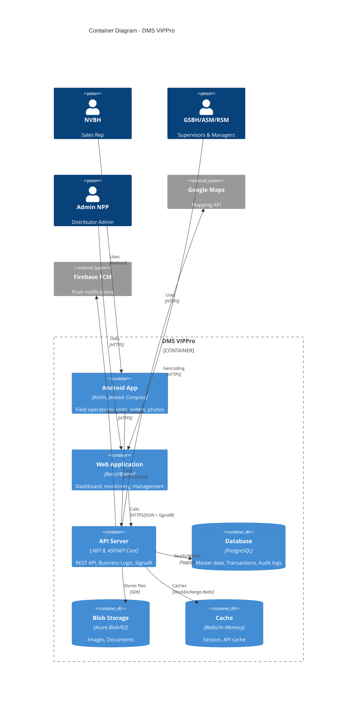

# DMS VIPPro - Container Architecture (C4 Level 2)

## Distribution Management System - Container Diagram

**Version:** 2.0
**Last Updated:** 2026-02-04
**PRD Reference:** PRD-v2.md (v2.3)

---

## 1. Container Overview

This document describes the high-level technology choices and responsibilities of each container (deployable unit) in the DMS VIPPro system.

```
┌─────────────────────────────────────────────────────────────────────────────────────────────┐
│                                   CONTAINER ARCHITECTURE                                    │
├─────────────────────────────────────────────────────────────────────────────────────────────┤
│                                                                                             │
│  ┌─────────────────────────────────────────────────────────────────────────────────────┐   │
│  │                                    USERS                                             │   │
│  │   ┌──────────┐   ┌──────────┐   ┌──────────┐   ┌──────────┐                        │   │
│  │   │  NVBH    │   │ GSBH/SS  │   │ ASM/RSM  │   │Admin NPP │                        │   │
│  │   │ (Field)  │   │  (Office)│   │ (Office) │   │ (Office) │                        │   │
│  │   └────┬─────┘   └────┬─────┘   └────┬─────┘   └────┬─────┘                        │   │
│  └────────┼──────────────┼──────────────┼──────────────┼──────────────────────────────┘   │
│           │              │              │              │                                    │
│           │              └──────────────┴──────────────┘                                    │
│           │                             │                                                   │
│           ▼                             ▼                                                   │
│  ┌─────────────────────┐      ┌─────────────────────────────────┐                          │
│  │                     │      │                                 │                          │
│  │   Android App       │      │      Web Application            │                          │
│  │   [Kotlin/Compose]  │      │      [React + TypeScript]       │                          │
│  │                     │      │              OR                 │                          │
│  │   - Offline-first   │      │      [Blazor WebAssembly]       │                          │
│  │   - SQLite cache    │      │                                 │                          │
│  │   - GPS tracking    │      │   - Responsive SPA              │                          │
│  │   - Camera capture  │      │   - Real-time updates           │                          │
│  │   - Background sync │      │   - Map visualization           │                          │
│  │                     │      │                                 │                          │
│  └──────────┬──────────┘      └───────────────┬─────────────────┘                          │
│             │                                 │                                             │
│             │   HTTPS/REST + JWT              │  HTTPS/REST + JWT + SignalR                │
│             │                                 │                                             │
│             └─────────────────┬───────────────┘                                             │
│                               │                                                             │
│                               ▼                                                             │
│             ┌─────────────────────────────────────────────────────┐                        │
│             │                                                     │                        │
│             │              .NET 8 Web API                         │                        │
│             │              [ASP.NET Core]                         │                        │
│             │                                                     │                        │
│             │   - RESTful endpoints                               │                        │
│             │   - JWT authentication                              │                        │
│             │   - SignalR for real-time                          │                        │
│             │   - Background services                             │                        │
│             │   - Business logic layer                            │                        │
│             │                                                     │                        │
│             └───────────────────────┬─────────────────────────────┘                        │
│                                     │                                                       │
│              ┌──────────────────────┼──────────────────────┐                               │
│              │                      │                      │                               │
│              ▼                      ▼                      ▼                               │
│  ┌───────────────────┐  ┌───────────────────┐  ┌───────────────────┐                      │
│  │   PostgreSQL      │  │   Blob Storage    │  │   Redis Cache     │                      │
│  │   [Database]      │  │   [Files/Images]  │  │   [Optional]      │                      │
│  │                   │  │                   │  │                   │                      │
│  │ - Master data     │  │ - Product images  │  │ - Session cache   │                      │
│  │ - Transactions    │  │ - Visit photos    │  │ - API responses   │                      │
│  │ - Audit logs      │  │ - Documents       │  │ - Real-time data  │                      │
│  └───────────────────┘  └───────────────────┘  └───────────────────┘                      │
│                                                                                             │
└─────────────────────────────────────────────────────────────────────────────────────────────┘
```

---

## 2. Container Details

### 2.1 Android Mobile Application

| Aspect | Details |
|--------|---------|
| **Technology** | Kotlin + Jetpack Compose |
| **Architecture** | MVVM + Clean Architecture |
| **Local Storage** | Room (SQLite) for offline data |
| **Networking** | Retrofit + OkHttp |
| **DI** | Hilt (Dagger) |
| **GPS** | Google Play Location Services |
| **Camera** | CameraX |
| **Min SDK** | Android 8.0 (API 26) |

**Key Responsibilities:**
- Field sales operations (check-in, orders, photos)
- Offline data storage and synchronization
- GPS tracking and location capture
- Push notification handling
- Background sync with API

```
┌─────────────────────────────────────────────────────────────────┐
│                    ANDROID APP LAYERS                           │
├─────────────────────────────────────────────────────────────────┤
│                                                                 │
│  ┌─────────────────────────────────────────────────────────┐   │
│  │              PRESENTATION LAYER                          │   │
│  │  ┌─────────────┐ ┌─────────────┐ ┌─────────────┐        │   │
│  │  │   Screens   │ │  ViewModels │ │   Compose   │        │   │
│  │  │  (Compose)  │ │             │ │  Components │        │   │
│  │  └─────────────┘ └─────────────┘ └─────────────┘        │   │
│  └─────────────────────────────────────────────────────────┘   │
│                              │                                  │
│  ┌─────────────────────────────────────────────────────────┐   │
│  │                DOMAIN LAYER                              │   │
│  │  ┌─────────────┐ ┌─────────────┐ ┌─────────────┐        │   │
│  │  │  Use Cases  │ │   Entities  │ │ Repository  │        │   │
│  │  │             │ │   (Models)  │ │ Interfaces  │        │   │
│  │  └─────────────┘ └─────────────┘ └─────────────┘        │   │
│  └─────────────────────────────────────────────────────────┘   │
│                              │                                  │
│  ┌─────────────────────────────────────────────────────────┐   │
│  │                 DATA LAYER                               │   │
│  │  ┌─────────────┐ ┌─────────────┐ ┌─────────────┐        │   │
│  │  │ Repository  │ │  Room DAOs  │ │   Retrofit  │        │   │
│  │  │   Impls     │ │  (SQLite)   │ │    APIs     │        │   │
│  │  └─────────────┘ └─────────────┘ └─────────────┘        │   │
│  └─────────────────────────────────────────────────────────┘   │
│                                                                 │
└─────────────────────────────────────────────────────────────────┘
```

### 2.2 Web Application

| Aspect | Details |
|--------|---------|
| **Option A** | React 18 + TypeScript + Vite |
| **Option B** | Blazor WebAssembly (.NET 8) |
| **UI Framework** | Tailwind CSS or MUI |
| **State** | React Query / Zustand OR Blazor state |
| **Maps** | Leaflet.js or Google Maps SDK |
| **Real-time** | SignalR client |
| **Charts** | Recharts or Chart.js |

**Key Responsibilities:**
- Supervisor dashboard and monitoring
- Order approval workflow
- Master data management (Admin NPP)
- Reporting and analytics
- Real-time GPS map display

### 2.3 .NET Web API

| Aspect | Details |
|--------|---------|
| **Framework** | ASP.NET Core 8 |
| **Architecture** | Clean Architecture / Vertical Slices |
| **ORM** | Entity Framework Core 8 |
| **Auth** | JWT Bearer + Identity |
| **Real-time** | SignalR Hub |
| **Validation** | FluentValidation |
| **Mapping** | AutoMapper or Mapster |
| **Logging** | Serilog |
| **API Docs** | Swagger/OpenAPI |

**Key Responsibilities:**
- RESTful API endpoints for all operations
- Authentication and authorization
- Business logic and validation
- Real-time notifications via SignalR
- Background job processing (sync, notifications)
- Integration with external services

```
┌─────────────────────────────────────────────────────────────────┐
│                    .NET API ARCHITECTURE                        │
├─────────────────────────────────────────────────────────────────┤
│                                                                 │
│  ┌─────────────────────────────────────────────────────────┐   │
│  │                    API LAYER                             │   │
│  │  ┌─────────────┐ ┌─────────────┐ ┌─────────────┐        │   │
│  │  │ Controllers │ │   SignalR   │ │ Middleware  │        │   │
│  │  │             │ │    Hubs     │ │ (Auth, Log) │        │   │
│  │  └─────────────┘ └─────────────┘ └─────────────┘        │   │
│  └─────────────────────────────────────────────────────────┘   │
│                              │                                  │
│  ┌─────────────────────────────────────────────────────────┐   │
│  │               APPLICATION LAYER                          │   │
│  │  ┌─────────────┐ ┌─────────────┐ ┌─────────────┐        │   │
│  │  │  Services   │ │   DTOs      │ │ Validators  │        │   │
│  │  │             │ │             │ │             │        │   │
│  │  └─────────────┘ └─────────────┘ └─────────────┘        │   │
│  └─────────────────────────────────────────────────────────┘   │
│                              │                                  │
│  ┌─────────────────────────────────────────────────────────┐   │
│  │                DOMAIN LAYER                              │   │
│  │  ┌─────────────┐ ┌─────────────┐ ┌─────────────┐        │   │
│  │  │  Entities   │ │   Enums     │ │  Interfaces │        │   │
│  │  │             │ │             │ │             │        │   │
│  │  └─────────────┘ └─────────────┘ └─────────────┘        │   │
│  └─────────────────────────────────────────────────────────┘   │
│                              │                                  │
│  ┌─────────────────────────────────────────────────────────┐   │
│  │             INFRASTRUCTURE LAYER                         │   │
│  │  ┌─────────────┐ ┌─────────────┐ ┌─────────────┐        │   │
│  │  │  EF Core    │ │  External   │ │   Storage   │        │   │
│  │  │  DbContext  │ │   APIs      │ │   Service   │        │   │
│  │  └─────────────┘ └─────────────┘ └─────────────┘        │   │
│  └─────────────────────────────────────────────────────────┘   │
│                                                                 │
└─────────────────────────────────────────────────────────────────┘
```

### 2.4 PostgreSQL Database

| Aspect | Details |
|--------|---------|
| **Engine** | PostgreSQL 16 |
| **Free Options** | Neon Free (512MB), Supabase Free (500MB), self-hosted |
| **Schema Design** | Normalized with strategic denormalization |
| **Indexing** | B-tree + GIN indexes for JSONB |
| **Security** | TLS encryption in transit, encryption at rest |

**Key Data Stores:**
- Master data (Customers, Products, Distributors)
- Transactional data (Orders, Visits, Inventory movements)
- User and authentication data
- Audit logs

### 2.5 Blob Storage

| Aspect | Details |
|--------|---------|
| **Purpose** | Store images and documents |
| **Free Options** | Azure Blob (5GB free), Cloudflare R2 |
| **Structure** | Container per type (products, visits, documents) |
| **Access** | SAS tokens for secure URLs |

### 2.6 Redis Cache (Optional)

| Aspect | Details |
|--------|---------|
| **Purpose** | Performance optimization, session state |
| **Free Options** | Redis Labs (30MB free), Upstash |
| **Use Cases** | API response caching, real-time presence |
| **Alternative** | In-memory caching for single instance |

---

## 3. Communication Patterns

### 3.1 Synchronous Communication

```
┌─────────────────────────────────────────────────────────────────┐
│                  SYNCHRONOUS API CALLS                          │
├─────────────────────────────────────────────────────────────────┤
│                                                                 │
│  Mobile/Web App  ──────►  .NET API  ──────►  PostgreSQL        │
│                                                                 │
│  Protocol: HTTPS                                                │
│  Format: JSON                                                   │
│  Auth: JWT Bearer Token                                         │
│                                                                 │
│  Request Flow:                                                  │
│  1. Client sends HTTP request with JWT                         │
│  2. API validates JWT                                           │
│  3. API processes request                                       │
│  4. API queries/updates database                                │
│  5. API returns JSON response                                   │
│                                                                 │
└─────────────────────────────────────────────────────────────────┘
```

### 3.2 Real-time Communication

```
┌─────────────────────────────────────────────────────────────────┐
│                  REAL-TIME (SIGNALR)                            │
├─────────────────────────────────────────────────────────────────┤
│                                                                 │
│  Web App  ◄──────►  SignalR Hub  ◄──────►  Other Clients       │
│                                                                 │
│  Protocol: WebSocket (fallback: SSE, Long Polling)             │
│  Use Cases:                                                     │
│  - GPS location updates                                         │
│  - New order notifications                                      │
│  - Visit status changes                                         │
│  - Real-time dashboard updates                                  │
│                                                                 │
│  Hub Groups:                                                    │
│  - LocationUpdates_{DistributorId}                             │
│  - OrderNotifications_{DistributorId}                          │
│  - Dashboard_{UserId}                                           │
│                                                                 │
└─────────────────────────────────────────────────────────────────┘
```

### 3.3 Push Notifications

```
┌─────────────────────────────────────────────────────────────────┐
│                  PUSH NOTIFICATIONS (FCM)                       │
├─────────────────────────────────────────────────────────────────┤
│                                                                 │
│  .NET API  ──────►  Firebase FCM  ──────►  Android Device      │
│                                                                 │
│  Use Cases:                                                     │
│  - Order approved/rejected                                      │
│  - Announcements from company                                   │
│  - Reminder to clock out                                        │
│  - Sync required notification                                   │
│                                                                 │
│  Payload: Data message (handled by app) + Notification         │
│                                                                 │
└─────────────────────────────────────────────────────────────────┘
```

### 3.4 Offline Sync Pattern

```
┌─────────────────────────────────────────────────────────────────┐
│                  OFFLINE SYNC PATTERN                           │
├─────────────────────────────────────────────────────────────────┤
│                                                                 │
│  INITIAL SYNC (App Launch)                                      │
│  1. App requests delta sync: GET /api/sync?since={timestamp}   │
│  2. API returns changed records since last sync                │
│  3. App updates local SQLite database                           │
│  4. App stores new sync timestamp                               │
│                                                                 │
│  OFFLINE OPERATION                                              │
│  1. User creates order/visit while offline                     │
│  2. App stores in SQLite with status="pending_sync"            │
│  3. App queues for upload                                       │
│                                                                 │
│  SYNC WHEN ONLINE                                               │
│  1. App detects connectivity                                    │
│  2. Uploads pending records: POST /api/sync/upload             │
│  3. Server processes and returns new IDs                        │
│  4. App updates local records with server IDs                   │
│  5. Downloads new data from server                              │
│                                                                 │
│  CONFLICT RESOLUTION                                            │
│  - Server-wins for master data                                  │
│  - Last-write-wins for transactional data                      │
│  - Merge for photo uploads                                      │
│                                                                 │
└─────────────────────────────────────────────────────────────────┘
```

---

## 4. Container Diagram (Mermaid)



---

## 5. Technology Stack Summary

| Layer | Technology | Free Tier Deployment |
|-------|------------|----------------------|
| **Mobile** | Kotlin + Jetpack Compose + Room | Google Play ($25 one-time) |
| **Web Frontend** | React + TypeScript + Tailwind | Vercel Free / Cloudflare Pages |
| **API Backend** | .NET 8 + ASP.NET Core + EF Core | Azure App Service F1 / Railway |
| **Database** | PostgreSQL | Neon Free (512MB) / Supabase |
| **Blob Storage** | Azure Blob / Cloudflare R2 | 5GB free / 10GB free |
| **Cache** | Redis / In-Memory | Upstash Free / In-memory |
| **Real-time** | SignalR | Included in API |
| **Push Notifications** | Firebase FCM | Free |
| **Maps** | Google Maps / OpenStreetMap | Free tier / Free |
| **Monitoring** | Application Insights | Free tier (5GB/month) |

---

## 6. Related Documents

- [03-COMPONENT-ARCHITECTURE.md](03-COMPONENT-ARCHITECTURE.md) - Component details
- [04-DATA-ARCHITECTURE.md](04-DATA-ARCHITECTURE.md) - Database schema
- [06-DEPLOYMENT-ARCHITECTURE.md](06-DEPLOYMENT-ARCHITECTURE.md) - Deployment guide
- [08-MOBILE-ARCHITECTURE.md](08-MOBILE-ARCHITECTURE.md) - Android app details
