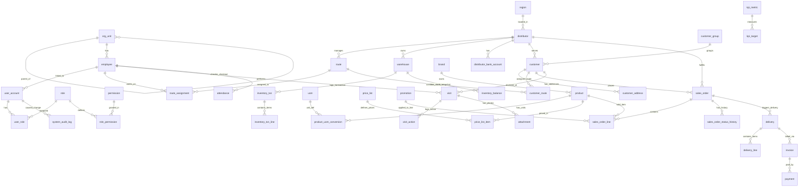

# DMS VIPPro - Data Architecture

## Distribution Management System - Database Design

**Version:** 3.1
**Last Updated:** 2026-02-04
**Status:** Draft

---

## 1. Overview

This document describes the comprehensive data architecture for DMS VIPPro, redesigned to support a scalable, multi-tenant distribution system.

### Technology Stack
| Component | Choice | Rationale |
|-----------|--------|-----------|
| **Database** | PostgreSQL 16+ | Strong geospatial support (PostGIS), JSONB for flexible attributes, robust scaling. |
| **ORM** | Entity Framework Core / Dapper | EF Core for complex domain logic, Dapper for high-performance reporting queries. |
| **Naming Convention** | **snake_case** | Standard PostgreSQL naming convention (e.g., `sales_order`, `user_account`). |
| **Timestamp** | `timestamptz` | All timestamps stored in UTC with timezone awareness. |

---

## 2. Conceptual Data Model (Groups A-K)

The database is organized into 11 functional groups:

- **Group A (Organization)**: Internal hierarchy and RBAC.
- **Group B (Territory)**: Routes and administrative units.
- **Group C (Distributors)**: Partner management.
- **Group D (Customers)**: Outlets and Points of Sale.
- **Group E (Products)**: SKU management.
- **Group F (Pricing)**: Price lists and promotions.
- **Group G (Sales O2C)**: Orders, Delivery, Invoice, Payment.
- **Group H (Inventory)**: Transaction-based stock management.
- **Group I (Field Force)**: Visits, Photos, Attendance.
- **Group J (KPI)**: Targets and Metrics.
- **Group K (System)**: Audit Logs.

---

## 3. Entity Relationship Diagram (ERD)



---

## 4. Detailed Physical Schema (SQL Definitions)

**Giải thích các kiểu dữ liệu đặc biệt:**
- **`UUID`**: Khóa chính ngẫu nhiên toàn cục, không dùng số tự tăng để tránh lộ quy mô dữ liệu và dễ dàng merge DB từ nhiều nguồn.
- **`TIMESTAMPTZ`**: Lưu thời gian kèm múi giờ (UTC). Quan trọng cho hệ thống chạy đa miền.
- **`JSONB`**: Lưu dữ liệu cấu trúc động (NoSQL) ngay trong SQL, giúp không phải tạo quá nhiều cột dư thừa.
- **`INT[]`**: Mảng số nguyên. Dùng để lưu danh sách Id nhỏ (ví dụ: thứ trong tuần) mà không cần tạo bảng phụ.
- **`GIST Index`**: Index đặc biệt hỗ trợ tìm kiếm không gian (Geospatial) và thời gian (Time-range).

### A. Organization – Người dùng – Phân quyền

```sql
-- Đơn vị tổ chức (Cây phòng ban/nhóm bán hàng)
CREATE TABLE org_unit (
    id UUID PRIMARY KEY DEFAULT gen_random_uuid(),
    code VARCHAR(50) NOT NULL UNIQUE, -- Mã đơn vị (nghiệp vụ)
    name VARCHAR(255) NOT NULL,
    parent_id UUID REFERENCES org_unit(id), -- Đệ quy (Cha con)
    type VARCHAR(50) NOT NULL, -- 'BRANCH', 'UNIT', 'TEAM'
    created_at TIMESTAMPTZ DEFAULT NOW(),
    updated_at TIMESTAMPTZ DEFAULT NOW(),
    deleted_at TIMESTAMPTZ -- Soft Delete: Không xóa thật, chỉ đánh dấu ngày xóa
);

-- Hồ sơ nhân viên (NVBH, GSBH...)
CREATE TABLE employee (
    id UUID PRIMARY KEY DEFAULT gen_random_uuid(),
    code VARCHAR(50) NOT NULL UNIQUE,
    full_name VARCHAR(100) NOT NULL,
    org_unit_id UUID NOT NULL REFERENCES org_unit(id),
    email VARCHAR(100),
    phone VARCHAR(20),
    status VARCHAR(20) DEFAULT 'ACTIVE',
    deleted_at TIMESTAMPTZ
);

-- Tài khoản đăng nhập App/Web
CREATE TABLE user_account (
    id UUID PRIMARY KEY DEFAULT gen_random_uuid(),
    username VARCHAR(50) NOT NULL UNIQUE,
    password_hash VARCHAR(255) NOT NULL, -- Mật khẩu đã mã hóa (BCrypt/Argon2)
    employee_id UUID REFERENCES employee(id),
    last_login_at TIMESTAMPTZ,
    status VARCHAR(20) DEFAULT 'ACTIVE',
    deleted_at TIMESTAMPTZ
);

-- Định nghĩa Vai trò (Role)
CREATE TABLE role (
    id UUID PRIMARY KEY DEFAULT gen_random_uuid(),
    code VARCHAR(50) NOT NULL UNIQUE, -- VD: 'SALES_REP', 'MANAGER'
    name VARCHAR(100) NOT NULL
);

-- Định nghĩa Quyền hạn nhỏ nhất (Atomic Permission)
CREATE TABLE permission (
    id UUID PRIMARY KEY DEFAULT gen_random_uuid(),
    code VARCHAR(100) NOT NULL UNIQUE, -- VD: 'order.create', 'order.view'
    description TEXT
);

-- Gán Quyền cho Vai trò (Role-Permission)
CREATE TABLE role_permission (
    role_id UUID REFERENCES role(id),
    permission_id UUID REFERENCES permission(id),
    PRIMARY KEY (role_id, permission_id)
);

-- Gán Vai trò cho Người dùng (User-Role)
CREATE TABLE user_role (
    user_id UUID REFERENCES user_account(id),
    role_id UUID REFERENCES role(id),
    PRIMARY KEY (user_id, role_id)
);
```

### B. Địa bàn – Tuyến – Phân công

```sql
-- Đơn vị hành chính
CREATE TABLE region (
    id UUID PRIMARY KEY DEFAULT gen_random_uuid(),
    code VARCHAR(50) UNIQUE,
    name VARCHAR(100)
);

-- Tuyến bán hàng (Route)
CREATE TABLE route (
    id UUID PRIMARY KEY DEFAULT gen_random_uuid(),
    code VARCHAR(50) NOT NULL UNIQUE,
    name VARCHAR(100) NOT NULL,
    distributor_id UUID NOT NULL, -- Link logical tới NPP sở hữu tuyến
    status VARCHAR(20) DEFAULT 'ACTIVE'
);

-- Lịch sử phân công nhân viên phụ trách tuyến (SCD Type 2)
CREATE TABLE route_assignment (
    id UUID PRIMARY KEY DEFAULT gen_random_uuid(),
    route_id UUID REFERENCES route(id),
    employee_id UUID REFERENCES employee(id),
    start_date DATE NOT NULL, -- Ngày bắt đầu phụ trách
    end_date DATE,            -- Ngày kết thúc (NULL = Đang phụ trách)
    is_primary BOOLEAN DEFAULT TRUE,
    created_at TIMESTAMPTZ DEFAULT NOW()
);
```

### C. Đối tác bán hàng (Distributor)

```sql
-- Nhà phân phối / Đại lý
CREATE TABLE distributor (
    id UUID PRIMARY KEY DEFAULT gen_random_uuid(),
    code VARCHAR(50) NOT NULL UNIQUE,
    name VARCHAR(255) NOT NULL,
    tax_code VARCHAR(50),
    region_id UUID REFERENCES region(id),
    address TEXT,
    status VARCHAR(20) DEFAULT 'ACTIVE',
    deleted_at TIMESTAMPTZ
);

-- Tài khoản ngân hàng NPP (để thanh toán)
CREATE TABLE distributor_bank_account (
    id UUID PRIMARY KEY DEFAULT gen_random_uuid(),
    distributor_id UUID REFERENCES distributor(id),
    bank_name VARCHAR(100),
    account_number VARCHAR(50),
    account_name VARCHAR(100)
);
```

### D. Khách hàng (Customer)

```sql
-- Nhóm khách hàng (Phân khúc)
CREATE TABLE customer_group (
    id UUID PRIMARY KEY DEFAULT gen_random_uuid(),
    code VARCHAR(50) UNIQUE,
    name VARCHAR(100)
);

-- Điểm bán hàng (Retail Outlet)
CREATE TABLE customer (
    id UUID PRIMARY KEY DEFAULT gen_random_uuid(),
    code VARCHAR(50) NOT NULL,
    name VARCHAR(255) NOT NULL,
    distributor_id UUID REFERENCES distributor(id),
    customer_group_id UUID REFERENCES customer_group(id),
    channel VARCHAR(50), -- 'GT' (Tạp hóa), 'MT' (Siêu thị)
    type VARCHAR(50), -- 'PHARMACY', 'GROCERY'
    credit_limit DECIMAL(18,2) DEFAULT 0, -- Hạn mức tín dụng (Traceability)
    status VARCHAR(20) DEFAULT 'ACTIVE',
    deleted_at TIMESTAMPTZ,
    CONSTRAINT uq_dist_cust_code UNIQUE (distributor_id, code) -- Mã KH duy nhất theo NPP
);

-- Đa địa chỉ (Giao hàng, Hóa đơn)
CREATE TABLE customer_address (
    id UUID PRIMARY KEY DEFAULT gen_random_uuid(),
    customer_id UUID REFERENCES customer(id),
    address_line TEXT NOT NULL,
    ward_id VARCHAR(20),
    district_id VARCHAR(20),
    province_id VARCHAR(20),
    latitude DECIMAL(10,8), -- Tọa độ GPS
    longitude DECIMAL(11,8),
    is_default BOOLEAN DEFAULT FALSE
);

-- Phân tuyến cho KH (Tần suất thăm)
CREATE TABLE customer_route (
    id UUID PRIMARY KEY DEFAULT gen_random_uuid(),
    customer_id UUID REFERENCES customer(id),
    route_id UUID REFERENCES route(id),
    visit_frequency VARCHAR(20), -- 'F2' (2 tuần/lần), 'F4', 'F8'
    visit_days INT[], -- [2,4,6] -> Thứ 2, 4, 6. Dùng mảng INT[] để query cực nhanh.
    start_date DATE NOT NULL,
    end_date DATE
);
```

### E. Sản phẩm (Product)

```sql
-- Thương hiệu / Nhãn hàng
CREATE TABLE brand (
    id UUID PRIMARY KEY DEFAULT gen_random_uuid(),
    name VARCHAR(100) NOT NULL
);

-- Danh mục sản phẩm (Master)
CREATE TABLE product (
    id UUID PRIMARY KEY DEFAULT gen_random_uuid(),
    code VARCHAR(50) NOT NULL UNIQUE, -- SKU
    name VARCHAR(255) NOT NULL,
    brand_id UUID REFERENCES brand(id),
    primary_uom_id UUID, -- Đơn vị tính chính
    status VARCHAR(20) DEFAULT 'ACTIVE',
    deleted_at TIMESTAMPTZ
);

-- Đơn vị tính (Thùng, Hộp, Cái)
CREATE TABLE uom (
    id UUID PRIMARY KEY DEFAULT gen_random_uuid(),
    code VARCHAR(20) NOT NULL, 
    name VARCHAR(50)
);

-- Quy đổi đơn vị (1 Thùng = 24 Cái)
CREATE TABLE product_uom_conversion (
    id UUID PRIMARY KEY DEFAULT gen_random_uuid(),
    product_id UUID REFERENCES product(id),
    from_uom_id UUID REFERENCES uom(id),
    to_uom_id UUID REFERENCES uom(id),
    factor DECIMAL(10,4) NOT NULL, -- Hệ số nhân
    is_base BOOLEAN DEFAULT FALSE
);
```

### F. Giá – Khuyến mãi

```sql
-- Bảng giá (Price Header)
CREATE TABLE price_list (
    id UUID PRIMARY KEY DEFAULT gen_random_uuid(),
    code VARCHAR(50) NOT NULL,
    name VARCHAR(100),
    valid_from DATE,
    valid_to DATE,
    status VARCHAR(20),
    deleted_at TIMESTAMPTZ
);

-- Chi tiết giá (Item Price)
CREATE TABLE price_list_item (
    price_list_id UUID REFERENCES price_list(id),
    product_id UUID REFERENCES product(id),
    uom_id UUID REFERENCES uom(id),
    price DECIMAL(18,2) NOT NULL,
    PRIMARY KEY (price_list_id, product_id, uom_id) -- Composite PK
);

-- Chương trình khuyến mãi
CREATE TABLE promotion (
    id UUID PRIMARY KEY DEFAULT gen_random_uuid(),
    code VARCHAR(50) NOT NULL,
    name VARCHAR(255),
    start_date TIMESTAMPTZ,
    end_date TIMESTAMPTZ,
    status VARCHAR(20),
    deleted_at TIMESTAMPTZ
);
```

### G. Bán hàng (Full O2C Flow)

```sql
-- Đơn hàng (Sale Order)
CREATE TABLE sales_order (
    id UUID PRIMARY KEY DEFAULT gen_random_uuid(),
    order_number VARCHAR(50) NOT NULL UNIQUE,
    distributor_id UUID REFERENCES distributor(id),
    customer_id UUID REFERENCES customer(id),
    salesman_id UUID REFERENCES employee(id),
    route_id UUID REFERENCES route(id),
    visit_id UUID, 
    order_date TIMESTAMPTZ NOT NULL,
    total_amount DECIMAL(18,2) NOT NULL,
    discount_amount DECIMAL(18,2) DEFAULT 0,
    status VARCHAR(20) NOT NULL, -- 'DRAFT', 'SUBMITTED', 'APPROVED', 'REJECTED', 'COMPLETED', 'CANCELLED'
    created_at TIMESTAMPTZ DEFAULT NOW(),
    updated_at TIMESTAMPTZ DEFAULT NOW(),
    deleted_at TIMESTAMPTZ
);

-- Chi tiết dòng hàng (Order Line)
CREATE TABLE sales_order_line (
    id UUID PRIMARY KEY DEFAULT gen_random_uuid(),
    sales_order_id UUID REFERENCES sales_order(id),
    product_id UUID REFERENCES product(id),
    uom_id UUID REFERENCES uom(id),
    quantity DECIMAL(12,4) NOT NULL,
    unit_price DECIMAL(18,2) NOT NULL, -- Snapshot giá tại thời điểm bán (để truy vết sau này nếu bảng giá đổi)
    total_price DECIMAL(18,2) NOT NULL,
    promotion_id UUID REFERENCES promotion(id), -- Bán do KM nào?
    discount_amount DECIMAL(18,2) DEFAULT 0
);

-- Lịch sử trạng thái đơn hàng (Audit Trail)
CREATE TABLE sales_order_status_history (
    id UUID PRIMARY KEY DEFAULT gen_random_uuid(),
    sales_order_id UUID REFERENCES sales_order(id),
    from_status VARCHAR(20),
    to_status VARCHAR(20),
    changed_by UUID REFERENCES user_account(id), -- Ai đổi trạng thái?
    changed_at TIMESTAMPTZ DEFAULT NOW()
);

-- Phiếu xuất kho / Giao hàng (Delivery Note)
CREATE TABLE delivery (
    id UUID PRIMARY KEY DEFAULT gen_random_uuid(),
    delivery_number VARCHAR(50) NOT NULL UNIQUE,
    sales_order_id UUID REFERENCES sales_order(id),
    warehouse_id UUID REFERENCES warehouse(id),
    delivery_date TIMESTAMPTZ,
    status VARCHAR(20), -- 'PENDING', 'SHIPPED', 'DELIVERED'
    created_at TIMESTAMPTZ DEFAULT NOW()
);

CREATE TABLE delivery_line (
    id UUID PRIMARY KEY DEFAULT gen_random_uuid(),
    delivery_id UUID REFERENCES delivery(id),
    product_id UUID REFERENCES product(id),
    uom_id UUID REFERENCES uom(id),
    quantity_ordered DECIMAL(12,4) NOT NULL,
    quantity_delivered DECIMAL(12,4) NOT NULL -- Cho phép giao thiếu (Partial Delivery)
);

-- Hóa đơn tài chính (Invoice)
CREATE TABLE invoice (
    id UUID PRIMARY KEY DEFAULT gen_random_uuid(),
    invoice_number VARCHAR(50) NOT NULL UNIQUE,
    sales_order_id UUID REFERENCES sales_order(id),
    customer_id UUID REFERENCES customer(id),
    order_date DATE,
    invoice_date DATE,
    due_date DATE, -- Hạn thanh toán
    total_amount DECIMAL(18,2),
    tax_amount DECIMAL(18,2),
    status VARCHAR(20) -- 'DRAFT', 'ISSUED', 'PAID', 'OVERDUE'
);

-- Thanh toán (Payment / Collection)
CREATE TABLE payment (
    id UUID PRIMARY KEY DEFAULT gen_random_uuid(),
    payment_number VARCHAR(50) NOT NULL UNIQUE,
    invoice_id UUID REFERENCES invoice(id),
    customer_id UUID REFERENCES customer(id),
    payment_date TIMESTAMPTZ,
    amount DECIMAL(18,2),
    payment_method VARCHAR(50), -- 'CASH', 'TRANSFER'
    status VARCHAR(20)
);
```

### H. Kho – Tồn – XNT (High Performance)

```sql
-- Kho hàng
CREATE TABLE warehouse (
    id UUID PRIMARY KEY DEFAULT gen_random_uuid(),
    code VARCHAR(50) NOT NULL,
    name VARCHAR(100),
    distributor_id UUID REFERENCES distributor(id),
    type VARCHAR(20), -- 'MAIN' (Kho cái), 'VAN_SALES' (Kho xe)
    deleted_at TIMESTAMPTZ
);

-- Bảng Tồn kho Snapshot (Hiệu năng cao)
-- Dùng để query tồn kho tức thì, không cần tính toán lại từ đầu.
CREATE TABLE inventory_balance (
    warehouse_id UUID REFERENCES warehouse(id),
    product_id UUID REFERENCES product(id),
    quantity DECIMAL(12,4) NOT NULL DEFAULT 0,
    last_updated_at TIMESTAMPTZ DEFAULT NOW(),
    PRIMARY KEY (warehouse_id, product_id)
);

-- Bảng Giao dịch kho (Source of Truth)
-- Mọi thay đổi tồn kho ĐỀU PHẢI ghi log vào đây.
CREATE TABLE inventory_txn (
    id UUID PRIMARY KEY DEFAULT gen_random_uuid(),
    txn_number VARCHAR(50) NOT NULL,
    warehouse_id UUID REFERENCES warehouse(id),
    txn_type VARCHAR(50) NOT NULL, -- 'IMPORT', 'EXPORT_SALES', 'ADJUSTMENT'
    txn_date TIMESTAMPTZ DEFAULT NOW(),
    reference_id UUID, -- ID của SO hoặc PO liên quan
    reference_type VARCHAR(50), 
    status VARCHAR(20)
);

CREATE TABLE inventory_txn_line (
    id UUID PRIMARY KEY DEFAULT gen_random_uuid(),
    inventory_txn_id UUID REFERENCES inventory_txn(id),
    product_id UUID REFERENCES product(id),
    uom_id UUID REFERENCES uom(id),
    quantity DECIMAL(12,4) NOT NULL, 
    direction INT NOT NULL -- 1 (Nhập), -1 (Xuất)
);
```

### I. Field Force (Giám sát thực địa)

```sql
-- Viếng thăm (Visit)
CREATE TABLE visit (
    id UUID PRIMARY KEY DEFAULT gen_random_uuid(),
    salesman_id UUID REFERENCES employee(id),
    customer_id UUID REFERENCES customer(id),
    route_id UUID REFERENCES route(id),
    checkin_time TIMESTAMPTZ NOT NULL,
    checkout_time TIMESTAMPTZ,
    checkin_lat DECIMAL(10,8),
    checkin_long DECIMAL(11,8),
    status VARCHAR(20) -- 'COMPLETED', 'IN_PROGRESS'
);

-- Các hoạt động trong viếng thăm
CREATE TABLE visit_action (
    id UUID PRIMARY KEY DEFAULT gen_random_uuid(),
    visit_id UUID REFERENCES visit(id),
    action_type VARCHAR(50), -- 'ORDER', 'SURVEY', 'PHOTO'
    created_at TIMESTAMPTZ DEFAULT NOW()
);

-- Hình ảnh/File đính kèm
CREATE TABLE attachment (
    id UUID PRIMARY KEY DEFAULT gen_random_uuid(),
    visit_id UUID REFERENCES visit(id),
    file_url VARCHAR(500) NOT NULL,
    file_type VARCHAR(50), -- 'IMAGE', 'DOC'
    tag VARCHAR(50) -- 'SHELF' (Quầy kệ), 'PROMO' (Khuyến mãi)
);

-- Chấm công GPS
CREATE TABLE attendance (
    id UUID PRIMARY KEY DEFAULT gen_random_uuid(),
    employee_id UUID REFERENCES employee(id),
    date DATE NOT NULL,
    checkin_time TIMESTAMPTZ,
    checkout_time TIMESTAMPTZ,
    status VARCHAR(20)
);
```

### J. KPI (Performance)

```sql
-- Định nghĩa chỉ tiêu (Doanh số, Viếng thăm)
CREATE TABLE kpi_metric (
    id UUID PRIMARY KEY DEFAULT gen_random_uuid(),
    code VARCHAR(50) NOT NULL,
    name VARCHAR(100)
);

-- Giao chỉ tiêu cho nhân viên
CREATE TABLE kpi_target (
    id UUID PRIMARY KEY DEFAULT gen_random_uuid(),
    metric_id UUID REFERENCES kpi_metric(id),
    target_type VARCHAR(20), -- 'EMPLOYEE', 'ORG_UNIT'
    target_id UUID, -- EmployeeID hoặc OrgUnitID
    period_start DATE,
    period_end DATE,
    target_value DECIMAL(18,2)
);
```

### K. System & Audit (Truy vết hệ thống)

```sql
-- Nhật ký thay đổi dữ liệu (Audit Log)
-- Lưu lại mọi thay đổi quan trọng để kiểm tra ai làm gì, khi nào.
CREATE TABLE system_audit_log (
    id BIGSERIAL PRIMARY KEY,
    table_name VARCHAR(50) NOT NULL,
    record_id UUID NOT NULL,
    action VARCHAR(10) NOT NULL, -- 'INSERT', 'UPDATE', 'DELETE'
    old_value JSONB, -- Dữ liệu cũ (trước khi sửa)
    new_value JSONB, -- Dữ liệu mới
    changed_by UUID REFERENCES user_account(id),
    changed_at TIMESTAMPTZ DEFAULT NOW()
);
```

---

## 5. Indexing & Partitioning Strategy

### Indexing Strategies
1.  **Search Indexes**: `GIN Index` trên các cột tên (product name, customer name) để tìm kiếm Full-Text siêu nhanh.
2.  **Geospatial Indexes**: `GIST Index` trên tọa độ (lat, long) để tìm "Khách hàng trong bán kính 500m".
3.  **Partial Indexes**: `CREATE INDEX ... WHERE deleted_at IS NULL` -> Chỉ index các dòng đang hoạt động, giúp giảm 50% dung lượng index và tăng tốc độ insert/update.
4.  **Covering Indexes**: Đưa các cột hay dùng vào Index (INCLUDE clause) để Database không cần đọc bảng chính.

### Temporal Indexing (Rule #8 Support)
Hỗ trợ truy vấn lịch sử theo thời gian (Time-Travel):
```sql
-- Đảm bảo không trùng lịch tuyến cho 1 nhân viên
CREATE EXTENSION IF NOT EXISTS btree_gist;
CREATE INDEX idx_route_assignment_period ON route_assignment 
USING GIST (employee_id, daterange(start_date, end_date, '[]'));

-- Truy vấn nhanh: "Ngày X khách hàng này thuộc tuyến nào?"
CREATE INDEX idx_customer_route_period ON customer_route 
USING GIST (customer_id, daterange(start_date, end_date, '[]'));
```

### Partitioning (Phân mảnh dữ liệu lớn)
Chia nhỏ các bảng lớn (hàng triệu dòng) theo tháng để tăng tốc độ query báo cáo:
1.  **`sales_order`**: Phân mảnh theo `order_date` (Monthly).
2.  **`inventory_txn`**: Phân mảnh theo `txn_date` (Monthly).
3.  **`visit`**: Phân mảnh theo `checkin_time` (Monthly).

---

## 6. Migration Strategy

Dự án áp dụng chiến lược **Code-First** với nguyên tắc **Zero-Downtime**:

### Delete Strategy (Soft vs Hard)
1.  **Soft Delete**: Dùng cho toàn bộ Master Data & Transaction.
    *   *Implementation*: Tất cả query mặc định phải có `WHERE deleted_at IS NULL`.
    *   *Lợi ích*: An toàn tuyệt đối, có thể khôi phục (Restore) ngay lập tức.
2.  **Hard Delete**:
    *   Chỉ dùng cho Log tạm, Staging tables, và dữ liệu Audit quá cũ (Archive).

### Zero-Downtime Principles
1.  **Expand-Contract**: Thêm cột mới -> Copy dữ liệu -> Xóa cột cũ (qua 3 lần deploy).
2.  **No Locks**: Sử dụng `CREATE INDEX CONCURRENTLY` để không khóa bảng khi hệ thống đang chạy.
