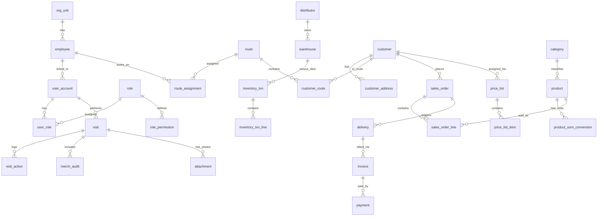

# DILIGO DMS - Data Architecture

## Distribution Management System - Database Design

**Version:** 2.0
**Last Updated:** 2026-02-04
<<<<<<< Updated upstream
**PRD Reference:** PRD-v2.md (v2.3)
=======
**Status:** Approved Draft
>>>>>>> Stashed changes

---

## 1. Overview

This document describes the comprehensive data architecture for DILIGO DMS, redesigned to support a scalable, multi-tenant distribution system.

### Technology Stack
| Component | Choice | Rationale |
|-----------|--------|-----------|
| **Database** | PostgreSQL 16+ | Strong geospatial support (PostGIS), JSONB for flexible attributes, robust scaling. |
| **ORM** | Entity Framework Core / Dapper | EF Core for complex domain logic, Dapper for high-performance reporting queries. |
| **Naming Convention** | **snake_case** | Standard PostgreSQL naming convention (e.g., `sales_order`, `user_account`). |
| **Timestamp** | `timestamptz` | All timestamps stored in UTC with timezone awareness. |

---

## 2. Conceptual Data Model (Groups A-J)

The database is organized into 10 functional groups:

### A. Organization & Access Control
Manages internal hierarchy and user access.
- `org_unit`: Organizational tree (Branch, Unit, Sales Group).
- `employee`: Internal staff profiles.
- `user_account`: System login credentials.
- `role`, `permission`, `role_permission`, `user_role`: RBAC security.

### B. Territory & Route Management
Manages geographical coverage and sales routes.
- `region`, `province`, `district`, `ward`: Administrative hierarchy.
- `route`: Sales routes (MCP).
- `route_assignment`: Assignment of employees to routes (history tracking).

### C. Sales Partners (Distributors)
Manages the distribution network.
- `distributor`: Distributors/Dealers information.
- `distributor_bank_account`: Financial details.
- `distributor_document`: Contracts and legal docs.

### D. Customers
Points of sale (POS) and outlets.
- `customer`: Main customer/outlet entity.
- `customer_address`: Multiple addresses (Delivery, Billing).
- `customer_contact`: Key contacts at outlets.
- `customer_route`: Assignment of customers to routes.
- `customer_tag`, `tag`: Flexible tagging.
- **Lookups**: `customer_type`, `customer_group`, `channel`.

### E. Products
Product catalog and configurations.
- `product`: Stock Keeping Units (SKUs).
- `brand`, `category`: Classification.
- `uom`: Units of Measure (Carton, Box, Pcs).
- `product_uom_conversion`: Conversion logic (e.g., 1 Carton = 24 Pcs).
- `product_barcode`: Barcode mapping.

### F. Pricing & Promotion
Price logic and trade marketing.
- `price_list`: Header for pricing versions.
- `price_list_item`: Prices by SKU + UOM.
- `promotion`: Promo programs.
- `promotion_rule`: Logic for discounts/gifts.
- `promotion_customer_scope`: Target audience for promos.

### G. Sales Transactions
Order to Cash (O2C) flow.
- `sales_order`, `sales_order_line`: Orders captured by sales force.
- `sales_order_status_history`: Audit trail of order lifecycle.
- `delivery`, `delivery_line`: Fulfillment records.
- `invoice`: Financial documents.
- `payment`: Collection and debt settlement.

### H. Inventory & Warehousing
Stock management (Transaction-based).
- `warehouse`: Storage locations (Distributor warehouse, van stock).
- `inventory_txn`, `inventory_txn_line`: The **source of truth** for all stock movements (In, Out, Adjust).
- `inventory_balance_snapshot`: Daily/Monthly snapshots for fast reporting.

### I. Field Force Execution
Daily activities of sales reps.
- `visit`: GPS Check-in/out records.
- `visit_action`: Actions performed (Survey, Order, Issue).
- `merch_campaign`, `merch_criteria`: Display programs.
- `merch_audit`, `merch_audit_item`: Display scoring/evaluation.
- `attachment`: Photos/Files linked to visits.
- `attendance`, `attendance_event`: Timekeeping.

### J. KPI & Reporting
Performance management.
- `kpi_metric`: Definitions (Revenue, Visit Rate, etc.).
- `kpi_target`: Targets appointed to staff/route.
- `kpi_result`: Calculated results.

---

## 3. Entity Relationship Diagram (ERD)



---

## 4. Detailed Physical Schema (SQL Definitions)

### A. Organization – Người dùng – Phân quyền

```sql
CREATE TABLE org_unit (
    id UUID PRIMARY KEY DEFAULT gen_random_uuid(),
    code VARCHAR(50) NOT NULL UNIQUE,
    name VARCHAR(255) NOT NULL,
    parent_id UUID REFERENCES org_unit(id),
    type VARCHAR(50) NOT NULL, -- 'BRANCH', 'UNIT', 'TEAM'
    created_at TIMESTAMPTZ DEFAULT NOW(),
    updated_at TIMESTAMPTZ DEFAULT NOW(),
    deleted_at TIMESTAMPTZ -- Soft Delete support
);

CREATE TABLE employee (
    id UUID PRIMARY KEY DEFAULT gen_random_uuid(),
    code VARCHAR(50) NOT NULL UNIQUE,
    full_name VARCHAR(100) NOT NULL,
    org_unit_id UUID NOT NULL REFERENCES org_unit(id),
    email VARCHAR(100),
    phone VARCHAR(20),
    status VARCHAR(20) DEFAULT 'ACTIVE',
    deleted_at TIMESTAMPTZ
);

CREATE TABLE user_account (
    id UUID PRIMARY KEY DEFAULT gen_random_uuid(),
    username VARCHAR(50) NOT NULL UNIQUE,
    password_hash VARCHAR(255) NOT NULL,
    employee_id UUID REFERENCES employee(id),
    last_login_at TIMESTAMPTZ,
    status VARCHAR(20) DEFAULT 'ACTIVE',
    deleted_at TIMESTAMPTZ
);

CREATE TABLE role (
    id UUID PRIMARY KEY DEFAULT gen_random_uuid(),
    code VARCHAR(50) NOT NULL UNIQUE,
    name VARCHAR(100) NOT NULL
);

CREATE TABLE permission (
    id UUID PRIMARY KEY DEFAULT gen_random_uuid(),
    code VARCHAR(100) NOT NULL UNIQUE, -- e.g. 'order.create'
    description TEXT
);

CREATE TABLE role_permission (
    role_id UUID REFERENCES role(id),
    permission_id UUID REFERENCES permission(id),
    PRIMARY KEY (role_id, permission_id)
);

<<<<<<< Updated upstream
CREATE TABLE RouteCustomers (
    RouteCustomerId     UUID                PRIMARY KEY DEFAULT gen_random_uuid(),
    RouteId             UUID                NOT NULL REFERENCES Routes(RouteId),
    CustomerId          UUID                NOT NULL REFERENCES Customers(CustomerId),
    VisitOrder          INT                 NOT NULL,

    CONSTRAINT UQ_Route_Customer UNIQUE (RouteId, CustomerId)
);

CREATE INDEX IX_Routes_AssignedUser ON Routes(AssignedUserId, DayOfWeek);
```

#### Visits

```sql
CREATE TABLE Visits (
    VisitId             UUID                PRIMARY KEY DEFAULT gen_random_uuid(),
    CustomerId          UUID                NOT NULL REFERENCES Customers(CustomerId),
    UserId              UUID                NOT NULL REFERENCES Users(UserId),
    RouteId             UUID                NULL REFERENCES Routes(RouteId),
    VisitDate           DATE                NOT NULL,
    CheckInTime         TIMESTAMPTZ         NOT NULL,
    CheckInLatitude     DECIMAL(10,7)       NOT NULL,
    CheckInLongitude    DECIMAL(10,7)       NOT NULL,
    CheckInDistance     INT                 NULL, -- Distance from customer location in meters
    CheckOutTime        TIMESTAMPTZ         NULL,
    CheckOutLatitude    DECIMAL(10,7)       NULL,
    CheckOutLongitude   DECIMAL(10,7)       NULL,
    VisitType           VARCHAR(20)         NOT NULL, -- 'InRoute', 'OutOfRoute'
    VisitResult         VARCHAR(20)         NOT NULL, -- 'HasOrder', 'NoOrder', 'Closed', 'OwnerAway'
    HasPhotos           BOOLEAN             NOT NULL DEFAULT FALSE,
    Notes               TEXT                NULL,
    CreatedAt           TIMESTAMPTZ         NOT NULL DEFAULT NOW(),
    UpdatedAt           TIMESTAMPTZ         NOT NULL DEFAULT NOW()
);

CREATE INDEX IX_Visits_Customer ON Visits(CustomerId, VisitDate DESC);
CREATE INDEX IX_Visits_User ON Visits(UserId, VisitDate DESC);
CREATE INDEX IX_Visits_Date ON Visits(VisitDate);
```

#### Visit Photos

```sql
CREATE TABLE VisitPhotos (
    PhotoId             UUID                PRIMARY KEY DEFAULT gen_random_uuid(),
    VisitId             UUID                NOT NULL REFERENCES Visits(VisitId),
    AlbumType           VARCHAR(50)         NOT NULL, -- 'TrungBay', 'MatTien', 'POSM', etc.
    ImageUrl            VARCHAR(500)        NOT NULL,
    ThumbnailUrl        VARCHAR(500)        NULL,
    Latitude            DECIMAL(10,7)       NOT NULL,
    Longitude           DECIMAL(10,7)       NOT NULL,
    CapturedAt          TIMESTAMPTZ         NOT NULL,
    CreatedAt           TIMESTAMPTZ         NOT NULL DEFAULT NOW()
);

CREATE INDEX IX_VisitPhotos_Visit ON VisitPhotos(VisitId);
CREATE INDEX IX_VisitPhotos_Album ON VisitPhotos(AlbumType, CapturedAt DESC);
```

#### Orders

```sql
CREATE TABLE Orders (
    OrderId             UUID                PRIMARY KEY DEFAULT gen_random_uuid(),
    DistributorId       UUID                NOT NULL REFERENCES Distributors(DistributorId),
    OrderNumber         VARCHAR(20)         NOT NULL UNIQUE,
    CustomerId          UUID                NOT NULL REFERENCES Customers(CustomerId),
    UserId              UUID                NOT NULL REFERENCES Users(UserId),
    VisitId             UUID                NULL REFERENCES Visits(VisitId),
    OrderDate           TIMESTAMPTZ         NOT NULL,
    OrderType           VARCHAR(20)         NOT NULL DEFAULT 'PreSales', -- [v2.0] 'PreSales', 'VanSales'
    Status              VARCHAR(20)         NOT NULL, -- 'Draft', 'Pending', 'Approved', 'Rejected', 'Delivered'
    SubTotal            DECIMAL(18,2)       NOT NULL,
    DiscountAmount      DECIMAL(18,2)       NOT NULL DEFAULT 0,
    TaxAmount           DECIMAL(18,2)       NOT NULL DEFAULT 0,
    TotalAmount         DECIMAL(18,2)       NOT NULL,
    Notes               TEXT                NULL,
    ApprovedBy          UUID                NULL REFERENCES Users(UserId),
    ApprovedAt          TIMESTAMPTZ         NULL,
    RejectionReason     VARCHAR(500)        NULL,
    VanSaleWarehouseId  UUID                NULL REFERENCES Warehouses(WarehouseId), -- [v2.0] For Van-sales orders
    SyncStatus          VARCHAR(20)         NOT NULL DEFAULT 'Synced', -- 'Pending', 'Synced', 'Failed'
    CreatedAt           TIMESTAMPTZ         NOT NULL DEFAULT NOW(),
    UpdatedAt           TIMESTAMPTZ         NOT NULL DEFAULT NOW()
);

CREATE INDEX IX_Orders_Customer ON Orders(CustomerId, OrderDate DESC);
CREATE INDEX IX_Orders_User ON Orders(UserId, OrderDate DESC);
CREATE INDEX IX_Orders_Status ON Orders(Status, OrderDate DESC);
CREATE INDEX IX_Orders_Distributor ON Orders(DistributorId, OrderDate DESC);
CREATE INDEX IX_Orders_Type ON Orders(OrderType, OrderDate DESC); -- [v2.0]
```

#### Order Details

```sql
CREATE TABLE OrderDetails (
    DetailId            UUID                PRIMARY KEY DEFAULT gen_random_uuid(),
    OrderId             UUID                NOT NULL REFERENCES Orders(OrderId) ON DELETE CASCADE,
    ProductId           UUID                NOT NULL REFERENCES Products(ProductId),
    Quantity            INT                 NOT NULL,
    UnitType            VARCHAR(10)         NOT NULL, -- 'Main', 'Sub'
    UnitPrice           DECIMAL(18,2)       NOT NULL,
    DiscountPercent     DECIMAL(5,2)        NOT NULL DEFAULT 0,
    DiscountAmount      DECIMAL(18,2)       NOT NULL DEFAULT 0,
    TaxAmount           DECIMAL(18,2)       NOT NULL DEFAULT 0,
    LineTotal           DECIMAL(18,2)       NOT NULL,
    PromotionId         UUID                NULL REFERENCES Promotions(PromotionId),
    Notes               VARCHAR(200)        NULL
);

CREATE INDEX IX_OrderDetails_Order ON OrderDetails(OrderId);
CREATE INDEX IX_OrderDetails_Product ON OrderDetails(ProductId);
```

### 3.3 Inventory & Finance

#### Warehouses

```sql
CREATE TABLE Warehouses (
    WarehouseId         UUID                PRIMARY KEY DEFAULT gen_random_uuid(),
    DistributorId       UUID                NOT NULL REFERENCES Distributors(DistributorId),
    WarehouseCode       VARCHAR(20)         NOT NULL,
    Name                VARCHAR(100)        NOT NULL,
    WarehouseType       VARCHAR(20)         NOT NULL DEFAULT 'Main', -- [v2.0] 'Main', 'VanSale'
    AssignedUserId      UUID                NULL REFERENCES Users(UserId), -- [v2.0] For Van-sale warehouses
    Address             VARCHAR(500)        NULL,
    Status              VARCHAR(20)         NOT NULL DEFAULT 'Active',
    CreatedAt           TIMESTAMPTZ         NOT NULL DEFAULT NOW()
);

CREATE INDEX IX_Warehouses_Type ON Warehouses(WarehouseType) WHERE WarehouseType = 'VanSale';
CREATE INDEX IX_Warehouses_AssignedUser ON Warehouses(AssignedUserId) WHERE AssignedUserId IS NOT NULL;

CREATE TABLE ProductStock (
    StockId             UUID                PRIMARY KEY DEFAULT gen_random_uuid(),
    WarehouseId         UUID                NOT NULL REFERENCES Warehouses(WarehouseId),
    ProductId           UUID                NOT NULL REFERENCES Products(ProductId),
    Quantity            INT                 NOT NULL DEFAULT 0,
    ReservedQuantity    INT                 NOT NULL DEFAULT 0, -- For pending orders
    LastUpdated         TIMESTAMPTZ         NOT NULL DEFAULT NOW(),

    CONSTRAINT UQ_Product_Warehouse UNIQUE (WarehouseId, ProductId)
=======
CREATE TABLE user_role (
    user_id UUID REFERENCES user_account(id),
    role_id UUID REFERENCES role(id),
    PRIMARY KEY (user_id, role_id)
>>>>>>> Stashed changes
);
```

### B. Địa bàn – Tuyến – Phân công

```sql
CREATE TABLE region (
    id UUID PRIMARY KEY DEFAULT gen_random_uuid(),
    code VARCHAR(50) UNIQUE,
    name VARCHAR(100)
);

CREATE TABLE route (
    id UUID PRIMARY KEY DEFAULT gen_random_uuid(),
    code VARCHAR(50) NOT NULL UNIQUE,
    name VARCHAR(100) NOT NULL,
    distributor_id UUID NOT NULL, -- Logical link to Distributor
    status VARCHAR(20) DEFAULT 'ACTIVE'
);

CREATE TABLE route_assignment (
    id UUID PRIMARY KEY DEFAULT gen_random_uuid(),
    route_id UUID REFERENCES route(id),
    employee_id UUID REFERENCES employee(id),
    start_date DATE NOT NULL,
    end_date DATE,
    is_primary BOOLEAN DEFAULT TRUE,
    created_at TIMESTAMPTZ DEFAULT NOW()
);
```

### C. Đối tác bán hàng (Distributor)

```sql
CREATE TABLE distributor (
    id UUID PRIMARY KEY DEFAULT gen_random_uuid(),
    code VARCHAR(50) NOT NULL UNIQUE,
    name VARCHAR(255) NOT NULL,
    tax_code VARCHAR(50),
    region_id UUID REFERENCES region(id),
    address TEXT,
    status VARCHAR(20) DEFAULT 'ACTIVE',
    deleted_at TIMESTAMPTZ
);

CREATE TABLE distributor_bank_account (
    id UUID PRIMARY KEY DEFAULT gen_random_uuid(),
    distributor_id UUID REFERENCES distributor(id),
    bank_name VARCHAR(100),
    account_number VARCHAR(50),
    account_name VARCHAR(100)
);
```

### D. Khách hàng (Customer)

```sql
CREATE TABLE customer_group (
    id UUID PRIMARY KEY DEFAULT gen_random_uuid(),
    code VARCHAR(50) UNIQUE,
    name VARCHAR(100)
);

CREATE TABLE customer (
    id UUID PRIMARY KEY DEFAULT gen_random_uuid(),
    code VARCHAR(50) NOT NULL,
    name VARCHAR(255) NOT NULL,
    distributor_id UUID REFERENCES distributor(id),
    customer_group_id UUID REFERENCES customer_group(id),
    channel VARCHAR(50), -- 'GT', 'MT'
    type VARCHAR(50), -- 'PHARMACY', 'GROCERY'
    credit_limit DECIMAL(18,2) DEFAULT 0, -- Added traceability field
    status VARCHAR(20) DEFAULT 'ACTIVE',
    deleted_at TIMESTAMPTZ,
    CONSTRAINT uq_dist_cust_code UNIQUE (distributor_id, code)
);

CREATE TABLE customer_address (
    id UUID PRIMARY KEY DEFAULT gen_random_uuid(),
    customer_id UUID REFERENCES customer(id),
    address_line TEXT NOT NULL,
    ward_id VARCHAR(20),
    district_id VARCHAR(20),
    province_id VARCHAR(20),
    latitude DECIMAL(10,8),
    longitude DECIMAL(11,8),
    is_default BOOLEAN DEFAULT FALSE
);

CREATE TABLE customer_route (
    id UUID PRIMARY KEY DEFAULT gen_random_uuid(),
    customer_id UUID REFERENCES customer(id),
    route_id UUID REFERENCES route(id),
    visit_frequency VARCHAR(20), -- 'F2', 'F4', 'F8'
    visit_days INT[], -- [2,4,6] Array for query optimization (Mon, Wed, Fri)
    start_date DATE NOT NULL,
    end_date DATE
);
```

<<<<<<< Updated upstream
### 3.5 KPI Management (NEW in v2.0)

#### KPI Targets

```sql
-- KPI Target assignments for employees
CREATE TABLE KPITargets (
    KPITargetId         UUID                PRIMARY KEY DEFAULT gen_random_uuid(),
    DistributorId       UUID                NOT NULL REFERENCES Distributors(DistributorId),
    UserId              UUID                NOT NULL REFERENCES Users(UserId),
    TargetMonth         DATE                NOT NULL, -- First day of target month
    VisitTarget         INT                 NULL, -- Số KH viếng thăm/tháng
    NewCustomerTarget   INT                 NULL, -- Số KH mới/tháng
    OrderTarget         INT                 NULL, -- Số đơn hàng/tháng
    RevenueTarget       DECIMAL(18,2)       NULL, -- Doanh số/tháng
    NetRevenueTarget    DECIMAL(18,2)       NULL, -- Doanh thu/tháng
    VolumeTarget        INT                 NULL, -- Sản lượng/tháng
    SKUTarget           INT                 NULL, -- Tổng SKU/tháng
    WorkingHoursTarget  DECIMAL(5,2)        NULL, -- Số giờ làm việc
    EffectiveFrom       DATE                NOT NULL,
    EffectiveTo         DATE                NULL,
    CreatedBy           UUID                NOT NULL REFERENCES Users(UserId),
    CreatedAt           TIMESTAMPTZ         NOT NULL DEFAULT NOW(),
    UpdatedAt           TIMESTAMPTZ         NOT NULL DEFAULT NOW(),

    CONSTRAINT UQ_KPI_User_Month UNIQUE (UserId, TargetMonth)
);

CREATE INDEX IX_KPITargets_User ON KPITargets(UserId, TargetMonth DESC);
CREATE INDEX IX_KPITargets_Distributor ON KPITargets(DistributorId, TargetMonth DESC);

-- Focus product KPI targets
CREATE TABLE KPIProductTargets (
    ProductTargetId     UUID                PRIMARY KEY DEFAULT gen_random_uuid(),
    KPITargetId         UUID                NOT NULL REFERENCES KPITargets(KPITargetId) ON DELETE CASCADE,
    ProductId           UUID                NOT NULL REFERENCES Products(ProductId),
    QuantityTarget      INT                 NOT NULL,
    RevenueTarget       DECIMAL(18,2)       NULL,

    CONSTRAINT UQ_KPI_Product UNIQUE (KPITargetId, ProductId)
);
```

### 3.6 Organizational Structure (NEW in v2.0)

```sql
-- Hierarchical organizational units
CREATE TABLE OrganizationUnits (
    UnitId              UUID                PRIMARY KEY DEFAULT gen_random_uuid(),
    DistributorId       UUID                NULL REFERENCES Distributors(DistributorId),
    UnitCode            VARCHAR(20)         NOT NULL,
    UnitName            VARCHAR(100)        NOT NULL,
    ParentUnitId        UUID                NULL REFERENCES OrganizationUnits(UnitId),
    HierarchyPath       VARCHAR(500)        NOT NULL, -- e.g., "1.1.1.2.1.1"
    IsSupervisorUnit    BOOLEAN             NOT NULL DEFAULT FALSE, -- Giám sát
    IsSalesGroup        BOOLEAN             NOT NULL DEFAULT FALSE, -- Nhóm bán hàng
    Level               INT                 NOT NULL DEFAULT 0,
    Status              VARCHAR(20)         NOT NULL DEFAULT 'Active',
    CreatedAt           TIMESTAMPTZ         NOT NULL DEFAULT NOW()
);

CREATE INDEX IX_OrgUnits_Parent ON OrganizationUnits(ParentUnitId);
CREATE INDEX IX_OrgUnits_Hierarchy ON OrganizationUnits(HierarchyPath);
CREATE INDEX IX_OrgUnits_Distributor ON OrganizationUnits(DistributorId);

-- User to Organization Unit mapping
CREATE TABLE UserOrganizationUnits (
    UserOrgId           UUID                PRIMARY KEY DEFAULT gen_random_uuid(),
    UserId              UUID                NOT NULL REFERENCES Users(UserId),
    UnitId              UUID                NOT NULL REFERENCES OrganizationUnits(UnitId),
    IsPrimary           BOOLEAN             NOT NULL DEFAULT TRUE,

    CONSTRAINT UQ_User_Unit UNIQUE (UserId, UnitId)
);
```

### 3.7 Display Scoring (NEW in v2.0)

```sql
-- VIP Display scoring for photos
CREATE TABLE DisplayScores (
    ScoreId             UUID                PRIMARY KEY DEFAULT gen_random_uuid(),
    VisitId             UUID                NOT NULL REFERENCES Visits(VisitId),
    CustomerId          UUID                NOT NULL REFERENCES Customers(CustomerId),
    CapturedByUserId    UUID                NOT NULL REFERENCES Users(UserId), -- NV Chụp thực tế
    PhotoCount          INT                 NOT NULL DEFAULT 0, -- SL Hình đã up
    UploadDate          DATE                NOT NULL, -- Ngày Upload
    ScoredByUserId      UUID                NULL REFERENCES Users(UserId), -- NV chấm điểm
    ScoredDate          DATE                NULL, -- Ngày chấm
    IsPassed            BOOLEAN             NULL, -- Đạt/Không đạt
    Revenue             DECIMAL(18,2)       NULL, -- Doanh số KH
    Notes               TEXT                NULL,
    CreatedAt           TIMESTAMPTZ         NOT NULL DEFAULT NOW()
);

CREATE INDEX IX_DisplayScores_Customer ON DisplayScores(CustomerId, UploadDate DESC);
CREATE INDEX IX_DisplayScores_CapturedBy ON DisplayScores(CapturedByUserId, UploadDate DESC);
CREATE INDEX IX_DisplayScores_Pending ON DisplayScores(ScoredByUserId) WHERE ScoredByUserId IS NULL;
```

### 3.8 Monitoring & Tracking

#### Attendance
=======
### E. Sản phẩm (Product)
>>>>>>> Stashed changes

```sql
CREATE TABLE brand (
    id UUID PRIMARY KEY DEFAULT gen_random_uuid(),
    name VARCHAR(100) NOT NULL
);

CREATE TABLE product (
    id UUID PRIMARY KEY DEFAULT gen_random_uuid(),
    code VARCHAR(50) NOT NULL UNIQUE,
    name VARCHAR(255) NOT NULL,
    brand_id UUID REFERENCES brand(id),
    brand_id UUID REFERENCES brand(id),
    primary_uom_id UUID, 
    status VARCHAR(20) DEFAULT 'ACTIVE',
    deleted_at TIMESTAMPTZ
);

CREATE TABLE uom (
    id UUID PRIMARY KEY DEFAULT gen_random_uuid(),
    code VARCHAR(20) NOT NULL, 
    name VARCHAR(50)
);

CREATE TABLE product_uom_conversion (
    id UUID PRIMARY KEY DEFAULT gen_random_uuid(),
    product_id UUID REFERENCES product(id),
    from_uom_id UUID REFERENCES uom(id),
    to_uom_id UUID REFERENCES uom(id),
    factor DECIMAL(10,4) NOT NULL,
    is_base BOOLEAN DEFAULT FALSE
);
```

### F. Giá – Khuyến mãi

```sql
CREATE TABLE price_list (
    id UUID PRIMARY KEY DEFAULT gen_random_uuid(),
    code VARCHAR(50) NOT NULL,
    name VARCHAR(100),
    valid_from DATE,
    valid_to DATE,
    status VARCHAR(20),
    deleted_at TIMESTAMPTZ
);

CREATE TABLE price_list_item (
    price_list_id UUID REFERENCES price_list(id),
    product_id UUID REFERENCES product(id),
    uom_id UUID REFERENCES uom(id),
    price DECIMAL(18,2) NOT NULL,
    PRIMARY KEY (price_list_id, product_id, uom_id)
);

CREATE TABLE promotion (
    id UUID PRIMARY KEY DEFAULT gen_random_uuid(),
    code VARCHAR(50) NOT NULL,
    name VARCHAR(255),
    start_date TIMESTAMPTZ,
    end_date TIMESTAMPTZ,
    status VARCHAR(20),
    deleted_at TIMESTAMPTZ
);
```

### G. Bán hàng (Full O2C Flow)

```sql
CREATE TABLE sales_order (
    id UUID PRIMARY KEY DEFAULT gen_random_uuid(),
    order_number VARCHAR(50) NOT NULL UNIQUE,
    distributor_id UUID REFERENCES distributor(id),
    customer_id UUID REFERENCES customer(id),
    salesman_id UUID REFERENCES employee(id),
    route_id UUID REFERENCES route(id),
    visit_id UUID, 
    order_date TIMESTAMPTZ NOT NULL,
    total_amount DECIMAL(18,2) NOT NULL,
    discount_amount DECIMAL(18,2) DEFAULT 0,
    status VARCHAR(20) NOT NULL, -- 'DRAFT', 'SUBMITTED', 'APPROVED', 'REJECTED', 'COMPLETED', 'CANCELLED'
    created_at TIMESTAMPTZ DEFAULT NOW(),
    updated_at TIMESTAMPTZ DEFAULT NOW(),
    deleted_at TIMESTAMPTZ
);

CREATE TABLE sales_order_line (
    id UUID PRIMARY KEY DEFAULT gen_random_uuid(),
    sales_order_id UUID REFERENCES sales_order(id),
    product_id UUID REFERENCES product(id),
    uom_id UUID REFERENCES uom(id),
    quantity DECIMAL(12,4) NOT NULL,
    unit_price DECIMAL(18,2) NOT NULL, -- Snapshot of price at time of order (Traceability)
    total_price DECIMAL(18,2) NOT NULL,
    promotion_id UUID REFERENCES promotion(id), -- Traceability: Which promo applied?
    discount_amount DECIMAL(18,2) DEFAULT 0
);

CREATE TABLE sales_order_status_history (
    id UUID PRIMARY KEY DEFAULT gen_random_uuid(),
    sales_order_id UUID REFERENCES sales_order(id),
    from_status VARCHAR(20),
    to_status VARCHAR(20),
    changed_by UUID REFERENCES user_account(id),
    changed_at TIMESTAMPTZ DEFAULT NOW()
);

-- Fulfillment: Delivery Note / Phieu Xuat Kho
CREATE TABLE delivery (
    id UUID PRIMARY KEY DEFAULT gen_random_uuid(),
    delivery_number VARCHAR(50) NOT NULL UNIQUE,
    sales_order_id UUID REFERENCES sales_order(id),
    warehouse_id UUID REFERENCES warehouse(id),
    delivery_date TIMESTAMPTZ,
    status VARCHAR(20), -- 'PENDING', 'SHIPPED', 'DELIVERED'
    created_at TIMESTAMPTZ DEFAULT NOW()
);

CREATE TABLE delivery_line (
    id UUID PRIMARY KEY DEFAULT gen_random_uuid(),
    delivery_id UUID REFERENCES delivery(id),
    product_id UUID REFERENCES product(id),
    uom_id UUID REFERENCES uom(id),
    quantity_ordered DECIMAL(12,4) NOT NULL,
    quantity_delivered DECIMAL(12,4) NOT NULL -- Supports partial delivery
);

-- Finance: Invoice / Hoa Don
CREATE TABLE invoice (
    id UUID PRIMARY KEY DEFAULT gen_random_uuid(),
    invoice_number VARCHAR(50) NOT NULL UNIQUE,
    sales_order_id UUID REFERENCES sales_order(id), -- Or refer delivery_id
    customer_id UUID REFERENCES customer(id),
    order_date DATE,
    invoice_date DATE,
    due_date DATE,
    total_amount DECIMAL(18,2),
    tax_amount DECIMAL(18,2),
    status VARCHAR(20) -- 'DRAFT', 'ISSUED', 'PAID', 'OVERDUE'
);

-- Finance: Payment / Thanh Toan
CREATE TABLE payment (
    id UUID PRIMARY KEY DEFAULT gen_random_uuid(),
    payment_number VARCHAR(50) NOT NULL UNIQUE,
    invoice_id UUID REFERENCES invoice(id),
    customer_id UUID REFERENCES customer(id),
    payment_date TIMESTAMPTZ,
    amount DECIMAL(18,2),
    payment_method VARCHAR(50), -- 'CASH', 'TRANSFER'
    status VARCHAR(20)
);
```

### H. Kho – Tồn – XNT (High Performance)

```sql
CREATE TABLE warehouse (
    id UUID PRIMARY KEY DEFAULT gen_random_uuid(),
    code VARCHAR(50) NOT NULL,
    name VARCHAR(100),
    distributor_id UUID REFERENCES distributor(id),
    type VARCHAR(20), -- 'MAIN', 'VAN_SALES'
    deleted_at TIMESTAMPTZ
);

-- Snapshot Table for High-Performance Queries
CREATE TABLE inventory_balance (
    warehouse_id UUID REFERENCES warehouse(id),
    product_id UUID REFERENCES product(id),
    quantity DECIMAL(12,4) NOT NULL DEFAULT 0,
    last_updated_at TIMESTAMPTZ DEFAULT NOW(),
    PRIMARY KEY (warehouse_id, product_id)
);

-- Transaction Table (Source of Truth)
CREATE TABLE inventory_txn (
    id UUID PRIMARY KEY DEFAULT gen_random_uuid(),
    txn_number VARCHAR(50) NOT NULL,
    warehouse_id UUID REFERENCES warehouse(id),
    txn_type VARCHAR(50) NOT NULL, -- 'IMPORT', 'EXPORT_SALES', 'ADJUSTMENT'
    txn_date TIMESTAMPTZ DEFAULT NOW(),
    reference_id UUID, 
    reference_type VARCHAR(50), 
    status VARCHAR(20)
);

CREATE TABLE inventory_txn_line (
    id UUID PRIMARY KEY DEFAULT gen_random_uuid(),
    inventory_txn_id UUID REFERENCES inventory_txn(id),
    product_id UUID REFERENCES product(id),
    uom_id UUID REFERENCES uom(id),
    quantity DECIMAL(12,4) NOT NULL, 
    direction INT NOT NULL -- 1 for IN, -1 for OUT
);
```

### I. Field Force (No changes needed)
*(Refer to Group I in overview)*

### J. KPI (No changes needed)
*(Refer to Group J in overview)*

### K. System & Audit (New)

```sql
CREATE TABLE system_audit_log (
    id BIGSERIAL PRIMARY KEY,
    table_name VARCHAR(50) NOT NULL,
    record_id UUID NOT NULL,
    action VARCHAR(10) NOT NULL, -- 'INSERT', 'UPDATE', 'DELETE'
    old_value JSONB,
    new_value JSONB,
    changed_by UUID REFERENCES user_account(id),
    changed_at TIMESTAMPTZ DEFAULT NOW()
);
```

---

## 5. Indexing & Partitioning Strategy

### Indexing
1.  **Search Performance**: `GIN` indexes on `product(name)` and `customer(name)` for fast text search.
2.  **Geospatial**: `GIST` indexes on `customer_address(latitude, longitude)` for radius search.
3.  **Foreign Keys**: All FK columns must be indexed to avoid table scan locks during updates.
4.  **Covering Indexes**: `sales_order(customer_id, order_date) INCLUDE (total_amount)` for reporting.
5.  **Partial Indexing (Soft Delete Optimization)**:
    - Create indexes ONLY on active records to reduce index size and improve speed.
    - Example: `CREATE INDEX idx_product_active ON product(code) WHERE deleted_at IS NULL;`

### Delete Strategy (Soft vs Hard)
1.  **Soft Delete**: All Master Data (Customer, Product, Employee) and Transactions (Order, Invoice) use `deleted_at`.
    - **Advantage**: Traceability, Recovery, Audit.
    - **Implementation**: Application filters `WHERE deleted_at IS NULL` by default.
2.  **Hard Delete**: Only allowed for:
    - Temporary staging tables.
    - `system_audit_log` (Archived then purged after X years).
    - `inventory_balance` (Recalculated from transactions).

### Partitioning
1.  **`sales_order` & `sales_order_line`**: Partition by Range on `order_date` (Monthly).
2.  **`inventory_txn`**: Partition by Range on `txn_date` (Monthly).
3.  **`visit`**: Partition by Range on `checkin_time` (Monthly).

### Temporal Indexing (Rule #8 Support)
To support efficient "Point-in-Time" queries for Assignments and Routes (SCD Type 2):
```sql
-- Ensure no overlapping assignments for the same employee
CREATE EXTENSION IF NOT EXISTS btree_gist;
CREATE INDEX idx_route_assignment_period ON route_assignment 
USING GIST (employee_id, daterange(start_date, end_date, '[]'));

-- Ensure efficient query of "Which route was this customer in on Date X?"
CREATE INDEX idx_customer_route_period ON customer_route 
USING GIST (customer_id, daterange(start_date, end_date, '[]'));
```

---

## 6. Migration Strategy

This project will follow a **Code-First / Migration-Script** approach using Flyway or EF Core Migrations.

### Zero-Downtime Principles
1.  **Expand-Contract Pattern**:
    - **Step 1 (Expand)**: Add new columns/tables. Deploy code that writes to BOTH old and new columns.
    - **Step 2 (Migrate)**: Backfill data from old to new.
    - **Step 3 (Contract)**: Deploy code that only reads/writes to new columns. Remove usage of old.
2.  **Lock Avoidance**:
    - Use `concurrently` for index creation.
    - Add columns with `DEFAULT NULL` first, then backfill, then set `NOT NULL`.

### Migration Pipeline
- **Dev**: Auto-migrate on startup (or via CLI).
- **Staging**: CI pipeline runs `dry-run` to generate SQL script for review.
- **Prod**: DBA/Lead reviews SQL script. Automated execution via maintenance window or zero-downtime rolling update.

---
