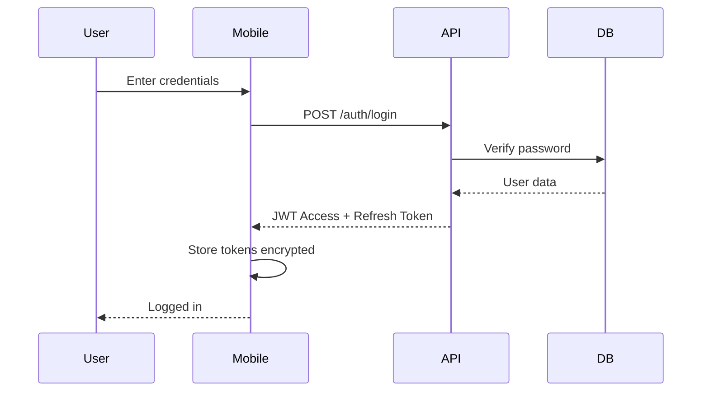
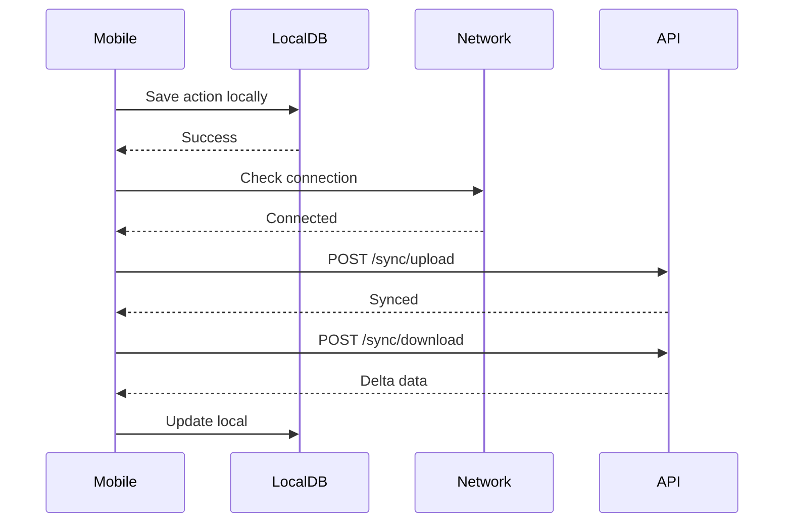

# Báo Cáo Phân Tích Kiến Trúc - DILIGO DMS v2.0

## Tóm Tắt Điều Hành (Executive Summary)

### Tổng quan dự án
DILIGO DMS (Distribution Management System) v2.0 là hệ thống quản lý phân phối toàn diện được thiết kế cho các công ty hàng tiêu dùng nhanh (FMCG) tại Việt Nam. Hệ thống hỗ trợ quản lý đội ngũ bán hàng hiện trường, giám sát hoạt động bán hàng, và tối ưu hóa quy trình từ đơn hàng đến giao hàng.

### Thời gian hoàn thành
- **Ngày bắt đầu**: 02/02/2026
- **Ngày hoàn thành kiến trúc**: 06/02/2026 (4 ngày)
- **Giai đoạn**: Hoàn thiện tài liệu kiến trúc, chưa có mã nguồn triển khai

### Mục tiêu chính
1. Quản lý đội ngũ bán hàng hiện trường (NVBH)
2. Giám sát hoạt động qua GPS và check-in
3. Quản lý đơn hàng (Pre-sales & Van-sales)
4. Theo dõi KPI và hiệu suất
5. Quản lý tồn kho và chuyển kho
6. Báo cáo và phân tích dữ liệu

---

## 1. Tổng quan về Hệ thống (System Overview)

### 1.1 Cấu trúc theo mô hình C4

Hệ thống được mô hình hóa theo 4 tầng của mô hình C4:

| Tầng | Tài liệu | Mô tả |
|------|----------|-------|
| Level 1 - Context | `01-SYSTEM-CONTEXT.md` | Ranh giới hệ thống, các tác nhân, hệ thống bên ngoài |
| Level 2 - Container | `02-CONTAINER-ARCHITECTURE.md` | Các thành phần chính và giao tiếp giữa chúng |
| Level 3 - Component | `03-COMPONENT-ARCHITECTURE.md` | Chi tiết các thành phần nội bộ của mỗi container |
| Level 4 - Code | (Chưa có) | Chi tiết mã nguồn (sẽ được tạo khi triển khai) |

### 1.2 Nguyên tắc thiết kế chính

1. **Mobile-First**: Ứng dụng mobile là trung tâm, hoạt động offline
2. **Offline-First**: Mobile app hoạt động ổn định ngay cả khi mất kết nối
3. **API-First**: Mọi chức năng đều được truy cập qua REST API
4. **Clean Architecture**: Tách biệt rõ ràng giữa các lớp logic
5. **Scalability**: Khả năng mở rộng với chi phí tối thiểu

---

## 2. Phân tích Kiến trúc Hệ thống

### 2.1 Các thành phần chính (System Context)

#### Tác nhân chính
| Vai trò | Ký hiệu | Nhiệm vụ chính | Giao diện |
|--------|---------|----------------|-----------|
| Nhân viên bán hàng | NVBH | Thăm khách hàng, chốt đơn hàng | Android App |
| Giám sát viên | GSBH/SS | Giám sát NVBH, quản lý lộ trình | Web + Mobile (v2.0) |
| Quản lý khu vực | ASM/RSM | Quản lý vùng, báo cáo tổng hợp | Web App |
| Admin nhà phân phối | Admin NPP | Quản lý tổng thể, cấu hình hệ thống | Web App |

#### Hệ thống bên ngoài
- **Google Maps API**: Định vị, hướng dẫn đường đi
- **Firebase FCM**: Thông báo đẩy (Push Notification)
- **Oracle ERP**: Hệ thống kế toán/ERP hiện có (chỉ xuất dữ liệu)

### 2.2 Kiến trúc Container (Container Architecture)

Hệ thống bao gồm 6 container chính:

```
┌─────────────────────────────────────────────────────────────┐
│                        Users                                │
└─────────────────────────────────────────────────────────────┘
                    │                    │
        ┌───────────▼────────┐   ┌──────▼────────┐
        │  Android App       │   │  Web App      │
        │  (Kotlin/Compose)  │   │  (React/TS)   │
        └───────────┬────────┘   └──────┬────────┘
                    │                    │
                    └──────────┬─────────┘
                               │
                    ┌──────────▼────────┐
                    │  .NET Web API     │
                    │  (.NET 8)         │
                    └──────────┬────────┘
                               │
         ┌─────────────────────┼─────────────────────┐
         │                     │                     │
    ┌────▼────┐          ┌────▼────┐        ┌──────▼──────┐
    │PostgreSQL│         │Blob Store│        │  Redis      │
    │(Neon/Free)│         │(Azure)   │        │  Cache      │
    └──────────┘         └──────────┘        └─────────────┘
```

#### Chi tiết từng container

| Container | Công nghệ | Chức năng chính |
|-----------|----------|-----------------|
| **Android App** | Kotlin + Jetpack Compose | Ứng dụng offline-first cho NVBH/GSBH |
| **Web App** | React/TypeScript hoặc Blazor | Dashboard quản lý, báo cáo |
| **.NET Web API** | ASP.NET Core 8 | REST API, SignalR real-time |
| **PostgreSQL** | PostgreSQL 16+ | Database chính |
| **Blob Storage** | Azure Blob / Cloudflare R2 | Lưu trữ hình ảnh, tài liệu |
| **Redis Cache** | Redis (tùy chọn) | Cache hiệu suất |

### 2.3 Kiến trúc Component (Component Architecture)

#### API Layer - 12 Controllers chính

1. **AuthController** - Đăng nhập, đăng ký, refresh token
2. **CustomerController** - Quản lý khách hàng
3. **ProductController** - Quản lý sản phẩm
4. **RouteController** - Quản lý lộ trình
5. **VisitController** - Quản lý lượt thăm
6. **OrderController** - Quản lý đơn hàng
7. **AttendanceController** - Chấm công
8. **SyncController** - Đồng bộ dữ liệu offline
9. **MonitoringController** - Theo dõi sức khỏe hệ thống
10. **DistributorV2Controller** - Quản lý NPP (v2.0)
11. **RouteManagementV2Controller** - Quản lý lộ trình (v2.0)
12. **KpiAssignmentV2Controller** - Gán KPI (v2.0)
13. **DisplayScoringV2Controller** - Chấm điểm trưng bày (v2.0)
14. **InventoryTransferV2Controller** - Chuyển kho (v2.0)

#### Android App - MVVM + Clean Architecture

```
Presentation Layer (UI)
    ↓
Domain Layer (Business Logic)
    ↓
Data Layer (Repository, API, Local DB)
```

#### Web App - Component Structure

- **Pages**: Trang quản lý chính
- **Components**: Các thành phần UI tái sử dụng
- **Hooks/State Management**: Quản lý trạng thái
- **API Layer**: Gọi REST API

---

## 3. Đánh giá Technology Stack

### 3.1 Mobile Platform

| Công nghệ | Phiên bản | Lý do chọn | Pros | Cons |
|-----------|----------|-----------|------|------|
| **Kotlin** | 1.9+ | Ngôn ngữ chính thức Android | Modern, concise, null-safe | - |
| **Jetpack Compose** | Latest | UI toolkit hiện đại | Declarative, type-safe | Curva học |
| **MVVM** | - | Pattern chuẩn Android | Tách biệt UI/Business Logic | Boilerplate |
| **Room** | - | SQLite ORM | Type-safe, migration support | - |
| **WorkManager** | - | Background tasks | Battery-efficient, constraints | - |

**Quyết định (ADR-001)**: Android-only do:
- Chi phí thấp (chỉ phí Google Play $25 một lần)
- Thị phần Việt Nam >80%
- Nhóm phát triển nhỏ

### 3.2 Backend API

| Công nghệ | Phiên bản | Lý do chọn | Pros | Cons |
|-----------|----------|-----------|------|------|
| **.NET 8** | 8.0 | Enterprise-grade, cross-platform | EF Core integration, SignalR built-in | Learning curve |
| **ASP.NET Core** | - | Web framework chuẩn | High performance, scalable | - |
| **Entity Framework Core** | 8.0 | ORM | Migrations, LINQ queries | Heavy for simple CRUD |
| **SignalR** | - | Real-time | Built-in, easy to use | - |
| **JWT** | - | Authentication | Stateless, mobile-friendly | Token management |

**Quyết định (ADR-002)**: .NET 8 vì:
- Tích hợp PostgreSQL tốt
- SignalR tích hợp sẵn
- Strong typing
- .NET ecosystem mạnh mẽ

### 3.3 Database

| Công nghệ | Phiên bản | Lý do chọn | Pros | Cons |
|-----------|----------|-----------|------|------|
| **PostgreSQL** | 16+ | Open-source, advanced features | JSONB, PostGIS, Full-text search | Free tier nhỏ (500MB) |
| **Neon/Supabase** | Free tier | Zero-cost hosting | Managed, auto-scaling | Limits on compute/storage |

**Quyết định (ADR-003)**: PostgreSQL vì:
- Mã nguồn mở
- Tính năng nâng cao (JSONB, PostGIS)
- Nhiều lựa chọn hosting
- Community lớn

### 3.4 Frontend Web

| Tùy chọn | Pros | Cons | Khuyến nghị |
|----------|------|------|------------|
| **React + TypeScript** | Ecosystem lớn, phổ biến | Cần build step | ✅ Khuyến nghị |
| **Blazor WebAssembly** | C# trên frontend, single-language | Ecosystem nhỏ hơn | Tùy chọn thay thế |

---

## 4. Đánh giá Kiến trúc Dữ liệu (Data Architecture)

### 4.1 Cấu trúc Database

Database được tổ chức thành **11 nhóm chức năng (A-K)**:

| Nhóm | Bảng chính | Chức năng |
|------|-----------|-----------|
| **A** | users, roles, permissions | Quản lý tổ chức, người dùng |
| **B** | routes, regions, assignments | Quản lý lãnh thổ, lộ trình |
| **C** | distributors | Quản lý nhà phân phối |
| **D** | customers, outlets | Quản lý khách hàng |
| **E** | products, skus, product_categories | Quản lý sản phẩm |
| **F** | price_lists, price_list_items, promotions | Quản lý giá |
| **G** | orders, order_items, deliveries | Quản lý bán hàng (O2C) |
| **H** | inventories, inventory_transactions, transfers | Quản lý tồn kho |
| **I** | visits, visit_photos, attendance | Quản lý lực lượng hiện trường |
| **J** | kpi_assignments, kpi_snapshots, display_scores | Quản lý KPI |
| **K** | audit_logs, settings, notifications | Quản lý hệ thống |

### 4.2 Quy ước đặt tên và cấu trúc

- **Primary Keys**: UUID (không tự tăng)
- **Naming Convention**: snake_case (ví dụ: `customer_id`, `order_date`)
- **Soft Delete**: `deleted_at` column (không xóa vật lý)
- **Timestamps**: `created_at`, `updated_at` cho mọi bảng
- **Indexes**: GIN indexes cho JSONB, GIN/GiST cho geospatial

### 4.3 Chiến lược Indexing

```sql
-- UUID indexes cho foreign keys
CREATE INDEX idx_visits_customer_id ON visits(customer_id);
CREATE INDEX idx_visits_route_id ON visits(route_id);

-- GIN indexes cho JSONB
CREATE INDEX idx_customers_metadata ON customers USING GIN(metadata);

-- GIST indexes cho geospatial
CREATE INDEX idx_customers_location ON customers USING GIST(location);
```

### 4.4 Soft Delete Strategy

```sql
-- Mọi bảng có soft delete
WHERE deleted_at IS NULL

-- Lấy cả dữ liệu đã xóa
WHERE deleted_at IS NOT NULL
```

---

## 5. Đánh giá Thiết kế API (API Design)

### 5.1 Tổng quan REST API

| Thuộc tính | Giá trị |
|-----------|---------|
| **Protocol** | HTTPS |
| **Format** | JSON |
| **Authentication** | JWT Bearer Token |
| **Versioning** | URL-based (v1, v2) |
| **Rate Limiting** | Có (Redis hoặc in-memory) |
| **CORS** | Có (configurable origins) |

### 5.2 Các nhóm Endpoint chính

#### 1. Authentication & Authorization
```
POST   /api/v1/auth/register
POST   /api/v1/auth/login
POST   /api/v1/auth/refresh
POST   /api/v1/auth/logout
POST   /api/v1/auth/forgot-password
```

#### 2. Customers
```
GET    /api/v1/customers
GET    /api/v1/customers/{id}
POST   /api/v1/customers
PUT    /api/v1/customers/{id}
DELETE /api/v1/customers/{id}
GET    /api/v1/customers/nearby
```

#### 3. Orders
```
GET    /api/v1/orders
GET    /api/v1/orders/{id}
POST   /api/v1/orders
PUT    /api/v1/orders/{id}
POST   /api/v1/orders/{id}/approve
POST   /api/v1/orders/{id}/cancel
```

#### 4. Sync (Offline)
```
GET    /api/v1/sync/last-sync-timestamp
POST   /api/v1/sync/download
POST   /api/v1/sync/upload
```

#### 5. Attendance
```
POST   /api/v1/attendance/check-in
POST   /api/v1/attendance/check-out
GET    /api/v1/attendance/history
```

#### 6. Monitoring
```
GET    /api/v1/monitoring/health
GET    /api/v1/monitoring/metrics
GET    /api/v1/monitoring/logs
```

#### 7. v2.0 Features
```
POST   /api/v2/distributors/onboard
POST   /api/v2/routes/create
POST   /api/v2/kpi/assign
POST   /api/v2/display/score
POST   /api/v2/inventory/transfer
```

### 5.3 Chiến lược Offline Sync

#### Delta Sync Pattern

```
1. Client gửi last_sync_timestamp
2. Server trả về dữ liệu thay đổi sau timestamp đó
3. Client upload dữ liệu thay đổi local
4. Server xử lý conflict theo quy tắc
```

#### Quy tắc giải quyết conflict

| Loại dữ liệu | Quy tắc |
|--------------|---------|
| Master data | Server wins |
| Visit data | Last Write Wins |
| Order data | Server wins (nếu đã xử lý) |
| Inventory | Server wins |

---

## 6. Đánh giá Kiến trúc Bảo mật (Security Architecture)

### 6.1 Authentication & Authorization

#### JWT Authentication Strategy (ADR-005)

```
┌─────────────────────────────────────────────────────────┐
│ 1. User đăng nhập (username/password)                   │
└───────────────────┬─────────────────────────────────────┘
                    │
                    ▼
┌─────────────────────────────────────────────────────────┐
│ 2. Server verify credentials (Argon2 hashing)           │
└───────────────────┬─────────────────────────────────────┘
                    │
                    ▼
┌─────────────────────────────────────────────────────────┐
│ 3. Server trả về:                                        │
│   - Access Token (24 giờ expiry)                        │
│   - Refresh Token (30 ngày expiry, lưu trong DB)        │
└───────────────────┬─────────────────────────────────────┘
                    │
                    ▼
┌─────────────────────────────────────────────────────────┐
│ 4. Client lưu tokens:                                   │
│   - Access Token: LocalStorage/Keychain (encrypted)     │
│   - Refresh Token: Encrypted SecureStorage             │
└─────────────────────────────────────────────────────────┘
```

#### Token Lifecycle

| Token Type | Expiry | Storage | Use Case |
|------------|--------|---------|----------|
| **Access Token** | 24 giờ | Encrypted local | Gọi API |
| **Refresh Token** | 30 ngày | Encrypted secure storage | Cấp lại access token |

### 6.2 Role-Based Access Control (RBAC)

| Role | Permissions | Scope |
|------|-------------|-------|
| **NVBH** | Chốt đơn, check-in khách hàng | Route được giao |
| **GSBH/SS** | Giám sát NVBH, quản lý lộ trình | Territory được quản lý |
| **ASM/RSM** | Báo cáo tổng hợp | Area/Region được quản lý |
| **Admin NPP** | Quản lý tổng thể | Tất cả tài sản NPP |

### 6.3 Biện pháp bảo mật

#### Mã hóa
- **At Rest**: AES-256 encryption cho sensitive data
- **In Transit**: TLS 1.3 cho mọi kết nối
- **Password**: Argon2id hashing (salt pepper)

#### Input Validation
- Server-side validation (FluentValidation)
- Parameter sanitization
- SQL injection prevention (EF Core parameterized queries)

#### Rate Limiting
- Per-IP rate limiting
- Per-endpoint limits
- Exponential backoff for failed attempts

#### Audit Logging
- Log mọi hành động CRUD
- Track user, timestamp, action
- Store immutable audit trail

---

## 7. Đánh giá Kiến trúc Mobile (Mobile Architecture)

### 7.1 Android App Structure

```
app/
├── presentation/        # UI Layer (Jetpack Compose)
│   ├── screens/
│   ├── components/
│   └── viewmodels/
├── domain/              # Business Logic Layer
│   ├── usecases/
│   ├── models/
│   └── repositories/
└── data/                # Data Layer
    ├── local/           # Room Database
    ├── remote/          # Retrofit API
    └── repository/      # Repository Implementations
```

### 7.2 Offline-First Architecture (ADR-006)

#### Quy trình Offline Sync

```
┌─────────────────────────────────────────────────────────┐
│ 1. User thực hiện hành động (check-in, chốt đơn)         │
│    → Lưu vào Room Database (local)                       │
│    → Update UI ngay lập tức                              │
└─────────────────────────────────────────────────────────┘
                    │
                    ▼
┌─────────────────────────────────────────────────────────┐
│ 2. WorkManager kiểm tra kết nối mạng                    │
│    → Có mạng: Trigger sync job                          │
│    → Không mạng: Queue job                              │
└─────────────────────────────────────────────────────────┘
                    │
                    ▼
┌─────────────────────────────────────────────────────────┐
│ 3. Upload dữ liệu thay đổi lên server                   │
│    → Dữ liệu local được đánh dấu là "synced"             │
└─────────────────────────────────────────────────────────┘
                    │
                    ▼
┌─────────────────────────────────────────────────────────┐
│ 4. Download dữ liệu mới từ server                       │
│    → Delta sync (chỉ tải thay đổi)                      │
│    → Update Room Database                               │
└─────────────────────────────────────────────────────────┘
```

#### Local Storage Strategy

| Loại dữ liệu | Sync Strategy | Conflict Resolution |
|--------------|---------------|---------------------|
| Master data | Full sync periodically | Server wins |
| Visit data | Delta sync real-time | Last Write Wins |
| Order data | Delta sync on change | Server wins |
| Attendance data | Delta sync on change | Server wins |

### 7.3 v2.0 Features Mobile

**GSBH Mobile App** (Mới trong v2.0):
- Onboarding nhà phân phối (NPP)
- Quản lý lộ trình (Route Management)
- Gán KPI cho nhân viên
- Giám sát nhân viên (Employee Monitoring)

**Van-sales Support** (Mới trong v2.0):
- Xem tồn kho trên xe
- Chốt đơn và giao hàng ngay
- Trừ tồn kho theo thời gian thực

---

## 8. Chiến lược Triển khai (Deployment Strategy)

### 8.1 Free Tier Architecture (ADR-004)

#### Tổng chi phí triển khai

| Thành phần | Dịch vụ | Gói | Chi phí tháng |
|-----------|---------|-----|---------------|
| API Server | Azure App Service | F1 Free | $0 |
| Database | Neon Free Tier | 512MB | $0 |
| Web App | Vercel Free | Unlimited bandwidth | $0 |
| File Storage | Azure Blob | 5GB LRS | $0 |
| Push Notifications | Firebase FCM | Free | $0 |
| **Tổng cộng** | | | **$0/tháng** |

*Lưu ý: Chi phí Google Play Console $25 (một lần)*

#### Hạn chế của Free Tier

| Thành phần | Hạn chế | Giải pháp khi vượt |
|-----------|--------|-------------------|
| Azure App Service | 60 phút CPU/ngày, auto-sleep | Upgrade đến Basic tier |
| Neon Free | 512MB storage, 1 connection | Upgrade đến Neon Pro |
| Vercel Free | Build time 60 phút, log 7 ngày | Upgrade đến Pro |

### 8.2 CI/CD Pipeline

#### GitHub Actions Workflow

```
┌─────────────────────────────────────────────────────────┐
│ 1. Push code to main branch                             │
└───────────────────┬─────────────────────────────────────┘
                    │
                    ▼
┌─────────────────────────────────────────────────────────┐
│ 2. Trigger GitHub Actions:                             │
│   - Run tests                                           │
│   - Build .NET API                                      │
│   - Build React Web App                                 │
│   - Build Android APK                                   │
└───────────────────┬─────────────────────────────────────┘
                    │
                    ▼
┌─────────────────────────────────────────────────────────┐
│ 3. Deploy:                                              │
│   - API → Azure App Service (zip deploy)               │
│   - Web → Vercel (automatic)                           │
│   - Android → Play Store (manual review)               │
└─────────────────────────────────────────────────────────┘
```

### 8.3 Zero-Downtime Deployment

**Chiến lược Expand-Contract**:
1. Deploy phiên bản mới song song
2. Switch traffic khi sẵn sàng
3. Monitor errors và metrics
4. Rollback nếu cần

---

## 9. Quyết định Kiến trúc Chính (Key Architectural Decisions)

### Tổng hợp 10 ADR

| # | Quyết định | Lý do chính | Hậu quả tích cực | Rủi ro |
|---|------------|-------------|-----------------|--------|
| **ADR-001** | Android-only | Chi phí thấp, thị phần VN cao | Giảm 50% chi phí dev | Mất khách iOS |
| **ADR-002** | .NET 8 API | EF Core, SignalR | Full-stack C# dev | Learning curve |
| **ADR-003** | PostgreSQL | Open-source, PostGIS | JSONB flexibility | Free tier nhỏ |
| **ADR-004** | Neon Free tier | Zero cost | $0 monthly cost | Limits khi scale |
| **ADR-005** | JWT Auth | Mobile-friendly | Stateless, offline support | Token mgmt complexity |
| **ADR-006** | Offline-first | Rụng kết nối VN | App hoạt động ổn định | Sync complexity |
| **ADR-007** | Unified order | Pre-sales + Van-sales | Dùng chung codebase | Logic phức tạp |
| **ADR-008** | Hybrid KPI | Real-time + Batch | Balance perf/cost | Consistency delay |
| **ADR-009** | Materialized Path | Org hierarchy hiệu quả | O(n) descendant query | Path length limit |
| **ADR-010** | Async display scoring | Manual review | Better quality | Slower than AI |

### Patterns sử dụng

| Pattern | Áp dụng tại | Lý do |
|---------|--------------|-------|
| **Clean Architecture** | Mobile, API | Tách biệt concerns |
| **MVVM** | Android | Pattern chuẩn Android |
| **CQRS** | KPI calculation | Tách read/write concern |
| **Repository Pattern** | Data Layer | Trừu tượng hóa data source |
| **Observer Pattern** | SignalR subscriptions | Real-time updates |
| **Materialized Path** | Org hierarchy | Query hierarchy hiệu quả |
| **Delta Sync** | Offline sync | Giảm bandwidth |

---

## 10. Khuyến nghị và Các bước tiếp theo (Recommendations)

### 10.1 Điểm mạnh (Strengths)

1. ✅ **Kiến trúc toàn diện**: Tài liệu chi tiết, mô hình C4 rõ ràng
2. ✅ **Chi phí tối ưu**: Free tier strategy, $0 monthly
3. ✅ **Offline-first**: Phù hợp điều kiện mạng Việt Nam
4. ✅ **Technology stack hiện đại**: .NET 8, Kotlin, PostgreSQL
5. ✅ **Scalability**: Có roadmap scale khi cần

### 10.2 Điểm cần cải thiện (Areas for Improvement)

| Vấn đề | Đề xuất giải pháp | Ưu tiên |
|--------|------------------|---------|
| **Quy trình sync offline phức tạp** | Tạo sync state machine visualization | 🔴 Cao |
| **Thiếu monitoring/logging chi tiết** | Thêm OpenTelemetry, Application Insights | 🟡 Trung bình |
| **Chưa có disaster recovery plan** | Document backup, restore procedures | 🔴 Cao |
| **Performance tuning chưa rõ** | Benchmark queries, add caching strategy | 🟡 Trung bình |
| **Testing strategy chưa chi tiết** | Add integration tests, E2E tests | 🟡 Trung bình |

### 10.3 Rủi ro (Risks)

| Rủi ro | Xác suất | Tác động | Mitigation |
|--------|----------|----------|------------|
| **Free tier limits exceeded** | Trung bình | Cao | Monitor usage, alert threshold |
| **Sync conflicts khó debug** | Cao | Trung bình | Add conflict logging, debug tools |
| **Performance degradation khi scale** | Trung bình | Cao | Load testing, caching strategy |
| **Security vulnerabilities** | Thấp | Cao | Security audit, penetration testing |
| **Team skill gaps (.NET 8, Kotlin)** | Trung bình | Trung bình | Training, pair programming |

### 10.4 Các bước tiếp theo (Next Steps)

#### Ngắn hạn (1-2 tháng)
1. **Setup Development Environment**
   - Install .NET 8 SDK
   - Install Android Studio + Kotlin
   - Install PostgreSQL (local dev)

2. **Initialize Project Structure**
   ```
   diligo-dms/
   ├── src/
   │   ├── Diligo.Api/          # .NET Web API
   │   ├── Diligo.Mobile/       # Android App
   │   └── Diligo.Web/          # React Web App
   └── tests/
   ```

3. **Database Implementation**
   - Run `01_ddl_schema.sql` on Neon
   - Create initial seed data
   - Setup migration strategy

4. **Authentication Foundation**
   - Implement JWT auth flow
   - Create user/role management
   - Setup permission system

#### Trung hạn (3-4 tháng)
5. **Core Features Phase 1**
   - Customer management
   - Product management
   - Route management

6. **Mobile App Phase 1**
   - Offline sync framework
   - Attendance (check-in/out)
   - Customer visit logging

7. **Web Dashboard Phase 1**
   - User management
   - Route assignment
   - Basic reporting

#### Dài hạn (5-6 tháng)
8. **Advanced Features**
   - Order management (Pre-sales)
   - Inventory tracking
   - KPI calculation

9. **v2.0 Features**
   - GSBH Mobile App
   - Van-sales support
   - Display scoring

10. **Production Deployment**
    - Migrate from Free Tier if needed
    - Setup monitoring/alerting
    - Load testing
    - Security audit

### 10.5 Success Metrics

| Metric | Target | Timeline |
|--------|--------|----------|
| **Time to MVP** | 3 tháng | End tháng 5/2026 |
| **Free Tier Usage** | <80% limits | Ongoing |
| **App Performance** | <2s load time | Ongoing |
| **Offline Success Rate** | >95% sync success | Ongoing |
| **User Satisfaction** | >4.0/5.0 | Sau 1 tháng sử dụng |

---

## Phụ lục (Appendix)

### A. Tài liệu tham khảo (References)

| Tài liệu | Đường dẫn | Mô tả |
|----------|----------|-------|
| Architecture Overview | `product-development/architecture/00-ARCHITECTURE-OVERVIEW.md` | Tổng quan hệ thống |
| System Context | `product-development/architecture/01-SYSTEM-CONTEXT.md` | C4 Level 1 |
| Container Architecture | `product-development/architecture/02-CONTAINER-ARCHITECTURE.md` | C4 Level 2 |
| Component Architecture | `product-development/architecture/03-COMPONENT-ARCHITECTURE.md` | C4 Level 3 |
| Data Architecture | `product-development/architecture/04-DATA-ARCHITECTURE.md` | Database design |
| API Design | `product-development/architecture/05-API-DESIGN.md` | REST API specs |
| Deployment Architecture | `product-development/architecture/06-DEPLOYMENT-ARCHITECTURE.md` | Deployment strategy |
| Security Architecture | `product-development/architecture/07-SECURITY-ARCHITECTURE.md` | Security design |
| Mobile Architecture | `product-development/architecture/08-MOBILE-ARCHITECTURE.md` | Android app design |
| Reporting Architecture | `product-development/architecture/09-REPORTING-ARCHITECTURE.md` | KPI và reporting |
| ADR Directory | `product-development/architecture/adr/` | 10 Architecture Decision Records |
| PRD v2.0 | `product-development/current-feature/PRD-v2.md` | Product Requirements |

### B. Thuật ngữ (Glossary)

| Thuật ngữ | Tiếng Anh | Giải thích |
|-----------|-----------|------------|
| NVBH | Sales Representative | Nhân viên bán hàng hiện trường |
| GSBH/SS | Sales Supervisor | Giám sát viên bán hàng |
| ASM/RSM | Area/Regional Sales Manager | Quản lý khu vực/vùng |
| Admin NPP | Distributor Admin | Admin nhà phân phối |
| NPP | Nhà Phân Phối | Distributor |
| Check-in | Customer Check-in | Đăng ký lượt thăm khách hàng |
| Chấm công | Attendance | Điểm danh nhân viên |
| Van-sales | Van Sales | Bán hàng và giao hàng ngay từ xe |
| Pre-sales | Pre Sales | Bán hàng đặt hàng trước, giao sau |
| Trưng bày | Display | Sắp xếp sản phẩm tại điểm bán |

### C. Biểu đồ Sequences (Mermaid Diagrams)

#### Login Flow



#### Offline Sync Flow



---

**Báo cáo được tạo bởi**: AI Assistant
**Ngày tạo**: 06/02/2026
**Phiên bản kiến trúc**: v2.0
**Trạng thái**: Hoàn thiện tài liệu, chờ triển khai
